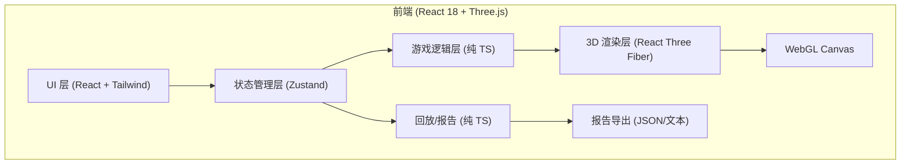
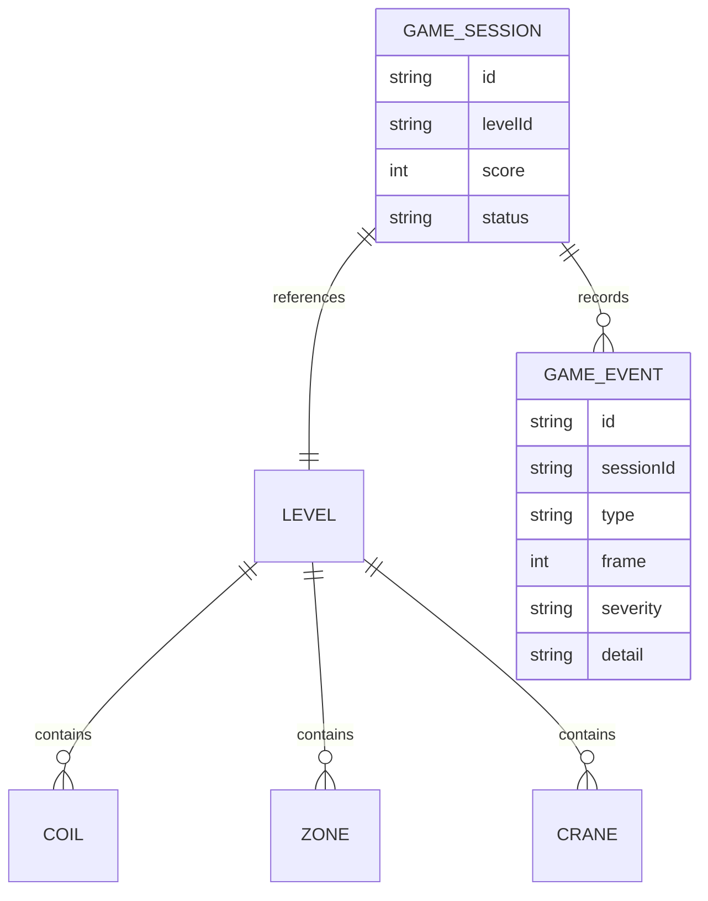

## 1. 架构设计



纯前端项目，无后端。所有状态与数据在前端内存中管理，回放数据用本地存储或手动导出。

## 2. 技术说明

- 前端框架：React@18 + TypeScript
- 构建工具：Vite@5
- 样式：TailwindCSS@3 + CSS Modules
- 3D 渲染：Three.js + @react-three/fiber + @react-three/drei
- 状态管理：Zustand
- 后端：无
- 数据库：无（使用 localStorage 存档）
- 初始化工具：`npm create vite@latest . -- --template react-ts`

## 3. 路由定义

| 路由 | 用途 |
|------|------|
| `/` | 主菜单（关卡选择、规则说明、边界案例） |
| `/game/:levelId` | 游戏主场景（3D 吊运） |
| `/result/:levelId` | 结算页面（失败回放、报告导出） |

## 4. API 定义

无后端 API。内部 TypeScript 接口：

```typescript
interface Coil {
  id: string;
  position: Vector3;
  weight: number;
  centerOffset: Vector2;
  targetZoneId: string;
}

interface Zone {
  id: string;
  position: Vector3;
  size: Vector3;
  type: 'pickup' | 'dropoff' | 'restricted' | 'personnel';
}

interface Crane {
  railId: string;
  position: Vector3;
  speed: number;
  maxTilt: number;
}

interface GameEvent {
  type: 'center_of_mass' | 'rail_conflict' | 'zone_collision' | 'personnel_cross' | 'success';
  frame: number;
  severity: 'warning' | 'critical' | 'success';
  detail: string;
}

interface LevelConfig {
  id: string;
  name: string;
  difficulty: number;
  coils: Coil[];
  zones: Zone[];
  cranes: Crane[];
  maxTiltDegrees: number;
  maxMoves: number;
  timeLimit: number;
}
```

## 5. 数据模型

### 5.1 数据模型定义



### 5.2 初始数据

5 个预置关卡配置，存储在 `src/levels/` 目录下的 JSON/TS 文件中。

## 6. 目录结构

```
src/
  components/
    GameCanvas.tsx       # 3D 画布包装
    Crane3D.tsx          # 行车与吊具 3D
    Coil3D.tsx           # 钢卷 3D
    Zone3D.tsx           # 作业区 3D
    CenterOfMassHUD.tsx  # 重心指示器
    LevelCard.tsx        # 关卡卡片
    ReplayTimeline.tsx   # 回放时间轴
    FailureList.tsx      # 失败原因列表
    ReportExport.tsx     # 报告导出
  pages/
    MainMenu.tsx
    GameScene.tsx
    ResultPage.tsx
  store/
    gameStore.ts         # Zustand 游戏状态
  levels/
    level1.ts
    level2.ts
    level3.ts
    level4.ts
    level5.ts
  utils/
    physics.ts           # 重心、碰撞判定
    replay.ts            # 回放记录/播放
    report.ts            # 报告生成
  types/
    game.ts
  App.tsx
  main.tsx
  index.css
```
