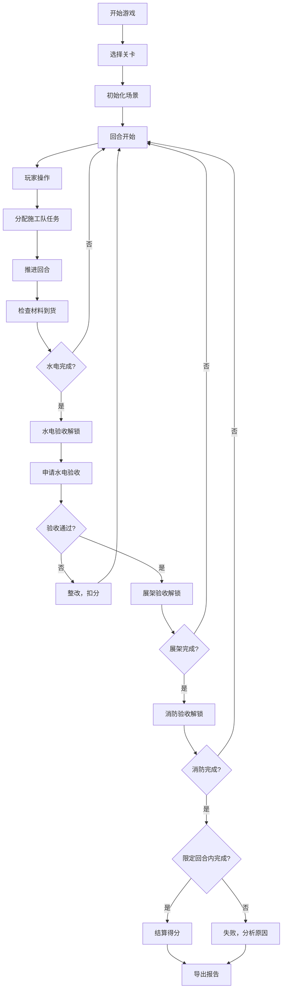

## 1. 产品概述

展会搭建进度游戏是一款面向展会公司项目助理培训的 Canvas 策略模拟游戏，通过回合制方式模拟真实展会搭建流程，训练玩家掌握水电、展架、消防验收的顺序推进逻辑。

- 目标用户：展会公司项目助理及新人培训人员
- 核心价值：在低风险环境中训练项目排程思维，避免真实展会中的常见失误
- 核心问题：材料延期、验收顺序错误、施工队冲突三大难点的应对训练

## 2. 核心功能

### 2.1 用户角色

| 角色 | 注册方式 | 核心权限 |
|------|----------|----------|
| 玩家 | 直接进入 | 开始游戏、操作施工、查看报告、查看历史 |

### 2.2 功能模块

1. **游戏主界面**：Canvas 2D 场景渲染、HUD 信息面板、资源列表
2. **关卡选择**：多关卡难度递进、不同展会规模
3. **回合管理**：推进回合、暂停/继续、重开
4. **施工调度**：分配施工队、安排水电、展架搭建
5. **验收系统**：水电验收、展架验收、消防验收顺序解锁
6. **材料管理**：材料到货时间、库存消耗、应急措施
7. **结算报告**：得分计算、失败原因分析、报告导出
8. **历史回放**：记录每回合操作、可回放查看

### 2.3 页面详情

| 页面名称 | 模块名称 | 功能描述 |
|----------|----------|----------|
| 主菜单 | 关卡选择 | 选择不同难度和规模的展会关卡 |
| 主菜单 | 历史回放 | 选择已完成关卡进行操作回放 |
| 游戏界面 | 场景 Canvas | 2D 俯视视角，展示展位布局、施工队位置、材料堆区 |
| 游戏界面 | 回合控制 | 显示当前回合/总回合，推进/暂停/重开按钮 |
| 游戏界面 | 资源面板 | 显示施工队状态、材料库存、验收进度 |
| 游戏界面 | 操作面板 | 选择施工队、分配任务、申请验收 |
| 游戏界面 | 事件日志 | 显示材料到货、验收结果、冲突警告等事件 |
| 结算界面 | 得分统计 | 各维度得分、总分、评级 |
| 结算界面 | 失败原因 | 失败项具体说明、改进建议 |
| 结算界面 | 报告导出 | 导出 JSON 格式结算报告 |

## 3. 核心流程

### 3.1 游戏主流程

玩家进入关卡后，从回合 1 开始，通过操作面板选择施工队并分配任务（水电布置、展架搭建等），推进回合消耗时间，材料按计划到达，验收按顺序解锁（水电 → 展架 → 消防）。目标是在限定回合内完成所有验收并获得高分。

### 3.2 关键决策点

- 施工队空闲时是否等待材料还是先做其他工作
- 水电未完成时是否提前安排展架搭建
- 消防验收前是否检查所有展位的合规性
- 材料未到是否申请紧急补货（扣分）

### 3.3 Mermaid 流程图

## 4. 用户界面设计

### 4.1 设计风格

- **主色调**：深蓝 #1a365d（工业感）、琥珀 #d69e2e（警示）、翠绿 #38a169（通过）
- **辅助色**：浅灰 #e2e8f0（面板）、红色 #e53e3e（失败）、蓝色 #4299e1（进行中）
- **按钮风格**：直角、工业风边框、悬停微亮
- **字体**：数字用等宽字体（JetBrains Mono），中文用系统无衬线
- **布局**：左侧 Canvas 主场景 + 右侧信息面板 + 底部事件日志
- **图标风格**：线条图标 + 状态色块

### 4.2 页面设计概览

| 页面名称 | 模块名称 | UI 元素 |
|----------|----------|---------|
| 主菜单 | 关卡选择 | 卡片式关卡列表、难度标签、星级评分 |
| 游戏界面 | 场景 Canvas | 深色背景、网格展位、施工队色块、动画连线 |
| 游戏界面 | 回合控制 | 大号回合数字、进度条、暂停/继续/重开按钮 |
| 游戏界面 | 资源面板 | 施工队卡片（头像+状态）、材料进度条、验收阶段指示器 |
| 游戏界面 | 操作面板 | 任务选择按钮、施工队下拉选择、确认按钮 |
| 结算界面 | 得分统计 | 得分雷达图、各维度得分条、评级徽章 |
| 结算界面 | 报告导出 | JSON 预览框、复制/下载按钮 |

### 4.3 响应式设计

- 桌面优先（1280px+），画布区域自适应
- 关键操作区（回合控制、操作面板）固定在视口边缘
- 事件日志可滚动

## 5. 关卡设计

### 5.1 关卡参数

| 关卡 | 名称 | 展位数量 | 施工队数量 | 限定回合 | 材料延迟概率 | 难度 |
|------|------|----------|------------|----------|--------------|------|
| 1 | 小型单展位 | 1 | 2 | 20 | 10% | 简单 |
| 2 | 中型双展位 | 2 | 3 | 25 | 20% | 中等 |
| 3 | 大型多展位 | 4 | 4 | 30 | 30% | 困难 |

### 5.2 验收阶段

1. **水电验收**：所有展位水电布置完成后解锁，检查布线合规
2. **展架验收**：水电验收通过后解锁，检查结构安全
3. **消防验收**：展架验收通过后解锁，检查消防通道和合规项

## 6. 计分规则

| 得分项 | 分值 | 说明 |
|--------|------|------|
| 按时完成 | +100 | 限定回合内完成所有验收 |
| 提前完成 | +10/回合 | 每提前一回合完成 |
| 验收一次通过 | +20/项 | 每项验收首次通过 |
| 材料无延误 | +15 | 所有材料按时到货 |
| 施工无冲突 | +10 | 无施工队任务冲突 |
| 验收失败 | -15/次 | 验收不通过需整改 |
| 紧急补货 | -10/次 | 申请紧急材料 |
| 超回合 | -5/回合 | 超过限定回合 |
