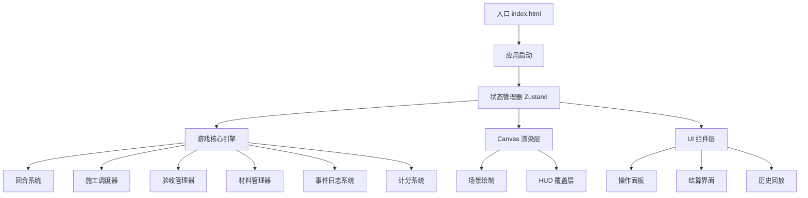

## 1. 架构设计

本项目为纯前端 Canvas 2D 策略游戏，无后端依赖。采用模块化架构分离游戏逻辑、渲染和 UI。



## 2. 技术描述

- **前端框架**：React@18 + TypeScript
- **构建工具**：Vite
- **状态管理**：Zustand
- **样式**：TailwindCSS 3 + 自定义 CSS 变量
- **图标**：lucide-react
- **Canvas 渲染**：原生 Canvas 2D API
- **历史回放**：基于 Command Pattern 的操作记录

## 3. 路由定义

| 路由 | 用途 |
|------|------|
| `/` | 主菜单，关卡选择与历史回放入口 |
| `/game/:levelId` | 游戏主界面，指定关卡的游戏进行 |
| `/replay/:levelId` | 历史回放界面，回放指定关卡的操作记录 |

## 4. 数据模型

### 4.1 核心数据结构

```typescript
// 游戏全局状态
interface GameState {
  phase: 'menu' | 'playing' | 'paused' | 'ended';
  currentLevel: number | null;
  currentTurn: number;
  maxTurns: number;
  score: number;
  scoreBreakdown: ScoreBreakdown;
  history: TurnRecord[];
  events: GameEvent[];
}

// 关卡配置
interface LevelConfig {
  id: number;
  name: string;
  boothCount: number;
  crewCount: number;
  maxTurns: number;
  materialDelayChance: number;
  materialSchedule: MaterialSchedule[];
}

// 展位
interface Booth {
  id: string;
  name: string;
  position: { x: number; y: number };
  size: { w: number; h: number };
  utilitiesDone: boolean;      // 水电完成
  structureDone: boolean;      // 展架完成
  fireSafetyDone: boolean;     // 消防完成
  utilitiesProgress: number;   // 0-100
  structureProgress: number;
  fireSafetyProgress: number;
}

// 施工队
interface Crew {
  id: string;
  name: string;
  status: 'idle' | 'working' | 'moving';
  currentTask: Task | null;
  assignedBooth: string | null;
  efficiency: number;          // 施工效率倍率
}

// 任务类型
type TaskType = 'utilities' | 'structure' | 'fire_safety' | 'inspection';

interface Task {
  id: string;
  type: TaskType;
  boothId: string;
  assignedCrew: string;
  turnsRequired: number;
  turnsSpent: number;
  status: 'pending' | 'in_progress' | 'completed' | 'failed';
}

// 材料
interface Material {
  id: string;
  name: string;
  type: 'utilities' | 'structure' | 'fire';
  requiredFor: string[];       // 依赖的展位
  deliveryTurn: number;        // 预计到达回合
  actualDeliveryTurn: number | null;
  delivered: boolean;
  quantity: number;
  used: boolean;
}

// 验收
interface Inspection {
  type: 'utilities' | 'structure' | 'fire';
  unlocked: boolean;
  requested: boolean;
  completed: boolean;
  passed: boolean;
  attempts: number;
}

// 事件
interface GameEvent {
  turn: number;
  type: 'info' | 'warning' | 'success' | 'error';
  message: string;
  boothId?: string;
  crewId?: string;
}

// 回合记录（用于回放）
interface TurnRecord {
  turn: number;
  actions: PlayerAction[];
  stateSnapshot: GameState;
}

// 玩家操作
interface PlayerAction {
  type: 'assign_task' | 'request_inspection' | 'emergency_material' | 'end_turn';
  crewId?: string;
  boothId?: string;
  taskType?: TaskType;
  timestamp: number;
}

// 得分明细
interface ScoreBreakdown {
  onTimeBonus: number;
  earlyCompletion: number;
  firstTryPass: number;
  noDelayBonus: number;
  noConflictBonus: number;
  inspectionPenalty: number;
  emergencyPenalty: number;
  overtimePenalty: number;
  total: number;
}
```

## 5. 游戏核心算法

### 5.1 回合推进

```
每回合执行顺序：
1. 处理玩家操作（分配任务、申请验收）
2. 检查施工队任务完成情况
3. 更新展位进度
4. 检查材料到货
5. 检查验收解锁条件
6. 生成事件日志
7. 检查胜负条件
```

### 5.2 验收解锁逻辑

```
水电验收解锁条件:
  - 所有展位 utilitiesProgress >= 100

展架验收解锁条件:
  - 水电验收已通过
  - 所有展位 structureProgress >= 100

消防验收解锁条件:
  - 展架验收已通过
  - 所有展位 fireSafetyProgress >= 100
```

### 5.3 胜负判定

```
胜利条件:
  - 消防验收通过
  - currentTurn <= maxTurns

失败条件:
  - currentTurn > maxTurns（超时）
```

## 6. Canvas 渲染设计

### 6.1 场景布局

```
Canvas 尺寸: 自适应容器
坐标系: 左上角为 (0,0)

元素定位:
- 场地边界: 内边距 40px
- 展位网格: 等间距排列
- 施工队: 圆点 + 连线，跟随任务移动
- 材料区: 场地一侧
- 验收标记: 展位上的状态徽章
```

### 6.2 渲染层级

```
1. 背景层: 网格、场地
2. 展位层: 展位矩形、进度条
3. 施工队层: 施工队位置、任务连线
4. 材料层: 材料堆、到货动画
5. HUD层: 验收进度、回合信息
6. 交互层: 选中高亮、悬停提示
```

## 7. 历史回放设计

### 7.1 记录机制

采用 Command Pattern，每次玩家操作都生成 `PlayerAction` 对象记录，每回合结束保存 `TurnRecord`。

### 7.2 回放机制

```
回放流程:
1. 加载关卡历史记录
2. 从回合 1 开始逐回合恢复状态
3. 可暂停/逐帧/继续播放
4. 显示操作时间线
```

## 8. 报告导出

结算时生成 JSON 格式报告，包含：
- 关卡信息
- 各回合操作摘要
- 得分明细
- 失败原因（如有）
- 时间戳
