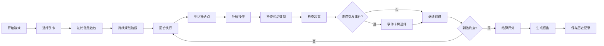

## 1. 产品概述

急救包补给游戏是一款面向户外活动组织者的策略模拟器，通过真实规则训练补给员处理急救包管理、药品效期检查、路线规划等核心技能。游戏以关卡制进行，玩家需要在限定时间内完成队伍补给任务，同时应对突发事件。

- 目标用户：户外活动组织者、急救培训学员
- 核心价值：通过游戏化方式提升急救补给管理能力

## 2. 核心 Features

### 2.1 用户角色

| 角色 | 注册方式 | 核心权限 |
|------|----------|----------|
| 玩家 | 无需注册 | 开始游戏、暂停重开、查看历史、导出报告 |

### 2.2 Feature Module

1. **游戏主界面**: 2D路线地图、急救包库存、队伍状态面板
2. **关卡选择**: 不同难度关卡、关卡进度保存
3. **历史回放**: 游戏记录回放、步骤复盘
4. **报告导出**: 结算报告生成、JSON导出

### 2.3 Page Details

| 页面名称 | 模块名称 | Feature 描述 |
|----------|----------|--------------|
| 主菜单 | 开始游戏 | 选择关卡、难度设置 |
| 游戏界面 | 路线地图 | Canvas绘制2D路线、补给点、队伍位置 |
| 游戏界面 | 库存管理 | 急救包物品清单、药品效期、重量计算 |
| 游戏界面 | 事件系统 | 突发事件卡牌、选择决策 |
| 结算界面 | 计分面板 | 得分明细、失败原因分析 |
| 历史记录 | 回放面板 | 游戏步骤回放、时间轴 |

## 3. 核心流程

## 4. User Interface Design

### 4.1 Design Style

- **主色调**: 军绿色 (#2D5A27) 代表户外、急救主题
- **辅助色**: 急救红 (#E53935) 用于警告、重要提示
- **中性色**: 深灰 (#37474F)、浅灰 (#ECEFF1)
- **按钮风格**: 扁平化圆角按钮，hover有轻微阴影
- **字体**: 标题使用 'Noto Sans SC Bold'，正文使用 'Noto Sans SC Regular'
- **布局风格**: 左侧地图，右侧信息面板的分栏布局
- **图标风格**: 使用急救相关图标（十字、药瓶、背包等）

### 4.2 Page Design Overview

| Page Name | Module Name | UI Elements |
|-----------|-------------|-------------|
| 游戏界面 | 路线地图 | Canvas绘制、节点拖拽、路径动画 |
| 游戏界面 | 库存面板 | 物品卡片、效期进度条、重量指示器 |
| 游戏界面 | 事件弹窗 | 卡牌样式、选项按钮、倒计时 |
| 结算界面 | 计分面板 | 分项得分、失败原因标签、总分数值 |

### 4.3 Responsiveness

- 桌面端：左右分栏布局（地图70%，面板30%）
- 平板端：上下布局，地图在上，面板在下
- 移动端：单页面滚动布局，触屏友好的按钮尺寸（≥44px）
- 触屏优化：支持拖拽、双击缩放、滑动操作

## 5. 游戏规则详情

### 5.1 核心机制

1. **急救包管理**:
   - 物品分类：药品、绷带、工具
   - 重量限制：每关有最大负重限制
   - 药品效期：显示剩余有效期，过期药品失效

2. **路线系统**:
   - 2D节点式地图，玩家选择路径
   - 补给点：可补充物资、替换过期药
   - 时间限制：每回合有行动点数

3. **事件系统**:
   - 随机触发突发事件
   - 玩家选择应对方案
   - 选择影响队伍状态和得分

### 5.2 胜负条件

**胜利条件**:
- 队伍到达终点
- 急救包无过期药品
- 队伍生命值 > 0

**失败原因**:
- 超时未到达终点
- 急救包超重
- 过期药品未清理
- 队伍生命值归零
- 错过关键补给点
