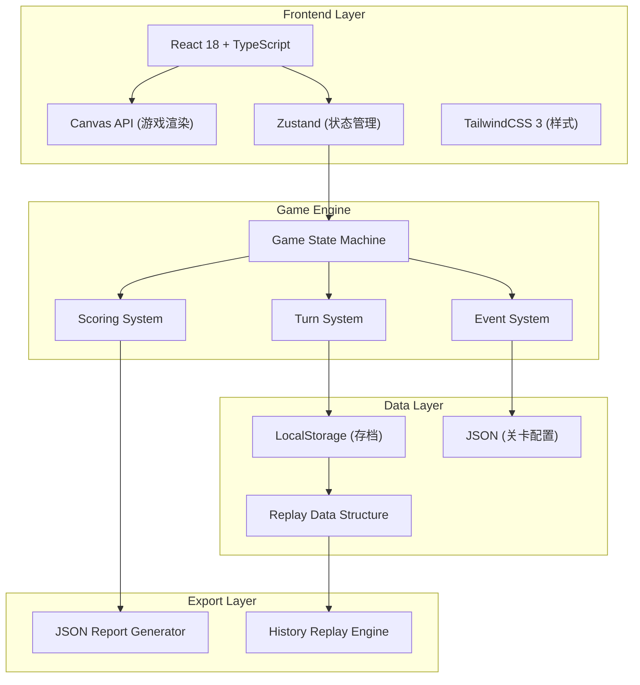
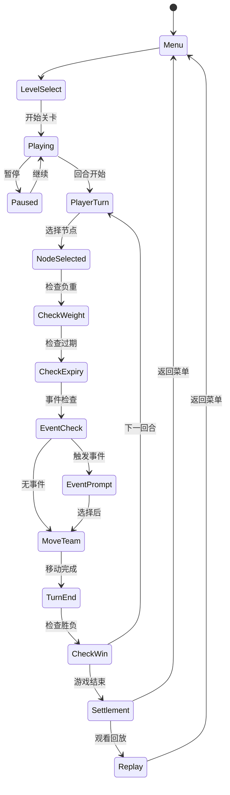

## 1. Architecture Design



## 2. Technology Description

- **Frontend**: React@18 + TypeScript + Vite
- **UI Framework**: TailwindCSS@3
- **State Management**: Zustand (轻量级状态管理)
- **Game Rendering**: HTML5 Canvas API
- **Data Persistence**: LocalStorage
- **Build Tool**: Vite@5

## 3. Directory Structure

```
src/
├── components/          # React组件
│   ├── GameCanvas.tsx   # Canvas游戏画布
│   ├── Inventory.tsx    # 库存面板
│   ├── StatusBar.tsx    # 状态栏
│   ├── EventCard.tsx    # 事件卡牌
│   ├── LevelSelect.tsx  # 关卡选择
│   ├── Settlement.tsx   # 结算面板
│   └── ReplayPlayer.tsx # 回放播放器
├── game/                # 游戏核心逻辑
│   ├── types.ts         # 类型定义
│   ├── config.ts        # 游戏配置
│   ├── state.ts         # Zustand状态
│   ├── engine.ts        # 游戏引擎
│   ├── scoring.ts       # 计分系统
│   └── replay.ts        # 回放系统
├── data/                # 游戏数据
│   ├── levels.ts        # 关卡配置
│   └── events.ts        # 事件库
└── utils/               # 工具函数
    ├── export.ts        # 报告导出
    └── storage.ts       # 本地存储
```

## 4. Core Data Models

### 4.1 Game State

```typescript
interface GameState {
  status: 'menu' | 'playing' | 'paused' | 'settlement' | 'replay';
  currentLevel: Level | null;
  turn: number;
  maxTurns: number;
  team: TeamState;
  inventory: InventoryItem[];
  currentNode: string;
  visitedNodes: string[];
  activeEvents: GameEvent[];
  history: HistoryStep[];
  score: ScoreBreakdown;
}

interface TeamState {
  health: number;
  maxHealth: number;
  actionPoints: number;
  maxActionPoints: number;
}

interface InventoryItem {
  id: string;
  name: string;
  type: 'medicine' | 'bandage' | 'tool';
  weight: number;
  quantity: number;
  expiryTurn?: number;
  isExpired: boolean;
}

interface MapNode {
  id: string;
  name: string;
  x: number;
  y: number;
  type: 'start' | 'normal' | 'supply' | 'end';
  connections: string[];
  supplyItems?: SupplyItem[];
}

interface GameEvent {
  id: string;
  title: string;
  description: string;
  choices: EventChoice[];
  countdown: number;
}

interface EventChoice {
  text: string;
  effect: {
    health?: number;
    actionPoints?: number;
    score?: number;
    removeItems?: string[];
    addItems?: InventoryItem[];
  };
}
```

### 4.2 Score System

```typescript
interface ScoreBreakdown {
  total: number;
  baseScore: number;
  timeBonus: number;
  healthBonus: number;
  inventoryBonus: number;
  noExpiredBonus: number;
  supplyVisitedBonus: number;
  eventChoicesBonus: number;
  penalties: {
    reason: string;
    amount: number;
  }[];
}
```

## 5. Game Engine State Machine



## 6. Replay Data Format

```typescript
interface ReplayData {
  version: string;
  levelId: string;
  timestamp: number;
  duration: number;
  finalScore: ScoreBreakdown;
  isWin: boolean;
  failReason?: string;
  steps: ReplayStep[];
}

interface ReplayStep {
  turn: number;
  action: 'move' | 'supply' | 'event' | 'inventory';
  nodeId?: string;
  eventId?: string;
  choiceIndex?: number;
  inventoryChanges: InventoryItem[];
  teamState: TeamState;
  scoreSnapshot: number;
}
```
