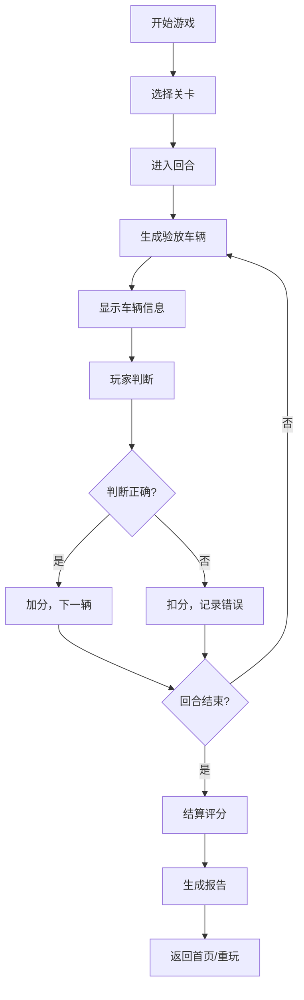

## 1. 产品概述

码头闸口验放游戏是一款面向港口闸口工作人员的训练模拟器，通过游戏化方式提升工作人员识别箱号、核对预约单、检查危品标记的能力。游戏模拟真实闸口工作场景，包含集装箱队列、限时验放、错误判罚等核心机制，帮助玩家在高压节奏下准确判断，降低误放率。

- 核心目标：训练闸口人员快速准确识别集装箱信息、核对预约、拦截危品
- 目标用户：港口闸口新员工、需要考核的在岗人员
- 游戏价值：提升业务熟练度、降低实际工作中的误放行率

## 2. 核心功能

### 2.1 用户角色
| 角色 | 注册方式 | 核心权限 |
|------|----------|----------|
| 玩家 | 无需注册，直接进入 | 开始游戏、选择关卡、查看历史记录 |

### 2.2 功能模块
1. **游戏主界面**：2D闸口队列视图、当前验放车辆信息、操作按钮区
2. **关卡系统**：多难度关卡、回合制进度、解锁机制
3. **验放系统**：箱号识别、预约匹配、危品检测、放行/拦截操作
4. **计分系统**：准确率评分、时间加成、错误扣分、结算评级
5. **历史回放**：错误记录回看、失败原因分析、操作回放
6. **报告系统**：验放报告导出、统计数据、成绩分享

### 2.3 页面详情
| 页面名称 | 模块名称 | 功能描述 |
|----------|----------|----------|
| 首页 | 关卡选择 | 展示可用关卡、难度说明、最佳成绩 |
| 游戏页 | 验放队列 | 2D展示等待验放的集装箱车辆队列 |
| 游戏页 | 信息面板 | 显示当前车辆的箱号、车牌、预约单、危品标记 |
| 游戏页 | 操作区 | 放行按钮、拦截按钮、暂停按钮、剩余时间 |
| 结算页 | 成绩展示 | 准确率、得分、评级、错误列表 |
| 历史页 | 记录列表 | 历史游戏记录、失败原因回看、报告导出 |

## 3. 核心流程

## 4. 用户界面设计

### 4.1 设计风格
- 主色调：港口工业风，深蓝色(#0f172a)为主，橙色(#f97316)为警示色，绿色(#22c55e)为通行色
- 按钮风格：硬朗工业风，直角边框，明确的状态反馈
- 字体：等宽字体展示箱号信息，增强专业感；常规字体用于说明文字
- 布局：信息密集型布局，模拟真实闸口操作终端
- 图标：使用线条型图标，保持简洁专业

### 4.2 页面设计概述
| 页面名称 | 模块名称 | UI元素 |
|----------|----------|--------|
| 首页 | 关卡卡片 | 关卡编号、名称、难度星级、最佳成绩、解锁状态 |
| 游戏页 | 队列区域 | 横向滚动的集装箱卡片队列，显示箱号摘要 |
| 游戏页 | 验放面板 | 大号箱号显示、车牌、预约单详情、危品标记闪烁提示 |
| 游戏页 | 状态栏 | 剩余时间进度条、当前得分、准确率、已处理数量 |
| 结算页 | 成绩面板 | 最终得分、星级评定、准确率、错误详情列表 |
| 历史页 | 记录列表 | 游戏时间、关卡、得分、准确率、操作按钮 |

### 4.3 响应性
- 桌面端优先设计，适配1280px及以上宽度
- 平板端自适应，保证操作按钮可点击区域
- 核心游戏区域保持固定比例，信息面板可折叠

## 5. 游戏规则

### 5.1 验放规则
1. **箱号匹配**：集装箱箱号必须与预约单完全一致
2. **车牌匹配**：车辆车牌必须与预约单登记车牌一致
3. **危品检查**：有危品标记的车辆必须拦截，除非预约单注明允许通行
4. **时间限制**：每辆车有单独验放时限，超时自动判为失误
5. **队列压力**：队列满员时新车辆无法进入，造成等待扣分

### 5.2 计分规则
- 正确放行：+100分
- 正确拦截：+150分（危品拦截额外+50）
- 错误放行：-200分，记录错误原因
- 错误拦截：-100分
- 超时未处理：-150分
- 队列等待超过3辆：每辆额外-50分/秒

### 5.3 关卡设计
| 关卡 | 名称 | 车辆数 | 时限/车 | 危品率 | 难点 |
|------|------|--------|---------|--------|------|
| 1 | 新手入门 | 10 | 15秒 | 10% | 基础识别训练 |
| 2 | 节奏加快 | 15 | 12秒 | 15% | 提升反应速度 |
| 3 | 危品专项 | 12 | 10秒 | 30% | 危品识别训练 |
| 4 | 预约陷阱 | 15 | 10秒 | 20% | 预约信息不匹配 |
| 5 | 综合考验 | 20 | 8秒 | 25% | 高压综合测试 |

### 5.4 边界案例
1. 箱号相似字符混淆（0/O、1/I、2/Z）
2. 预约单箱号多一位或少一位
3. 危品标记位置隐蔽，颜色较浅
4. 车牌字体轻微模糊
5. 同一辆车重复出现（预约次数限制）
6. 预约单有效期已过
