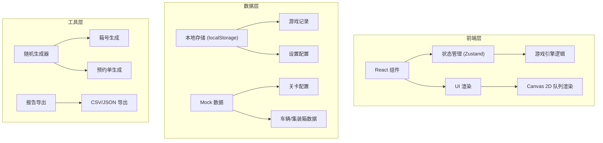

## 1. 架构设计



## 2. 技术描述

- 前端框架：React@18 + TypeScript
- 构建工具：Vite@5
- 样式方案：Tailwind CSS@3
- 状态管理：Zustand
- 图标库：lucide-react
- 数据存储：localStorage（本地存储游戏记录）
- 图形渲染：HTML5 Canvas 2D（用于队列动画）

## 3. 目录结构

```
src/
├── components/          # React 组件
│   ├── game/           # 游戏相关组件
│   │   ├── GameCanvas.tsx      # 2D 队列画布
│   │   ├── InspectionPanel.tsx # 验放面板
│   │   ├── StatusBar.tsx       # 状态栏
│   │   └── OperationButtons.tsx # 操作按钮
│   ├── layout/         # 布局组件
│   │   ├── Header.tsx
│   │   └── Container.tsx
│   └── ui/             # 通用UI组件
│       ├── Button.tsx
│       ├── Card.tsx
│       └── Modal.tsx
├── pages/              # 页面组件
│   ├── Home.tsx        # 首页/关卡选择
│   ├── Game.tsx        # 游戏页面
│   ├── Result.tsx      # 结算页面
│   └── History.tsx     # 历史记录
├── store/              # 状态管理
│   ├── useGameStore.ts    # 游戏状态
│   └── useHistoryStore.ts # 历史记录
├── types/              # TypeScript 类型定义
│   └── index.ts
├── utils/              # 工具函数
│   ├── generator.ts    # 数据生成器
│   ├── validator.ts    # 验放规则校验
│   ├── exporter.ts     # 报告导出
│   └── storage.ts      # 本地存储
├── data/               # 配置数据
│   ├── levels.ts       # 关卡配置
│   └── constants.ts    # 常量定义
├── hooks/              # 自定义 Hooks
│   ├── useTimer.ts     # 计时器
│   └── useGameLoop.ts  # 游戏循环
├── App.tsx
├── main.tsx
└── index.css
```

## 4. 核心数据模型

### 4.1 类型定义

```typescript
// 集装箱信息
interface Container {
  id: string;
  containerNo: string;      // 箱号
  licensePlate: string;     // 车牌
  hasDangerous: boolean;    // 是否有危品
  dangerousLevel?: number;  // 危品等级 1-3
}

// 预约单
interface Reservation {
  id: string;
  containerNo: string;      // 预约箱号
  licensePlate: string;     // 预约车牌
  isValid: boolean;         // 是否有效
  expireTime: number;       // 过期时间戳
  allowDangerous: boolean;  // 是否允许危品
}

// 待验放车辆
interface Vehicle {
  id: string;
  container: Container;
  reservation: Reservation;
  arriveTime: number;       // 到达时间
  shouldIntercept: boolean; // 正确判断：是否应该拦截
  interceptionReason?: string; // 拦截原因
}

// 验放记录
interface InspectionRecord {
  vehicleId: string;
  containerNo: string;
  licensePlate: string;
  hasDangerous: boolean;
  playerAction: 'pass' | 'intercept' | 'timeout';
  isCorrect: boolean;
  errorReason?: string;
  scoreChange: number;
  timestamp: number;
  timeSpent: number;
}

// 游戏状态
interface GameState {
  level: Level;
  status: 'idle' | 'playing' | 'paused' | 'finished';
  currentVehicle: Vehicle | null;
  queue: Vehicle[];
  score: number;
  processedCount: number;
  correctCount: number;
  records: InspectionRecord[];
  startTime: number;
  pauseTime: number;
}

// 关卡配置
interface Level {
  id: number;
  name: string;
  vehicleCount: number;
  timePerVehicle: number;
  dangerousRate: number;
  mismatchRate: number;
  maxQueueSize: number;
  passScore: number;
}
```

## 5. 核心模块设计

### 5.1 游戏状态管理 (Zustand)

```typescript
// useGameStore.ts
import { create } from 'zustand';

interface GameStore {
  // 状态
  gameState: GameState;
  
  // 操作
  startGame: (level: Level) => void;
  pauseGame: () => void;
  resumeGame: () => void;
  restartGame: () => void;
  endGame: () => void;
  
  // 验放操作
  passVehicle: () => void;
  interceptVehicle: () => void;
  
  // 内部方法
  generateNextVehicle: () => void;
  handleTimeout: () => void;
}
```

### 5.2 规则校验器

```typescript
// utils/validator.ts
export function validateInspection(
  vehicle: Vehicle,
  action: 'pass' | 'intercept'
): {
  isCorrect: boolean;
  errorReason?: string;
  scoreChange: number;
} {
  // 1. 检查箱号是否匹配
  if (vehicle.container.containerNo !== vehicle.reservation.containerNo) {
    if (action === 'pass') {
      return { isCorrect: false, errorReason: '箱号不匹配', scoreChange: -200 };
    }
    return { isCorrect: true, scoreChange: 150 };
  }
  
  // 2. 检查车牌是否匹配
  if (vehicle.container.licensePlate !== vehicle.reservation.licensePlate) {
    if (action === 'pass') {
      return { isCorrect: false, errorReason: '车牌不匹配', scoreChange: -200 };
    }
    return { isCorrect: true, scoreChange: 150 };
  }
  
  // 3. 检查危品
  if (vehicle.container.hasDangerous && !vehicle.reservation.allowDangerous) {
    if (action === 'pass') {
      return { isCorrect: false, errorReason: '危品未拦截', scoreChange: -200 };
    }
    return { isCorrect: true, scoreChange: 200 };
  }
  
  // 4. 检查预约是否有效
  if (!vehicle.reservation.isValid) {
    if (action === 'pass') {
      return { isCorrect: false, errorReason: '预约无效', scoreChange: -200 };
    }
    return { isCorrect: true, scoreChange: 150 };
  }
  
  // 正常放行
  if (action === 'pass') {
    return { isCorrect: true, scoreChange: 100 };
  }
  return { isCorrect: false, errorReason: '错误拦截正常车辆', scoreChange: -100 };
}
```

### 5.3 数据生成器

```typescript
// utils/generator.ts
export function generateContainerNo(): string {
  // 箱号规则：4位字母 + 6位数字 + 校验位
  const letters = 'ABCDEFGHIJKLMNOPQRSTUVWXYZ';
  let result = '';
  for (let i = 0; i < 4; i++) {
    result += letters.charAt(Math.floor(Math.random() * letters.length));
  }
  for (let i = 0; i < 6; i++) {
    result += Math.floor(Math.random() * 10);
  }
  result += Math.floor(Math.random() * 10);
  return result;
}

export function generateLicensePlate(): string {
  const provinces = '京津沪渝冀豫云辽黑湘皖鲁新苏浙赣鄂桂甘晋蒙陕吉闽贵粤青藏川宁琼';
  const letters = 'ABCDEFGHJKLMNPQRSTUVWXYZ';
  const province = provinces.charAt(Math.floor(Math.random() * provinces.length));
  const city = letters.charAt(Math.floor(Math.random() * letters.length));
  let number = '';
  for (let i = 0; i < 5; i++) {
    if (Math.random() > 0.7) {
      number += letters.charAt(Math.floor(Math.random() * letters.length));
    } else {
      number += Math.floor(Math.random() * 10);
    }
  }
  return `${province}${city}${number}`;
}
```

## 6. 游戏循环设计

```
┌─────────────────────────────────────────────────┐
│                    游戏循环                      │
├─────────────────────────────────────────────────┤
│                                                 │
│  1. 生成车辆加入队列                            │
│     ↓                                            │
│  2. 取出队列首车进行验放                         │
│     ↓                                            │
│  3. 启动倒计时（每辆车独立计时）                 │
│     ↓                                            │
│  4. 玩家操作：放行 / 拦截                        │
│     ↓                                            │
│  5. 校验结果，更新分数，记录操作                 │
│     ↓                                            │
│  6. 检查是否达到目标数量，是则结束游戏            │
│     ↓                                            │
│  7. 否则回到步骤2，继续下一辆                    │
│                                                 │
└─────────────────────────────────────────────────┘
```

## 7. 报告导出设计

支持导出 JSON 和 CSV 格式的验放报告，包含：
- 游戏基本信息（关卡、时间、最终得分）
- 每辆车的验放详情
- 错误类型统计
- 准确率分析
