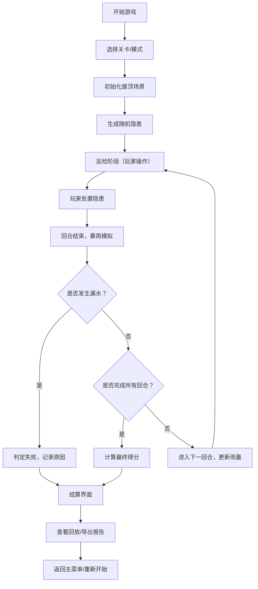
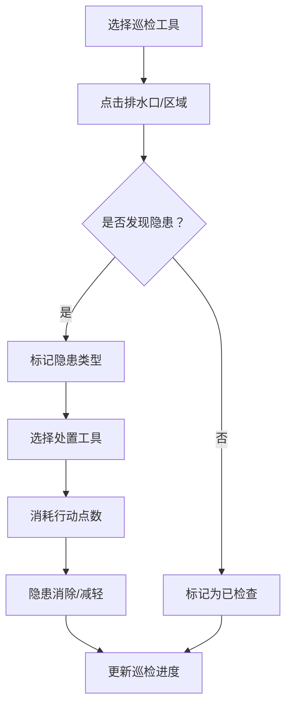

## 1. 产品概述

屋顶排水巡检游戏是一款面向物业培训新人的模拟经营类轻3D浏览器游戏。玩家扮演物业巡检员，需要在暴雨来临前排查并处理屋顶排水系统隐患，包括疏通排水口堵塞、处理低洼区积水，防止屋顶漏水事故发生。

- 核心目标：通过真实的排水系统模拟，培训新人掌握屋顶巡检要点、隐患识别和处置优先级判断
- 目标用户：物业新入职员工、设施管理培训人员
- 市场价值：将枯燥的安全培训转化为互动性强、规则真实的游戏体验，提升培训效果

## 2. 核心 Features

### 2.1 游戏模式

| 模式 | 描述 | 核心玩法 |
|------|------|----------|
| 关卡模式 | 预设多个难度递增的关卡 | 每个关卡有不同的屋顶布局、隐患数量和暴雨倒计时 |
| 自由模式 | 随机生成地图和隐患 | 无限挑战，追求最高分 |

### 2.2 功能模块

1. **游戏主界面**：3D屋顶场景渲染、2D策略地图切换、实时状态面板
2. **巡检系统**：排水口检查、堵塞物识别、低洼区标记
3. **处置系统**：疏通排水口、抽水排涝、临时加固
4. **雨量系统**：回合制雨量变化、积水模拟、漏水判定
5. **计分系统**：巡检完整性、处置效率、隐患严重度加权
6. **报告系统**：巡检报告生成、缺陷清单、整改建议
7. **回放系统**：游戏录像、关键节点回放、失败原因分析
8. **控制系统**：暂停/继续、重新开始、难度调节

### 2.3 页面详情

| 页面名称 | 模块名称 | 功能描述 |
|---------|---------|---------|
| 主菜单 | 模式选择 | 关卡模式/自由模式切换、关卡列表 |
| 主菜单 | 设置面板 | 音效、画质、操作方式设置 |
| 游戏主界面 | 3D场景 | 屋顶3D渲染、可交互的排水口和低洼区 |
| 游戏主界面 | 2D策略地图 | 俯视视角的屋顶平面图、快速导航 |
| 游戏主界面 | 状态面板 | 暴雨倒计时、当前雨量、水位信息、得分 |
| 游戏主界面 | 工具栏 | 巡检工具、疏通工具、抽水工具 |
| 游戏主界面 | 控制面板 | 暂停、继续、重新开始、切换视角 |
| 结算界面 | 得分详情 | 各项得分明细、评级 |
| 结算界面 | 失败原因 | 漏水点分析、漏查隐患、处置不当分析 |
| 结算界面 | 巡检报告 | 导出PDF格式的巡检报告 |
| 回放界面 | 录像播放 | 进度条、倍速播放、关键节点跳转 |

## 3. 核心流程

### 3.1 游戏主流程

### 3.2 巡检处置流程

## 4. 用户界面设计

### 4.1 设计风格

- **主色调**：深蓝色（#1E3A5F）代表专业与信任，搭配橙色（#E87722）作为警示色，青色（#2EC4B6）作为安全提示色
- **视觉风格**：工业风+科技感，模拟真实的物业巡检场景
- **字体**：标题使用 Noto Sans SC Bold，正文使用 Noto Sans SC Regular
- **按钮风格**：圆角矩形（4px），悬浮时轻微放大和阴影加深
- **图标风格**：线性图标，统一2px描边，使用工业工具类图标

### 4.2 页面设计概述

| 页面名称 | 模块名称 | UI元素 |
|---------|---------|--------|
| 主菜单 | 模式选择 | 大卡片式布局，关卡卡片显示难度星级、最佳成绩 |
| 游戏主界面 | 3D场景 | 透视视角，可拖拽旋转，鼠标悬停显示排水口状态 |
| 游戏主界面 | 状态栏 | 顶部横向布局，暴雨倒计时使用进度条+数字双显示 |
| 游戏主界面 | 工具栏 | 底部横向排列，工具按钮显示图标+名称+快捷键 |
| 结算界面 | 得分面板 | 仪表盘样式显示总分，进度条显示各项得分占比 |
| 结算界面 | 报告预览 | 可滚动的报告内容，导出按钮高亮显示 |

### 4.3 响应式设计

- 桌面端优先，最低支持1280x720分辨率
- 工具栏和状态面板支持自适应宽度
- 3D场景根据窗口大小自动调整渲染区域
- 不支持移动端触控操作（培训场景主要使用桌面端）

### 4.4 3D场景设计

- **场景环境**：写实风格的平屋顶场景，包含女儿墙、通风管道、空调外机等真实屋顶元素
- **光照设置**：白天自然光，动态天气效果（乌云聚集、雨滴粒子）
- **摄像机**：默认透视视角，支持环绕观察，可切换到俯视2D模式
- **材质**：屋顶使用沥青材质，排水口使用金属材质，积水使用半透明蓝色材质
- **特效**：下雨粒子效果、积水波纹、漏水时的水滴效果
- **性能**：控制多边形数量在1万面以内，确保60fps流畅运行
