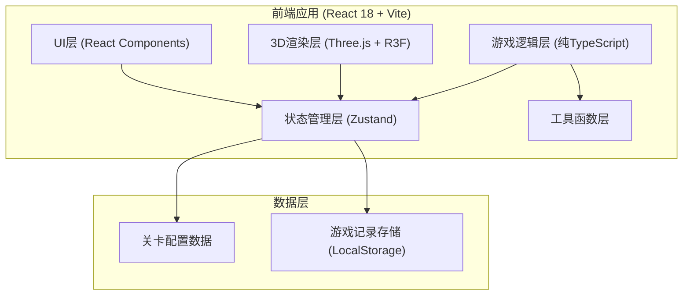

## 1. 架构设计



## 2. 技术描述

- **前端框架**：React 18 + TypeScript
- **构建工具**：Vite 5
- **3D渲染**：Three.js + @react-three/fiber + @react-three/drei
- **状态管理**：Zustand（轻量级，适合游戏状态）
- **样式方案**：TailwindCSS 3
- **UI组件**：自定义组件（避免第三方UI库依赖）
- **数据存储**：LocalStorage（游戏记录、最佳成绩）
- **报告导出**：html2canvas + jspdf（生成PDF巡检报告）

## 3. 核心目录结构

```
src/
├── components/          # React组件
│   ├── ui/             # 通用UI组件
│   ├── game/           # 游戏相关组件
│   ├── menu/           # 菜单相关组件
│   └── report/         # 报告相关组件
├── store/              # Zustand状态管理
│   ├── gameStore.ts    # 游戏主状态
│   └── replayStore.ts  # 回放状态
├── game/               # 游戏核心逻辑（纯TS，与UI分离）
│   ├── types.ts        # 类型定义
│   ├── config.ts       # 游戏配置
│   ├── engine.ts       # 游戏引擎
│   ├── roof.ts         # 屋顶地图生成
│   ├── rainfall.ts     # 雨量系统
│   ├── scoring.ts      # 计分系统
│   └── replay.ts       # 回放系统
├── three/              # Three.js相关
│   ├── RoofScene.tsx   # 屋顶3D场景
│   ├── Drain.tsx       # 排水口组件
│   └── Water.tsx       # 积水效果
├── utils/              # 工具函数
│   ├── export.ts       # 报告导出
│   └── storage.ts      # 本地存储
└── App.tsx             # 应用入口
```

## 4. 路由定义

| 路由 | 页面 | 说明 |
|------|------|------|
| / | 主菜单 | 模式选择、关卡列表 |
| /game | 游戏主界面 | 3D场景、工具栏、状态面板 |
| /result | 结算界面 | 得分、失败原因、报告导出 |
| /replay | 回放界面 | 录像播放、进度控制 |

## 5. 核心数据模型

### 5.1 游戏状态类型

```typescript
// 排水口状态
interface Drain {
  id: string;
  position: { x: number; y: number };
  isBlocked: boolean;
  blockageSeverity: number; // 0-100
  flowRate: number; // 排水速率
  inspected: boolean;
}

// 低洼区
interface LowArea {
  id: string;
  position: { x: number; y: number; radius: number };
  waterLevel: number; // 0-100
  maxCapacity: number;
  inspected: boolean;
}

// 屋顶地图
interface RoofMap {
  width: number;
  height: number;
  drains: Drain[];
  lowAreas: LowArea[];
  obstacles: Obstacle[];
}

// 游戏状态
interface GameState {
  phase: 'menu' | 'playing' | 'paused' | 'result' | 'replay';
  currentRound: number;
  totalRounds: number;
  actionPoints: number;
  maxActionPoints: number;
  score: number;
  stormTimer: number; // 暴雨倒计时
  rainfallIntensity: number; // 当前雨量强度
  roofMap: RoofMap;
  selectedTool: ToolType;
  inspectedDrains: string[];
  resolvedIssues: string[];
  failed: boolean;
  failureReason?: string;
  leakPoints: LeakPoint[];
}

// 工具类型
type ToolType = 'inspect' | 'unclog' | 'pump' | 'reinforce';

// 游戏动作记录（用于回放）
interface GameAction {
  timestamp: number;
  type: 'tool_use' | 'round_end' | 'rainfall_change';
  payload: any;
  stateSnapshot: Partial<GameState>;
}
```

### 5.2 游戏配置

```typescript
// 关卡配置
interface LevelConfig {
  id: number;
  name: string;
  difficulty: 'easy' | 'medium' | 'hard';
  roofSize: { width: number; height: number };
  drainCount: number;
  lowAreaCount: number;
  initialBlockageChance: number;
  totalRounds: number;
  maxActionPoints: number;
  rainfallPattern: number[]; // 每回合雨量强度
  description: string;
}

// 工具配置
const TOOL_CONFIG = {
  inspect: { cost: 1, name: '巡检', icon: '🔍' },
  unclog: { cost: 2, name: '疏通', icon: '🔧' },
  pump: { cost: 3, name: '抽水', icon: '💧' },
  reinforce: { cost: 2, name: '加固', icon: '🛠️' },
};
```

## 6. 核心游戏规则

### 6.1 回合制系统
- 每回合玩家有固定行动点数
- 使用工具消耗行动点数
- 回合结束后触发暴雨模拟

### 6.2 雨量系统
- 每回合雨量强度随机变化（基于配置的概率分布）
- 雨量影响积水速度和排水口负荷
- 连续暴雨会增加积水溢出风险

### 6.3 漏水判定
- 低洼区积水超过容量 → 漏水
- 堵塞排水口导致周边积水 → 漏水
- 漏水点数量和严重程度影响最终得分

### 6.4 计分规则
- 巡检完整性：+10分/每个检查的排水口
- 隐患处置：+20分/疏通堵塞，+15分/排除积水
- 效率加成：提前完成回合 +5分/剩余行动点
- 漏水惩罚：-50分/每个漏水点
- 时间奖励：回合数越少额外加成越高

## 7. 状态管理设计

使用Zustand创建多个store：
1. `gameStore` - 主游戏状态，包含当前游戏的所有数据
2. `replayStore` - 回放状态，管理录像播放
3. `uiStore` - UI状态，如菜单展开、弹窗等

## 8. 关键技术决策

1. **React + Three.js分离**：游戏逻辑使用纯TypeScript实现，React只负责UI和3D渲染
2. **状态快照回放**：每回合记录完整状态快照，实现精确的历史回放
3. **本地存储**：使用LocalStorage保存最佳成绩和游戏记录
4. **PDF导出**：使用html2canvas将DOM转为图片，再用jspdf生成PDF报告
