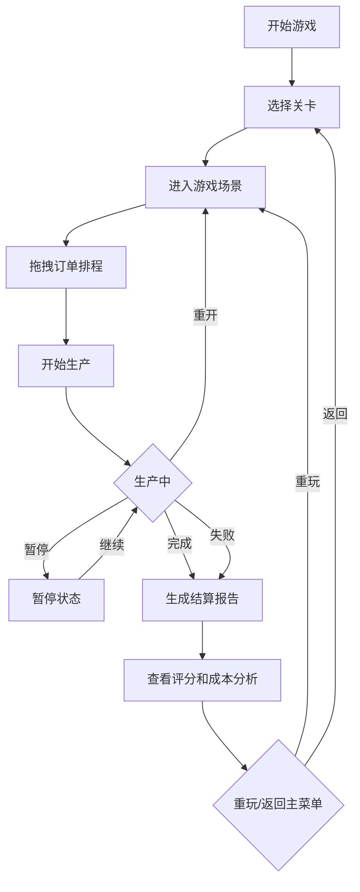

# 工厂换线排程游戏 - 产品需求文档 (PRD)

## 1. 产品概述

一款基于Canvas的2D策略模拟游戏，通过模拟工厂生产排程场景，让玩家理解换线成本的概念。玩家需要合理安排订单生产顺序，优化模具切换、清洗时间和交期，以最小化成本并完成关卡目标。

- **核心价值**：寓教于乐，让制造主管和员工在游戏中学习排程优化思维
- **目标用户**：制造行业管理人员、生产计划人员、供应链相关从业者
- **游戏类型**：策略模拟 / 经营管理 / 教育类游戏

## 2. 核心功能

### 2.1 用户角色
| 角色 | 注册方式 | 核心权限 |
|------|----------|----------|
| 玩家 | 无需注册，本地游戏 | 选择关卡、进行游戏、查看历史记录 |

### 2.2 功能模块
1. **主菜单界面**：关卡选择、游戏说明、历史记录
2. **游戏主界面**：Canvas排程视图、订单列表、产线状态、控制面板
3. **结算报告界面**：成本明细、评分、失败原因分析
4. **历史回放界面**：步骤回放、时间轴控制

### 2.3 页面详情
| 页面名称 | 模块名称 | 功能描述 |
|----------|----------|----------|
| 主菜单 | 关卡选择 | 3个难度关卡，显示完成状态和最高评分 |
| 主菜单 | 游戏说明 | 规则说明、操作指南、成本计算公式 |
| 主菜单 | 历史记录 | 最近5局游戏的成绩和回放入口 |
| 游戏主界面 | 订单队列 | 待排程订单列表，支持拖拽排序 |
| 游戏主界面 | Canvas排程图 | 甘特图风格的时间轴，显示产线状态 |
| 游戏主界面 | 模具状态 | 当前模具、可用模具、清洗倒计时 |
| 游戏主界面 | 控制面板 | 开始/暂停/重开/加速按钮 |
| 游戏主界面 | 实时成本 | 累计换线成本、等待成本、延迟成本 |
| 结算报告 | 成本明细 | 各项成本的具体数值和占比 |
| 结算报告 | 评分系统 | S/A/B/C/D评级，成本优化建议 |
| 结算报告 | 失败原因 | 若失败，显示具体超时或超支原因 |

## 3. 核心流程

**游戏流程说明**：
1. 玩家选择关卡难度，进入对应场景
2. 通过拖拽调整订单队列顺序
3. 点击开始后，产线按排程顺序生产
4. 模具切换时产生换线成本和清洗时间
5. 订单交期超时产生延迟成本
6. 关卡目标：总成本 ≤ 目标成本 或 所有订单按时完成

## 4. 用户界面设计

### 4.1 设计风格

**整体风格**：工业制造风 + 现代扁平化
- **主色调**：深蓝色 (#1e3a5f) - 代表专业、可靠
- **辅助色**：橙色 (#f59e0b) - 代表警告、成本
- **成功色**：绿色 (#10b981) - 按时完成
- **失败色**：红色 (#ef4444) - 超时/超支
- **中性色**：深灰/浅灰渐变背景

**字体选择**：
- 标题：JetBrains Mono - 等宽字体，工业感
- 正文：Inter - 清晰易读

**视觉元素**：
- 网格背景模拟工厂车间
- 模具图标使用工业风格设计
- 时间轴采用甘特图样式
- 成本数字使用等宽字体便于对齐比较

### 4.2 页面设计概览

| 页面名称 | 模块名称 | UI元素 |
|----------|----------|--------|
| 主菜单 | 关卡卡片 | 工业风卡片，悬停动画，进度条显示完成度 |
| 游戏主界面 | Canvas区域 | 网格背景，时间轴，产线甘特图，动态生产动画 |
| 游戏主界面 | 订单列表 | 可拖拽卡片，显示颜色编码（按模具类型），交期指示器 |
| 游戏主界面 | 成本面板 | 实时数字跳动动画，进度条显示接近目标程度 |
| 结算报告 | 图表区域 | 饼图显示成本构成，柱状图对比实际vs目标 |

### 4.3 响应式设计
- 桌面端优先设计（1280px+）
- Canvas区域自适应窗口大小
- 平板端调整面板布局为垂直堆叠
- 移动端简化部分功能，保证核心玩法

### 4.4 动画效果
- 拖拽时的吸附效果和视觉反馈
- 生产进行时的进度条动画
- 成本变化时的数字滚动效果
- 模具切换时的过渡动画
- 关卡完成时的庆祝动效

## 5. 游戏规则与数值设计

### 5.1 核心机制
- **模具冲突**：不同产品需要不同模具，切换需要清洗时间
- **换线成本**：每次换模 = 固定成本 + 清洗时间 × 工时成本
- **清洗规则**：同类模具切换清洗时间短，跨类型清洗时间长
- **交期系统**：每个订单有截止时间，超时按分钟罚款
- **等待成本**：产线空闲也产生成本（设备折旧+人工）

### 5.2 三个关卡设计
| 关卡 | 名称 | 核心机制变化 | 难度特点 |
|------|------|--------------|----------|
| 第一关 | 新手入门 | 仅2种模具，无清洗时间差异 | 熟悉拖拽排程，理解基本概念 |
| 第二关 | 模具冲突 | 3种模具，跨类型清洗时间×2 | 学习归类生产，减少换线次数 |
| 第三关 | 交期压力 | 4种模具，部分订单有严格交期 | 需要权衡换线成本与延迟成本 |

### 5.3 胜负条件
**胜利条件**：
- 所有订单完成生产
- 总成本 ≤ 目标成本
- 或 订单准时交付率 ≥ 90%

**失败条件**：
- 总成本超过目标成本的150%
- 或 某订单超时超过规定时间
- 或 玩家主动放弃
