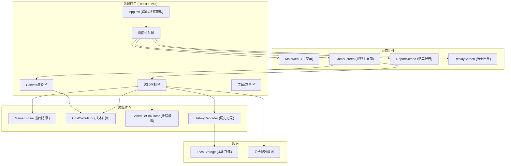

# 工厂换线排程游戏 - 技术架构文档

## 1. 架构设计



## 2. 技术选型

| 技术栈 | 选型 | 说明 |
|--------|------|------|
| 前端框架 | React 18 + TypeScript | 类型安全，组件化开发 |
| 构建工具 | Vite 5 | 快速开发，热更新 |
| 样式方案 | Tailwind CSS 3 | 原子化CSS，快速开发 |
| 图形渲染 | HTML5 Canvas API | 高性能甘特图渲染 |
| 状态管理 | React Context + useReducer | 轻量级，满足游戏状态管理 |
| 拖拽交互 | 原生 HTML5 Drag and Drop API | 无需额外依赖 |
| 本地存储 | LocalStorage | 保存关卡进度和历史记录 |
| 图标 | Lucide React | 现代化图标库 |

## 3. 目录结构

```
src/
├── components/          # 可复用组件
│   ├── ui/             # 基础UI组件 (按钮、卡片等)
│   ├── game/           # 游戏相关组件
│   └── layout/         # 布局组件
├── pages/              # 页面组件
│   ├── MainMenu.tsx
│   ├── GameScreen.tsx
│   ├── ReportScreen.tsx
│   └── ReplayScreen.tsx
├── game/               # 游戏核心逻辑
│   ├── types.ts        # 类型定义
│   ├── constants.ts    # 常量配置
│   ├── levels.ts       # 关卡数据
│   ├── engine.ts       # 游戏引擎
│   ├── calculator.ts   # 成本计算器
│   └── recorder.ts     # 历史记录器
├── hooks/              # 自定义Hooks
│   ├── useGame.ts
│   └── useCanvas.ts
├── context/            # React Context
│   └── GameContext.tsx
├── utils/              # 工具函数
│   └── formatters.ts
├── styles/             # 全局样式
├── App.tsx
├── main.tsx
└── index.css
```

## 4. 核心数据模型

### 4.1 类型定义

```typescript
// 模具类型
interface Mold {
  id: string;
  name: string;
  color: string;
  category: string;  // 模具类别，用于计算清洗时间
}

// 订单
interface Order {
  id: string;
  name: string;
  moldId: string;     // 需要的模具
  productionTime: number;  // 生产时间 (分钟)
  quantity: number;   // 数量
  deadline: number;   // 交期 (相对时间，分钟)
  delayPenalty: number;  // 每分钟延迟罚款
}

// 关卡配置
interface Level {
  id: number;
  name: string;
  description: string;
  molds: Mold[];
  orders: Order[];
  targetCost: number;
  initialMoldId: string;
  sameCategoryCleanTime: number;   // 同类清洗时间
  crossCategoryCleanTime: number;  // 跨类清洗时间
  changeoverFixedCost: number;     // 换模固定成本
  laborCostPerMinute: number;      // 每分钟工时成本
  idleCostPerMinute: number;       // 每分钟闲置成本
}

// 生产事件
interface ProductionEvent {
  type: 'start' | 'changeover' | 'cleaning' | 'produce' | 'complete' | 'delay';
  time: number;
  orderId?: string;
  moldId?: string;
  cost: number;
  description: string;
}

// 游戏状态
interface GameState {
  levelId: number;
  status: 'idle' | 'scheduling' | 'running' | 'paused' | 'completed' | 'failed';
  scheduledOrders: string[];  // 排程顺序 - orderId数组
  currentTime: number;        // 当前模拟时间
  currentMoldId: string;
  currentOrderIndex: number;
  costs: {
    total: number;
    changeover: number;
    cleaning: number;
    idle: number;
    delay: number;
  };
  completedOrders: string[];
  events: ProductionEvent[];
  failReason?: string;
  speed: number;  // 1x, 2x, 4x
}

// 历史记录
interface GameHistory {
  id: string;
  levelId: number;
  timestamp: number;
  finalCost: number;
  targetCost: number;
  score: string;
  scheduledOrders: string[];
  events: ProductionEvent[];
  isWin: boolean;
}
```

### 4.2 成本计算公式

```typescript
// 换线成本 = 固定成本 + 清洗时间 × 工时成本
const changeoverCost = fixedCost + cleanTime * laborCostPerMinute;

// 清洗时间判断
const cleanTime = sameCategory ? sameCategoryCleanTime : crossCategoryCleanTime;

// 延迟成本 = 超时分钟数 × 每分钟罚款
const delayCost = Math.max(0, actualFinishTime - deadline) * delayPenalty;

// 闲置成本 = 闲置分钟数 × 每分钟闲置成本
const idleCost = idleMinutes * idleCostPerMinute;

// 总成本 = 换线成本 + 延迟成本 + 闲置成本
const totalCost = changeoverCost + cleaningCost + delayCost + idleCost;
```

## 5. 核心模块设计

### 5.1 游戏引擎 (GameEngine)
```typescript
class GameEngine {
  constructor(level: Level);
  scheduleOrders(orderIds: string[]): void;  // 设置排程顺序
  start(): void;
  pause(): void;
  resume(): void;
  reset(): void;
  setSpeed(speed: number): void;
  tick(deltaTime: number): void;  // 每帧更新
  getState(): GameState;
  private processCurrentStep(): void;  // 处理当前生产步骤
  private checkWinLose(): void;       // 检查胜负条件
}
```

### 5.2 Canvas渲染器
```typescript
class ScheduleCanvas {
  constructor(canvas: HTMLCanvasElement, level: Level);
  render(state: GameState): void;
  drawBackground(): void;
  drawTimeline(): void;
  drawGanttChart(): void;      // 甘特图
  drawProductionBar(): void;   // 当前生产进度
  drawMoldIndicator(): void;   // 模具指示器
  drawDeadlines(): void;       // 交期线
  getOrderAtPosition(x: number, y: number): string | null;  // 点击检测
}
```

## 6. 状态管理

使用 React Context + useReducer 管理游戏状态：

```typescript
// Action 类型
type GameAction =
  | { type: 'SET_LEVEL'; payload: number }
  | { type: 'SCHEDULE_ORDERS'; payload: string[] }
  | { type: 'START' }
  | { type: 'PAUSE' }
  | { type: 'RESUME' }
  | { type: 'RESET' }
  | { type: 'SET_SPEED'; payload: number }
  | { type: 'TICK'; payload: number }
  | { type: 'COMPLETE'; payload: { events: ProductionEvent[] } }
  | { type: 'FAIL'; payload: string };
```

## 7. 性能优化

1. **Canvas渲染优化**
   - 使用 requestAnimationFrame 同步渲染
   - 仅在状态变化时重绘
   - 离屏Canvas预绘制静态元素

2. **游戏循环优化**
   - 固定时间步长模拟 (fixed timestep)
   - 可变渲染帧率
   - 后台标签页自动暂停

3. **内存管理**
   - 历史记录限制最多保存20条
   - 及时清理事件监听器
   - Canvas资源手动释放

## 8. 本地存储

```typescript
// 存储键名
const STORAGE_KEYS = {
  LEVEL_PROGRESS: 'factory_game_progress',    // 关卡完成状态
  HIGH_SCORES: 'factory_game_highscores',     // 最高分
  HISTORY: 'factory_game_history',            // 历史记录
};

// 数据结构
interface LevelProgress {
  [levelId: number]: {
    completed: boolean;
    bestScore: string;
    bestCost: number;
    stars: number;
  };
}
```
