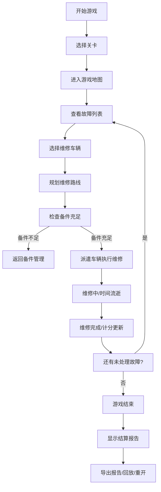

## 1. 产品概述

城市路灯检修游戏是一款2D浏览器策略模拟游戏，玩家扮演市政维修调度员，在夜间城市地图中派遣维修车辆处理路灯故障。游戏核心在于平衡维修效率、路线成本和备件管理，通过真实的调度规则实现高度可玩的策略体验。

- 核心目标：在有限时间和资源内，高效处理所有路灯故障，获得最高评分
- 目标用户：策略游戏爱好者、模拟经营玩家
- 游戏价值：培养资源优化思维，体验真实调度决策的挑战

## 2. 核心功能

### 2.1 用户角色
| 角色 | 注册方式 | 核心权限 |
|------|----------|----------|
| 玩家 | 无需注册 | 完整游戏体验、查看历史记录 |

### 2.2 功能模块
1. **游戏主界面**：2D地图视图、维修车辆调度、实时状态面板
2. **备件管理系统**：备件库存、备件消耗、补给机制
3. **关卡系统**：多关卡难度递进、回合制时间管理
4. **计分系统**：实时计分、扣分细则、结算报告
5. **历史回放**：操作记录回放、失败原因分析
6. **报告导出**：检修报告生成、JSON格式导出

### 2.3 页面详情
| 页面名称 | 模块名称 | 功能描述 |
|----------|----------|----------|
| 游戏主界面 | 2D地图模块 | 显示城市道路网络、路灯位置、故障标记、车辆位置 |
| 游戏主界面 | 控制面板 | 暂停/继续、重新开始、速度调节、回合控制 |
| 游戏主界面 | 状态面板 | 显示当前分数、剩余时间、备件数量、车辆状态 |
| 游戏主界面 | 故障列表 | 显示所有故障路灯的优先级、超时倒计时 |
| 结算界面 | 计分详情 | 详细展示各项得分和扣分明细 |
| 结算界面 | 失败分析 | 分析失败原因（超时、备件不足、路线低效等） |
| 历史记录 | 回放系统 | 回放历史对局、查看操作序列 |
| 报告界面 | 导出功能 | 生成并导出检修报告JSON文件 |

## 3. 核心流程

玩家开始游戏后，首先选择关卡难度。进入游戏后，地图上会出现多个路灯故障点，每个故障有不同的优先级和超时时间。玩家需要：
1. 选择维修车辆
2. 规划维修路线（考虑道路成本和时间）
3. 管理备件库存
4. 在时限内完成所有维修任务

游戏结束后显示结算报告，可导出检修记录或回放游戏过程。

## 4. 用户界面设计

### 4.1 设计风格
- **主色调**：深蓝色系（#0a1628）代表夜间城市氛围
- **辅助色**：琥珀黄（#ffb347）代表路灯光芒，警示红（#ff4757）代表故障，成功绿（#2ed573）代表完成
- **按钮风格**：圆角矩形，带有微妙的发光效果，呼应夜间主题
- **字体**：标题使用 Orbitron（科技感），正文使用 Roboto Mono（清晰易读）
- **布局风格**：左侧地图主视图，右侧垂直控制面板，底部状态栏
- **图标风格**：线性简约图标，配合发光效果

### 4.2 页面设计概述
| 页面名称 | 模块名称 | UI元素 |
|----------|----------|--------|
| 游戏主界面 | 2D地图 | 深色背景、发光路灯节点、道路网络、动画车辆移动 |
| 游戏主界面 | 控制面板 | 玻璃拟态风格卡片、发光按钮、进度条动画 |
| 结算界面 | 报告面板 | 数据可视化图表、颜色编码的得分项、清晰的总结 |
| 历史回放 | 时间轴 | 可拖动时间轴、步进控制、关键事件标记 |

### 4.3 响应式
- 桌面端优先设计，支持1920x1080最佳体验
- 平板设备自适应布局，控制面板可折叠
- 不支持移动端（游戏需要精确点击操作）

## 5. 计分规则说明

### 5.1 基础得分
- 每成功维修一盏路灯：+100分
- 高优先级故障额外奖励：+50分
- 在时限前完成维修：每提前10秒+10分

### 5.2 扣分项（明确标注）
- **错误操作扣分**：
  - 派遣无备件车辆：-30分
  - 重复派遣同一任务：-20分
  - 取消已派遣任务：-15分
- **超时扣分**：
  - 普通故障超时：-50分
  - 高优先级故障超时：-100分
- **资源浪费扣分**：
  - 路线绕行超过最优路线50%：每10%额外路程-5分
  - 未使用备件过期：每个-10分
  - 车辆空驶：每分钟-5分

### 5.3 最终评级
- S级：900分以上，无超时，资源利用率>90%
- A级：750-899分
- B级：600-749分
- C级：450-599分
- D级：450分以下（失败）
