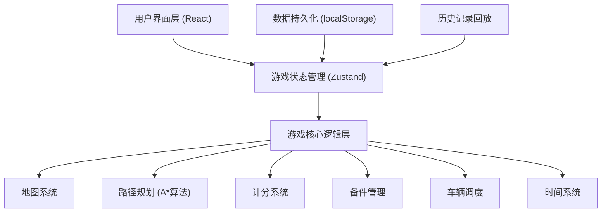
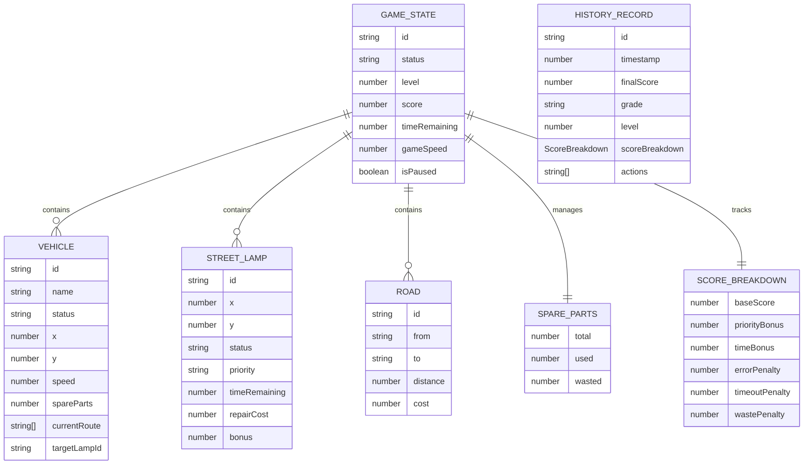

## 1. 架构设计



## 2. 技术描述

- **前端框架**：React@18 + TypeScript
- **构建工具**：Vite@5
- **样式方案**：TailwindCSS@3
- **状态管理**：Zustand（轻量级，适合游戏状态）
- **2D渲染**：Canvas API（原生，性能最优）
- **图标库**：Lucide React
- **数据持久化**：localStorage（历史记录存储）
- **后端**：无（纯前端游戏）
- **数据库**：无（内存数据 + localStorage）

## 3. 路由定义

| 路由 | 用途 |
|------|------|
| / | 游戏主界面（包含开始菜单、游戏、结算） |
| /history | 历史记录与回放 |

## 4. 核心数据模型

### 4.1 数据模型定义



### 4.2 TypeScript 类型定义

```typescript
// 游戏状态
interface GameState {
  id: string;
  status: 'menu' | 'playing' | 'paused' | 'ended';
  level: number;
  score: number;
  timeRemaining: number;
  gameSpeed: number;
  isPaused: boolean;
  vehicles: Vehicle[];
  lamps: StreetLamp[];
  roads: Road[];
  spareParts: SpareParts;
  scoreBreakdown: ScoreBreakdown;
  actions: ActionRecord[];
}

// 维修车辆
interface Vehicle {
  id: string;
  name: string;
  status: 'idle' | 'moving' | 'repairing' | 'returning';
  x: number;
  y: number;
  speed: number;
  spareParts: number;
  currentRoute: string[];
  targetLampId: string | null;
  progress: number;
}

// 路灯
interface StreetLamp {
  id: string;
  x: number;
  y: number;
  status: 'normal' | 'broken' | 'assigned' | 'repairing' | 'repaired' | 'timeout';
  priority: 'low' | 'normal' | 'high' | 'critical';
  timeRemaining: number;
  maxTime: number;
  repairCost: number;
  repairTime: number;
}

// 道路
interface Road {
  id: string;
  from: string;
  to: string;
  distance: number;
  cost: number;
}

// 备件
interface SpareParts {
  total: number;
  used: number;
  wasted: number;
}

// 计分明细
interface ScoreBreakdown {
  baseScore: number;
  priorityBonus: number;
  timeBonus: number;
  errorPenalty: number;
  timeoutPenalty: number;
  wastePenalty: number;
}

// 操作记录
interface ActionRecord {
  timestamp: number;
  type: 'dispatch' | 'cancel' | 'repair' | 'timeout' | 'waste';
  vehicleId?: string;
  lampId?: string;
  details: string;
  scoreChange: number;
}

// 历史记录
interface HistoryRecord {
  id: string;
  timestamp: number;
  finalScore: number;
  grade: string;
  level: number;
  scoreBreakdown: ScoreBreakdown;
  failureReason?: string;
  actions: ActionRecord[];
}
```

## 5. 核心算法

### 5.1 路径规划算法
- 使用 A* 寻路算法计算两点间最优路径
- 考虑道路距离和成本权重
- 支持动态路线重新计算

### 5.2 计分系统
- 实时追踪各项得分与扣分
- 根据操作类型应用不同计分规则
- 游戏结束时综合评估并给出评级

### 5.3 历史回放系统
- 记录每帧游戏状态变化
- 支持按时间轴回放
- 可定位关键事件点
