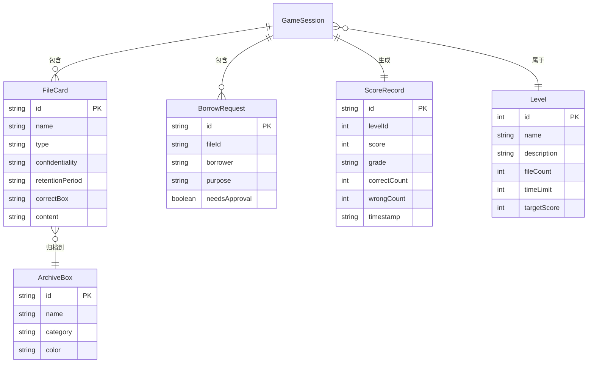

## 1. 架构设计

```mermaid
flowchart TD
    "React 前端层" --> "UI 组件层 (HUD/面板/弹窗)"
    "UI 组件层" --> "3D 场景层 (R3F Canvas)"
    "3D 场景层" --> "交互层 (拖拽/选择/悬停)"
    "交互层" --> "游戏逻辑层 (回合/计分/规则)"
    "游戏逻辑层" --> "状态管理层 (Zustand Store)"
    "状态管理层" --> "持久化层 (LocalStorage)"
    "UI 组件层" --> "报告导出层 (JSON/文本)"
```

## 2. 技术说明
- **前端**：React@18 + TypeScript + Vite + TailwindCSS
- **3D 渲染**：three.js + @react-three/fiber + @react-three/drei
- **状态管理**：zustand
- **图标**：lucide-react
- **初始化工具**：vite-init
- **后端**：无，纯前端，数据存储于 LocalStorage
- **数据库**：无，使用 LocalStorage 存储关卡进度和历史记录

## 3. 路由定义
| 路由 | 用途 |
|------|------|
| `/` | 游戏主界面，包含 3D 场景和 2D 操作面板 |
| `/levels` | 关卡选择界面 |
| `/report` | 结算报告界面 |

## 4. 数据模型

### 4.1 数据模型定义



### 4.2 核心类型定义

```typescript
// 文件类型
type FileCategory = 'contract' | 'invoice' | 'confidential' | 'meeting' | 'project';

// 保密级别
type ConfidentialityLevel = 'open' | 'secret' | 'confidential' | 'top_secret';

// 保管期限
type RetentionPeriod = 'permanent' | '30yrs' | '10yrs' | '5yrs' | '3yrs';

// 游戏状态
type GamePhase = 'menu' | 'playing' | 'paused' | 'finished';

// 文件卡片数据
interface FileCard {
  id: string;
  name: string;
  type: FileCategory;
  confidentiality: ConfidentialityLevel;
  retentionPeriod: RetentionPeriod;
  content: string;
  correctBoxId: string;
  // 玩家操作记录
  playerConfidentiality?: ConfidentialityLevel;
  playerRetentionPeriod?: RetentionPeriod;
  playerBoxId?: string;
  isCorrect?: boolean;
  errorReason?: string;
}

// 档案盒
interface ArchiveBox {
  id: string;
  name: string;
  category: FileCategory;
  color: string;
  position: { x: number; y: number };
}

// 借阅请求
interface BorrowRequest {
  id: string;
  fileId: string;
  borrower: string;
  department: string;
  purpose: string;
  needsApproval: boolean;
  approved: boolean;
  registered: boolean;
  deadline: string;
}

// 关卡
interface Level {
  id: number;
  name: string;
  description: string;
  fileCount: number;
  timeLimit: number;
  targetScore: number;
  files: FileCard[];
  boxes: ArchiveBox[];
  borrowRequests?: BorrowRequest[];
}

// 游戏会话
interface GameSession {
  levelId: number;
  phase: GamePhase;
  currentFileIndex: number;
  timeRemaining: number;
  score: number;
  correctCount: number;
  wrongCount: number;
  actionHistory: ActionRecord[];
  startTime: string;
  endTime?: string;
}

// 操作记录
interface ActionRecord {
  timestamp: string;
  fileId: string;
  action: 'set_confidentiality' | 'set_retention' | 'assign_box' | 'process_borrow';
  value: string;
  isCorrect: boolean;
  errorReason?: string;
}

// 结算报告
interface SettlementReport {
  sessionId: string;
  levelId: number;
  levelName: string;
  totalScore: number;
  grade: 'S' | 'A' | 'B' | 'C' | 'D' | 'F';
  correctCount: number;
  wrongCount: number;
  accuracy: number;
  duration: number;
  actionHistory: ActionRecord[];
  wrongActions: ActionRecord[];
  exportTime: string;
}
```