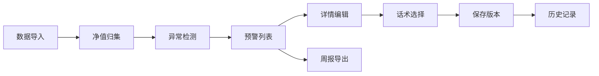

## 1. 产品概述

私募净值回撤预警系统，帮助私募客服高效处理每周净值回撤解释工作，解决风控表、估值表、申赎限制分散的问题。核心价值在于：统一数据归集、智能预警识别、话术分层管理、版本历史追踪，确保客服工作标准化、可追溯、零差错。

## 2. 核心功能

### 2.1 用户角色

| 角色 | 注册方式 | 核心权限 |
|------|----------|----------|
| 客服专员 | 内部账号 | 查看列表、编辑备注、导出周报 |
| 风控主管 | 内部账号 | 全部权限 + 审核 + 数据导入 |

### 2.2 功能模块

1. **预警列表页**：产品净值列表、预警状态筛选、异常标识、搜索
2. **详情编辑页**：产品基本信息、净值数据、持仓估值、申赎状态、客服备注、话术生成
3. **历史记录页**：版本追踪、操作日志、对比差异
4. **数据导入页**：多源数据导入、原始口径保留
5. **周报导出页**：周报生成、模板选择、批量导出

### 2.3 页面详情

| 页面名称 | 模块名称 | 功能描述 |
|----------|----------|----------|
| 预警列表页 | 数据概览卡片 | 总产品数、预警数、异常数、待处理数统计 |
| 预警列表页 | 筛选搜索区 | 按产品、预警级别、日期范围、异常类型筛选 |
| 预警列表页 | 产品列表 | 产品名称、最新净值、回撤率、预警线、状态标签、异常标识 |
| 详情编辑页 | 净值走势图 | 历史净值曲线、预警线/止损线标注 |
| 详情编辑页 | 估值信息 | 持仓估值明细、估值日期校验 |
| 详情编辑页 | 申赎状态 | 申赎限制显示、暂停赎回警示 |
| 详情编辑页 | 话术分层 | 普通话术/警示话术/特殊话术生成与编辑 |
| 详情编辑页 | 客服备注 | 富文本备注、保留原始手工录入 |
| 历史记录页 | 版本列表 | 按时间线显示所有版本、操作人、操作类型 |
| 历史记录页 | 版本对比 | 高亮显示版本差异内容 |
| 数据导入页 | 多源导入 | 净值表/估值表/申赎表/预警线表导入 |
| 数据导入页 | 导入预览 | 数据校验、异常预览、确认导入 |
| 周报导出页 | 周报生成 | 按模板生成周报、预览调整 |
| 周报导出页 | 批量导出 | 多选产品批量导出PDF/Excel |

## 3. 核心流程

用户登录系统后，首先查看预警列表，关注异常标识的产品。点击进入详情页，系统自动归集该产品的净值、估值、申赎数据。客服根据预警级别选择对应话术模板，编辑备注信息后保存。所有操作自动记录版本历史，可随时回溯。每周固定时间，客服批量导出周报发送给投资人。

## 4. 用户界面设计

### 4.1 设计风格

- **主色调**：深海军蓝 (#0A2463) - 专业、稳重
- **辅助色**：警示红 (#D62828)、警告橙 (#F77F00)、成功绿 (#00A86B)、信息蓝 (#3E92CC)
- **按钮风格**：微圆角 (4px)、轻微阴影、悬停浮起效果
- **字体**：思源黑体 (Source Han Sans) - 清晰易读，适合金融数据
- **布局风格**：卡片式布局、左侧导航 + 顶部操作栏 + 内容区三段式
- **图标风格**：线性图标，统一24px尺寸

### 4.2 页面设计概述

| 页面名称 | 模块名称 | UI 元素 |
|----------|----------|---------|
| 预警列表页 | 数据概览 | 四色统计卡片、数值动画、趋势小箭头 |
| 预警列表页 | 表格区 | 斑马纹行、状态色标、异常红色高亮 |
| 详情编辑页 | 净值走势 | 交互式图表、预警线虚线标注、hover详情 |
| 详情编辑页 | 信息卡片 | 分组标签页、卡片阴影、边框强调异常项 |
| 历史记录页 | 时间线 | 垂直时间线、版本节点、差异diff高亮 |
| 周报导出页 | 模板选择 | 卡片式模板预览、选中态边框高亮 |

### 4.3 响应性

- 桌面端优先设计 (1280px+)
- 平板适配 (768px-1279px)：导航折叠、卡片堆叠
- 状态持久化：localStorage 保存筛选条件、分页位置、编辑草稿

### 4.4 关键交互

- 异常项红色闪烁提示（估值日期错位、预警线变更、暂停赎回）
- 编辑自动保存草稿，刷新不丢失
- 版本对比时高亮差异字段
- 导出前预览确认
