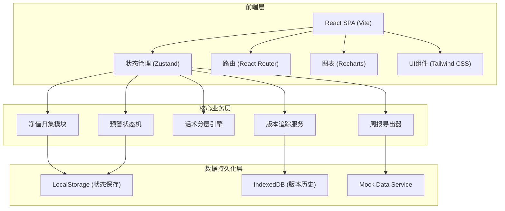
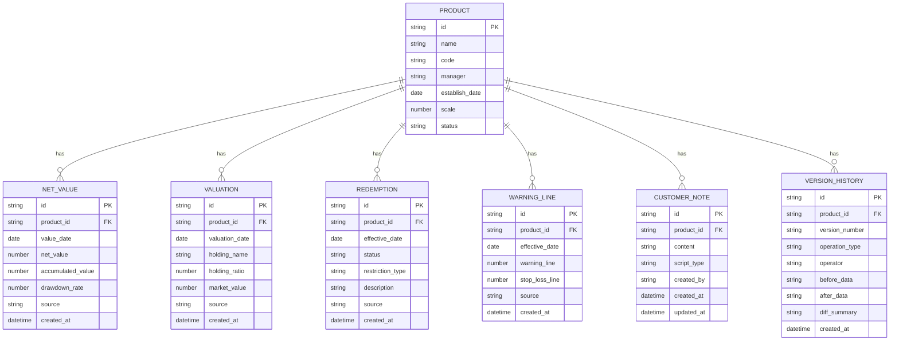

## 1. 架构设计



## 2. 技术描述

- **前端框架**: React@18 + TypeScript
- **构建工具**: Vite@5
- **样式方案**: TailwindCSS@3 + PostCSS
- **状态管理**: Zustand (轻量级、支持持久化)
- **路由**: React Router@6
- **图表**: Recharts
- **数据持久化**: 
  - localStorage (页面状态、筛选条件、草稿)
  - IndexedDB (版本历史、大量数据存储)
- **导出**: xlsx (Excel导出) + jspdf (PDF导出)
- **日期处理**: date-fns

## 3. 路由定义

| 路由 | 页面 | 功能 |
|------|------|------|
| / | 预警列表页 | 产品列表、筛选、搜索、概览统计 |
| /product/:id | 详情编辑页 | 产品详情、净值走势、话术编辑、备注 |
| /product/:id/history | 历史记录页 | 版本列表、版本对比、操作日志 |
| /import | 数据导入页 | 多源数据导入、预览校验 |
| /export | 周报导出页 | 周报生成、模板选择、批量导出 |

## 4. 数据模型

### 4.1 数据模型定义



### 4.2 核心TypeScript类型定义

```typescript
// 产品基础信息
interface Product {
  id: string;
  name: string;
  code: string;
  manager: string;
  establishDate: string;
  scale: number;
  status: 'normal' | 'warning' | 'stop_loss';
  latestNetValue: number;
  latestDrawdownRate: number;
  warningLine: number;
  stopLossLine: number;
  anomalies: Anomaly[];
}

// 异常类型
type AnomalyType = 'date_mismatch' | 'warning_line_changed' | 'redemption_suspended';

interface Anomaly {
  type: AnomalyType;
  description: string;
  level: 'high' | 'medium' | 'low';
  detectedAt: string;
}

// 净值数据
interface NetValue {
  id: string;
  productId: string;
  valueDate: string;
  netValue: number;
  accumulatedValue: number;
  drawdownRate: number;
  source: string;
}

// 话术类型
type ScriptType = 'normal' | 'warning' | 'special';

interface CustomerScript {
  productId: string;
  type: ScriptType;
  title: string;
  content: string;
  lastModified: string;
  modifiedBy: string;
}

// 版本历史
interface VersionRecord {
  id: string;
  productId: string;
  versionNumber: string;
  operationType: 'create' | 'update' | 'import' | 'export';
  operator: string;
  beforeData: Record<string, unknown>;
  afterData: Record<string, unknown>;
  diffSummary: string;
  createdAt: string;
}
```

## 5. 核心模块设计

### 5.1 预警状态机

```typescript
type WarningState = 'normal' | 'monitoring' | 'warning' | 'critical' | 'resolved';

interface WarningStateMachine {
  currentState: WarningState;
  transition(event: WarningEvent): void;
  getStateDescription(): string;
}
```

### 5.2 话术分层引擎

```typescript
interface ScriptEngine {
  generateScript(product: Product, type: ScriptType): string;
  validateScript(script: string, product: Product): ValidationResult;
  getTemplate(type: ScriptType, anomalyType?: AnomalyType): ScriptTemplate;
}
```

### 5.3 版本追踪服务

```typescript
interface VersionTracker {
  recordVersion(productId: string, operation: OperationData): string;
  getHistory(productId: string): VersionRecord[];
  compareVersions(versionId1: string, versionId2: string): DiffResult;
  rollback(versionId: string): boolean;
}
```

## 6. 状态持久化策略

| 数据类型 | 存储方式 | 过期策略 |
|----------|----------|----------|
| 列表筛选条件 | localStorage | 永不过期 |
| 编辑草稿 | localStorage | 7天自动清理 |
| 分页位置 | localStorage | 会话级 |
| 版本历史 | IndexedDB | 永不过期 |
| 导出记录 | IndexedDB | 30天自动清理 |
| 产品主数据 | IndexedDB | 永不过期 |
