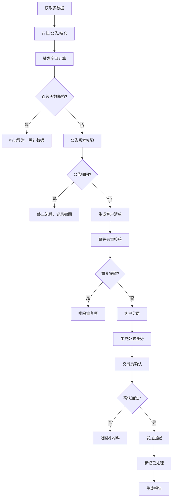

## 1. 产品概述

可转债强赎提醒系统是面向固收交易员的专业风险管理工具，解决强赎条件监控中数据不一致、提醒重复、公告版本混乱等核心痛点。通过统一数据口径、严格幂等校验、多维度客户分层，确保强赎提醒的准确性和可追溯性。

- **核心问题解决**：连续天数断档、公告撤回、同客户重复提醒
- **目标用户**：固收交易员、风控人员、客户服务团队
- **产品价值**：降低操作风险、提高处置效率、全流程可审计

## 2. 核心功能

### 2.1 用户角色

| 角色 | 注册方式 | 核心权限 |
|------|----------|----------|
| 交易员 | 内部系统登录 | 查看监控、发送提醒、标记处置状态 |
| 风控审核 | 内部系统登录 | 审核提醒、查看风险报告、回退异常记录 |
| 系统管理员 | 内部系统登录 | 数据配置、源数据管理、审计日志 |

### 2.2 功能模块

1. **监控仪表盘**：强赎触发概览、正股价格走势、连续天数热力图、待办任务统计
2. **强赎明细列表**：转债筛选、触发窗口计算、公告版本追踪、数据来源追溯
3. **客户提醒管理**：客户分层展示、幂等去重校验、提醒记录管理、批量操作
4. **处置清单中心**：已处理/待确认/需退回三态管理、处置流程追踪、批量导出
5. **数据溯源查询**：每类材料来源追踪、历史版本对比、操作审计日志

### 2.3 页面详情

| 页面名称 | 模块名称 | 功能描述 |
|----------|----------|----------|
| 监控仪表盘 | 数据概览卡片 | 展示触发中、待提醒、已处置、异常等核心指标，支持一键刷新 |
| 监控仪表盘 | 正股价格走势图 | 多只转债正股价格叠加展示，标注强赎触发线和连续达标天数 |
| 监控仪表盘 | 触发窗口热力图 | 以日历热力图形式展示每只转债的连续达标天数分布，识别断档风险 |
| 监控仪表盘 | 待办任务列表 | 按优先级展示待确认、待发送、待补材料的任务 |
| 强赎明细 | 转债筛选面板 | 按转债代码、行业、强赎状态、触发天数等多维度筛选 |
| 强赎明细 | 数据表格 | 展示转债基本信息、正股价格、连续天数、公告状态、客户数等 |
| 强赎明细 | 详情侧边栏 | 展示单只转债的完整信息：触发窗口计算、公告版本历史、数据来源链接 |
| 客户提醒 | 客户分层列表 | 按机构/零售、持仓规模、风险等级分层展示客户 |
| 客户提醒 | 幂等校验面板 | 展示已提醒/待提醒/重复提醒客户，支持去重合并 |
| 客户提醒 | 提醒记录时间线 | 按时间顺序展示所有提醒操作，包含操作人、内容、状态 |
| 处置清单 | 三态分类视图 | 已处理、待确认、需退回三个标签页，清晰区分处置状态 |
| 处置清单 | 批量操作 | 批量标记状态、批量导出Excel、批量发送提醒 |
| 处置清单 | 退回原因管理 | 需退回记录登记原因、补材料要求、跟踪状态 |
| 数据溯源 | 来源追踪 | 每类数据（行情/公告/持仓）展示来源系统、获取时间、原始数据快照 |
| 数据溯源 | 版本对比 | 公告撤回前后版本对比，高亮差异字段 |

## 3. 核心流程

### 3.1 强赎触发监控流程
每日定时从数据源获取转债行情、强赎公告、客户持仓数据 → 触发窗口计算（检查连续30/20交易日中15/10天满足强赎条件）→ 断档检测与补全 → 公告版本校验（检测撤回/更新）→ 生成待提醒客户清单 → 幂等去重（排除近期已提醒客户）→ 客户分层 → 生成处置任务

### 3.2 客户提醒处置流程
交易员查看待确认清单 → 核对数据来源 → 确认或退回补材料 → 发送提醒（记录操作）→ 标记已处理 → 生成处置报告

## 4. 用户界面设计

### 4.1 设计风格
- **主色调**：专业金融蓝（#1E3A8A），代表信任和专业
- **辅助色**：成功绿（#059669）、警告橙（#D97706）、危险红（#DC2626）、信息灰（#64748B）
- **按钮风格**：扁平化设计，2px圆角，hover时有轻微阴影和颜色加深
- **字体**：标题使用 Noto Serif SC（专业感），正文使用 Noto Sans SC（可读性）
- **布局风格**：卡片式布局，左侧导航 + 顶部操作栏 + 主内容区，信息密度适中
- **图标风格**：线性图标，统一2px描边，配合状态色使用

### 4.2 页面设计概述

| 页面名称 | 模块名称 | UI元素 |
|----------|----------|--------|
| 监控仪表盘 | 数据概览卡片 | 4张彩色渐变卡片，大数字展示，底部趋势箭头，hover上浮动画 |
| 监控仪表盘 | 价格走势图 | 双Y轴图表，价格曲线+成交量柱状，强赎线虚线标注，交互tooltip |
| 监控仪表盘 | 触发热力图 | 日历网格布局，颜色深浅表示连续天数，悬停显示详情 |
| 强赎明细 | 筛选面板 | 可折叠侧边筛选，多条件组合，标签式已选条件展示 |
| 强赎明细 | 数据表格 | 斑马纹行，状态标签色标，行hover展开详情预览 |
| 强赎明细 | 详情侧边栏 | 右侧滑入式面板，分段式信息展示，来源链接可点击跳转 |
| 客户提醒 | 分层列表 | 分组标题+折叠列表，不同层级使用不同背景色区分 |
| 客户提醒 | 幂等校验面板 | 三列对比布局（已提醒/待提醒/重复），重复项红框高亮 |
| 处置清单 | 三态标签页 | 大标签页设计，带计数徽章，内容区卡片式布局 |
| 处置清单 | 批量操作栏 | 顶部固定操作栏，选中计数，操作按钮带权限控制 |

### 4.3 响应性
- **设计优先级**：Desktop-first，面向专业交易员的大屏使用场景
- **断点设置**：1440px（默认）、1280px（紧凑）、1024px（平板）
- **触摸优化**：最小点击区域44x44px，重要操作按钮尺寸放大
- **自适应策略**：侧边栏可折叠，表格支持横向滚动，图表容器响应式调整

### 4.4 动效设计
- **页面加载**：卡片依次淡入（staggered fade-in），间隔80ms
- **数据刷新**：数字滚动动画（count-up），图表平滑重绘
- **状态变更**：标签颜色渐变过渡，操作成功后绿色闪光反馈
- **侧边抽屉**：300ms ease-out 滑入动画，背景半透明遮罩
- **表格行交互**：hover时背景色微变+轻微左移（4px）
