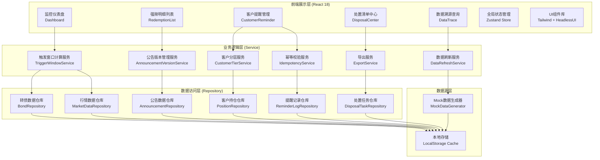
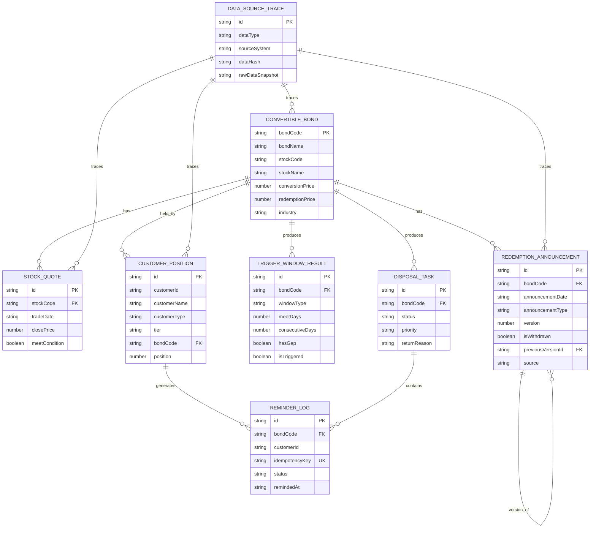

## 1. 架构设计



## 2. 技术描述

- **前端框架**：React@18.2.0 + TypeScript@5.4.0
- **构建工具**：Vite@5.2.0
- **样式方案**：TailwindCSS@3.4.0 + PostCSS
- **状态管理**：Zustand@4.5.0（轻量级，适合金融应用）
- **路由管理**：React Router@6.22.0
- **UI组件**：HeadlessUI@2.0.0 + Lucide React Icons
- **图表库**：Recharts@2.12.0（专业数据可视化）
- **表格组件**：TanStack Table@8.15.0（高性能表格）
- **日期处理**：dayjs@1.11.0
- **导出功能**：xlsx@0.18.0（Excel导出）
- **数据持久化**：LocalStorage + IndexedDB（可选）
- **无后端架构**：全部使用Mock数据，业务逻辑在前端Service层实现

## 3. 路由定义

| Route | 页面组件 | 用途 |
|-------|----------|------|
| / | Dashboard | 监控仪表盘首页 |
| /redemption | RedemptionList | 强赎明细列表 |
| /redemption/:bondCode | RedemptionDetail | 单只转债详情（侧边栏展示） |
| /customer | CustomerReminder | 客户提醒管理 |
| /disposal | DisposalCenter | 处置清单中心 |
| /trace/:dataType | DataTrace | 数据溯源查询 |

## 4. 核心类型定义

```typescript
// 转债基本信息
interface ConvertibleBond {
  bondCode: string;           // 转债代码
  bondName: string;           // 转债名称
  stockCode: string;          // 正股代码
  stockName: string;          // 正股名称
  conversionPrice: number;    // 转股价
  redemptionPrice: number;    // 强赎触发价（转股价*130%）
  currentPrice: number;       // 当前转债价格
  stockPrice: number;         // 当前正股价
  conversionPremiumRate: number; // 转股溢价率
  industry: string;           // 所属行业
  rating: string;             // 债项评级
  maturityDate: string;       // 到期日
}

// 正股行情数据
interface StockQuote {
  stockCode: string;
  tradeDate: string;
  openPrice: number;
  highPrice: number;
  lowPrice: number;
  closePrice: number;
  volume: number;
  turnover: number;
  meetRedemptionCondition: boolean; // 是否满足强赎条件
}

// 强赎公告
interface RedemptionAnnouncement {
  id: string;
  bondCode: string;
  announcementDate: string;   // 公告日期
  announcementType: 'PRE_ANNOUNCE' | 'FORMAL_ANNOUNCE' | 'WITHDRAW_ANNOUNCE' | 'UPDATE_ANNOUNCE';
  title: string;
  content: string;
  redemptionDate: string;     // 强赎实施日
  redemptionCode: string;     // 强赎代码
  version: number;            // 版本号
  isWithdrawn: boolean;       // 是否已撤回
  previousVersionId: string | null; // 上一版本ID
  source: string;             // 数据来源
  sourceUrl: string;          // 来源链接
  fetchedAt: string;          // 获取时间
}

// 客户持仓
interface CustomerPosition {
  id: string;
  customerId: string;
  customerName: string;
  customerType: 'INSTITUTION' | 'RETAIL';
  tier: 'PLATINUM' | 'GOLD' | 'SILVER' | 'BRONZE'; // 客户分层
  riskLevel: 'R1' | 'R2' | 'R3' | 'R4' | 'R5';
  bondCode: string;
  bondName: string;
  position: number;           // 持仓数量（张）
  positionAmount: number;     // 持仓金额
  costPrice: number;          // 成本价
  profitLoss: number;         // 盈亏
  accountManager: string;     // 客户经理
  source: string;             // 数据来源
  fetchedAt: string;          // 获取时间
}

// 触发窗口计算结果
interface TriggerWindowResult {
  bondCode: string;
  windowStartDate: string;    // 窗口起始日
  windowEndDate: string;      // 窗口结束日
  windowType: '30_15' | '20_10'; // 30交易日15天 / 20交易日10天
  totalDays: number;          // 窗口内总天数
  meetDays: number;           // 满足条件天数
  consecutiveDays: number;    // 连续满足天数
  hasGap: boolean;            // 是否有断档
  gapDates: string[];         // 断档日期
  isTriggered: boolean;       // 是否已触发
  triggeredAt: string | null; // 首次触发时间
  dailyQuotes: StockQuote[];  // 每日行情明细
}

// 提醒记录
interface ReminderLog {
  id: string;
  bondCode: string;
  customerId: string;
  customerName: string;
  reminderType: 'SMS' | 'EMAIL' | 'PHONE' | 'SYSTEM';
  reminderContent: string;
  operatorId: string;
  operatorName: string;
  remindedAt: string;
  status: 'PENDING' | 'SENT' | 'FAILED' | 'CANCELLED';
  idempotencyKey: string;     // 幂等键（bondCode + customerId + date）
  sourceTaskId: string;       // 关联的处置任务ID
}

// 处置任务
interface DisposalTask {
  id: string;
  bondCode: string;
  bondName: string;
  taskType: 'REMIND_CUSTOMER' | 'CONFIRM_DATA' | 'SUPPLEMENT_DATA';
  status: 'PENDING_CONFIRM' | 'PROCESSING' | 'PROCESSED' | 'RETURNED';
  priority: 'HIGH' | 'MEDIUM' | 'LOW';
  customerCount: number;
  totalPosition: number;
  assignedTo: string;
  createdAt: string;
  confirmedAt: string | null;
  processedAt: string | null;
  returnedAt: string | null;
  returnReason: string | null;
  supplementRequirements: string | null;
  remarks: string | null;
  dataSourceSnapshot: {
    marketData: string;
    announcement: string;
    position: string;
  };
}

// 数据来源追踪
interface DataSourceTrace {
  id: string;
  dataType: 'BOND_INFO' | 'MARKET_DATA' | 'ANNOUNCEMENT' | 'POSITION' | 'REMINDER';
  sourceSystem: string;
  sourceUrl: string;
  fetchedAt: string;
  dataHash: string;
  rawDataSnapshot: string;    // JSON字符串
  createdBy: string;
}
```

## 5. 数据模型ER图



## 6. 核心业务逻辑设计

### 6.1 触发窗口计算服务 (TriggerWindowService)
```typescript
class TriggerWindowService {
  // 核心算法：计算30/15和20/10两个窗口
  calculateTriggerWindow(
    bondCode: string,
    quotes: StockQuote[],
    windowType: '30_15' | '20_10'
  ): TriggerWindowResult {
    const windowDays = windowType === '30_15' ? 30 : 20;
    const requiredDays = windowType === '30_15' ? 15 : 10;
    
    // 1. 按日期排序
    const sortedQuotes = [...quotes].sort((a, b) => 
      new Date(a.tradeDate).getTime() - new Date(b.tradeDate).getTime()
    );
    
    // 2. 检测断档（交易日间隔>1天且非周末）
    const gapDates: string[] = [];
    for (let i = 1; i < sortedQuotes.length; i++) {
      const prev = new Date(sortedQuotes[i-1].tradeDate);
      const curr = new Date(sortedQuotes[i].tradeDate);
      const diffDays = Math.floor((curr.getTime() - prev.getTime()) / (1000*60*60*24));
      if (diffDays > 3) { // 考虑周末
        gapDates.push(sortedQuotes[i-1].tradeDate);
      }
    }
    
    // 3. 滑动窗口计算
    let maxMeetDays = 0;
    let maxConsecutive = 0;
    let currentConsecutive = 0;
    let triggerDate: string | null = null;
    
    for (let i = 0; i <= sortedQuotes.length - windowDays; i++) {
      const window = sortedQuotes.slice(i, i + windowDays);
      const meetDays = window.filter(q => q.meetRedemptionCondition).length;
      
      if (meetDays > maxMeetDays) maxMeetDays = meetDays;
      
      // 计算连续满足天数
      for (const q of window) {
        if (q.meetRedemptionCondition) {
          currentConsecutive++;
          if (currentConsecutive > maxConsecutive) {
            maxConsecutive = currentConsecutive;
          }
        } else {
          currentConsecutive = 0;
        }
      }
      
      // 检测首次触发
      if (meetDays >= requiredDays && !triggerDate) {
        triggerDate = window[window.length - 1].tradeDate;
      }
    }
    
    return {
      bondCode,
      windowStartDate: sortedQuotes[0]?.tradeDate || '',
      windowEndDate: sortedQuotes[sortedQuotes.length - 1]?.tradeDate || '',
      windowType,
      totalDays: windowDays,
      meetDays: maxMeetDays,
      consecutiveDays: maxConsecutive,
      hasGap: gapDates.length > 0,
      gapDates,
      isTriggered: maxMeetDays >= requiredDays,
      triggeredAt: triggerDate,
      dailyQuotes: sortedQuotes
    };
  }
}
```

### 6.2 公告版本管理服务 (AnnouncementVersionService)
```typescript
class AnnouncementVersionService {
  // 检测公告撤回或更新
  detectAnnouncementChanges(
    announcements: RedemptionAnnouncement[]
  ): { 
    hasWithdrawal: boolean; 
    hasUpdate: boolean; 
    latestVersion: RedemptionAnnouncement | null;
    versionHistory: RedemptionAnnouncement[];
  } {
    const sorted = [...announcements].sort((a, b) => b.version - a.version);
    const latestVersion = sorted[0] || null;
    
    const hasWithdrawal = sorted.some(a => a.announcementType === 'WITHDRAW_ANNOUNCE');
    const hasUpdate = sorted.some(a => a.announcementType === 'UPDATE_ANNOUNCE');
    
    return {
      hasWithdrawal,
      hasUpdate,
      latestVersion,
      versionHistory: sorted
    };
  }
  
  // 版本对比
  compareVersions(
    v1: RedemptionAnnouncement,
    v2: RedemptionAnnouncement
  ): { field: string; oldValue: any; newValue: any }[] {
    const fieldsToCompare = ['redemptionDate', 'redemptionPrice', 'title', 'content'];
    const differences: { field: string; oldValue: any; newValue: any }[] = [];
    
    for (const field of fieldsToCompare) {
      if (v1[field as keyof RedemptionAnnouncement] !== v2[field as keyof RedemptionAnnouncement]) {
        differences.push({
          field,
          oldValue: v1[field as keyof RedemptionAnnouncement],
          newValue: v2[field as keyof RedemptionAnnouncement]
        });
      }
    }
    
    return differences;
  }
}
```

### 6.3 幂等校验服务 (IdempotencyService)
```typescript
class IdempotencyService {
  // 生成幂等键
  generateIdempotencyKey(
    bondCode: string,
    customerId: string,
    reminderType: string,
    date: string
  ): string {
    return `${bondCode}_${customerId}_${reminderType}_${date}`;
  }
  
  // 检查是否已提醒（幂等校验）
  checkIdempotency(
    idempotencyKey: string,
    existingLogs: ReminderLog[],
    coolingPeriodDays: number = 7 // 7天冷却期
  ): { 
    isDuplicate: boolean; 
    existingLog: ReminderLog | null;
    coolingPeriodEnd: string | null;
  } {
    const existingLog = existingLogs.find(log => log.idempotencyKey === idempotencyKey);
    
    if (existingLog) {
      // 检查是否在冷却期内
      const remindedDate = new Date(existingLog.remindedAt);
      const now = new Date();
      const diffDays = Math.floor((now.getTime() - remindedDate.getTime()) / (1000*60*60*24));
      
      if (diffDays < coolingPeriodDays) {
        const coolingEnd = new Date(remindedDate);
        coolingEnd.setDate(coolingEnd.getDate() + coolingPeriodDays);
        return {
          isDuplicate: true,
          existingLog,
          coolingPeriodEnd: coolingEnd.toISOString().split('T')[0]
        };
      }
    }
    
    return {
      isDuplicate: false,
      existingLog: null,
      coolingPeriodEnd: null
    };
  }
  
  // 批量去重
  dedupeReminders(
    pendingReminders: { bondCode: string; customerId: string; reminderType: string }[],
    existingLogs: ReminderLog[],
    date: string
  ): {
    toSend: { bondCode: string; customerId: string; reminderType: string }[];
    duplicates: { item: any; existingLog: ReminderLog; coolingPeriodEnd: string }[];
  } {
    const toSend: typeof pendingReminders = [];
    const duplicates: { item: any; existingLog: ReminderLog; coolingPeriodEnd: string }[] = [];
    
    for (const item of pendingReminders) {
      const key = this.generateIdempotencyKey(item.bondCode, item.customerId, item.reminderType, date);
      const result = this.checkIdempotency(key, existingLogs);
      
      if (result.isDuplicate && result.existingLog && result.coolingPeriodEnd) {
        duplicates.push({
          item,
          existingLog: result.existingLog,
          coolingPeriodEnd: result.coolingPeriodEnd
        });
      } else {
        toSend.push(item);
      }
    }
    
    return { toSend, duplicates };
  }
}
```

### 6.4 客户分层服务 (CustomerTierService)
```typescript
class CustomerTierService {
  // 客户分层规则
  tierRules = {
    PLATINUM: { minPosition: 1000000, customerTypes: ['INSTITUTION'] },
    GOLD: { minPosition: 500000, customerTypes: ['INSTITUTION', 'RETAIL'] },
    SILVER: { minPosition: 100000, customerTypes: ['RETAIL'] },
    BRONZE: { minPosition: 0, customerTypes: ['RETAIL'] }
  };
  
  // 分层客户
  tierCustomers(
    positions: CustomerPosition[]
  ): Record<string, CustomerPosition[]> {
    const tiers: Record<string, CustomerPosition[]> = {
      PLATINUM: [],
      GOLD: [],
      SILVER: [],
      BRONZE: []
    };
    
    for (const pos of positions) {
      const rule = this.tierRules[pos.tier as keyof typeof this.tierRules];
      if (rule) {
        tiers[pos.tier].push(pos);
      }
    }
    
    return tiers;
  }
  
  // 按风险等级过滤
  filterByRiskLevel(
    positions: CustomerPosition[],
    minRiskLevel: string
  ): CustomerPosition[] {
    const riskOrder = ['R1', 'R2', 'R3', 'R4', 'R5'];
    const minIndex = riskOrder.indexOf(minRiskLevel);
    return positions.filter(p => riskOrder.indexOf(p.riskLevel) >= minIndex);
  }
}
```

### 6.5 导出服务 (ExportService)
```typescript
class ExportService {
  // 导出处置清单为Excel
  exportDisposalList(
    tasks: DisposalTask[],
    positions: CustomerPosition[],
    statusFilter: string
  ): Blob {
    const exportData = tasks
      .filter(t => statusFilter === 'ALL' || t.status === statusFilter)
      .flatMap(task => {
        const taskPositions = positions.filter(p => p.bondCode === task.bondCode);
        return taskPositions.map(pos => ({
          '处置任务ID': task.id,
          '转债代码': task.bondCode,
          '转债名称': task.bondName,
          '任务状态': this.getStatusText(task.status),
          '优先级': this.getPriorityText(task.priority),
          '客户ID': pos.customerId,
          '客户名称': pos.customerName,
          '客户类型': pos.customerType === 'INSTITUTION' ? '机构' : '零售',
          '客户分层': this.getTierText(pos.tier),
          '风险等级': pos.riskLevel,
          '持仓数量': pos.position,
          '持仓金额': pos.positionAmount,
          '成本价': pos.costPrice,
          '盈亏': pos.profitLoss,
          '客户经理': pos.accountManager,
          '创建时间': task.createdAt,
          '退回原因': task.returnReason || '',
          '补材料要求': task.supplementRequirements || ''
        }));
      });
    
    // 使用xlsx库导出
    const ws = XLSX.utils.json_to_sheet(exportData);
    const wb = XLSX.utils.book_new();
    XLSX.utils.book_append_sheet(wb, ws, '处置清单');
    const excelBuffer = XLSX.write(wb, { bookType: 'xlsx', type: 'array' });
    return new Blob([excelBuffer], { type: 'application/vnd.openxmlformats-officedocument.spreadsheetml.sheet' });
  }
}
```

## 7. 状态管理设计 (Zustand Store)

```typescript
interface AppState {
  // 原始数据
  bonds: ConvertibleBond[];
  stockQuotes: Record<string, StockQuote[]>;
  announcements: Record<string, RedemptionAnnouncement[]>;
  positions: CustomerPosition[];
  reminderLogs: ReminderLog[];
  disposalTasks: DisposalTask[];
  dataTraces: DataSourceTrace[];
  
  // 计算结果
  triggerResults: Record<string, TriggerWindowResult>;
  
  // UI状态
  selectedBondCode: string | null;
  activeTab: string;
  filters: Record<string, any>;
  isRefreshing: boolean;
  lastRefreshTime: string | null;
  
  // Actions
  refreshAllData: () => Promise<void>;
  calculateTriggerWindows: () => void;
  createDisposalTask: (bondCode: string) => DisposalTask;
  sendReminder: (params: SendReminderParams) => ReminderLog;
  updateTaskStatus: (taskId: string, status: string, reason?: string) => void;
  setSelectedBond: (bondCode: string | null) => void;
  setFilters: (filters: Record<string, any>) => void;
}
```

## 8. 性能优化策略

1. **数据缓存**：使用LocalStorage缓存计算结果，设置1小时过期
2. **懒计算**：触发窗口计算按需执行，避免全量重复计算
3. **虚拟滚动**：大列表使用TanStack Virtual实现虚拟滚动
4. **防抖节流**：筛选、搜索操作使用防抖（300ms）
5. **Memo优化**：使用React.memo、useMemo、useCallback减少重渲染
6. **代码分割**：按路由分割代码，首屏加载只加载Dashboard
7. **Web Worker**：复杂计算（触发窗口、批量去重）移至Web Worker
