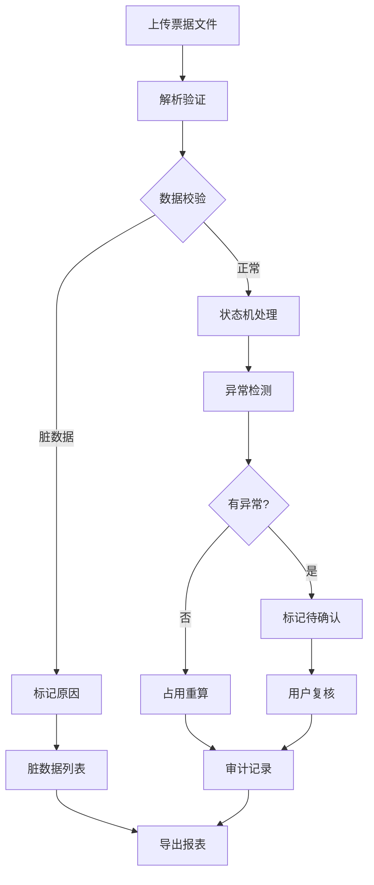

## 1. 产品概述

企业票据池管理系统是专为企业资金经理设计，解决银行回单干扰下的票据管理问题。系统支持批量文件导入，自动分离正常数据与脏数据，对异常情况（到期未释放、展期后仍提示到期、同票重复质押）进行标记待确认，确保票据状态机、到期提醒、释放回写、占用重算、审计导出等功能深度参与业务判断。

## 2. 核心功能

### 2.1 用户角色

| 角色 | 注册方式 | 核心权限 |
|------|-----------|----------|
| 资金经理 | 企业账号登录 | 批量导入、票据管理、异常处理、审计导出、数据看板 |

### 2.2 功能模块

1. **数据看板**：总览票据池概览、风险预警、到期提醒
2. **批量导入**：文件上传、数据解析、正常/脏数据分离
3. **票据管理**：票据列表、状态机流转、明细钻取
4. **异常中心**：异常检测、待确认列表、异常处理
5. **审计导出**：审计日志、导出报表

### 2.3 页面详情

| 页面名称 | 模块名称 | 功能描述 |
|---------|---------|----------|
| 数据看板 | 概览卡片 | 展示质押票、到期票、保证金释放统计 |
| 数据看板 | 趋势图表 | 票据状态分布、到期趋势、风险评分 |
| 数据看板 | 风险预警 | 高亮异常票据列表 |
| 批量导入 | 文件上传区 | 支持拖拽上传、多文件批量处理 |
| 批量导入 | 解析结果 | 正常数据预览、脏数据展示与原因 |
| 票据管理 | 票据列表 | 筛选、搜索、分页、状态筛选 |
| 票据管理 | 票据详情 | 完整信息、状态历史、操作记录 |
| 异常中心 | 异常列表 | 待确认票据、异常类型分类 |
| 异常中心 | 异常详情 | 异常原因、处理建议、操作按钮 |
| 审计导出 | 操作日志 | 所有操作记录、筛选查询 |
| 审计导出 | 报表导出 | Excel导出、PDF导出 |

## 3. 核心流程

用户上传票据文件 → 系统解析并验证 → 分离正常/脏数据 → 状态机处理 → 异常检测 → 异常标记待确认 → 用户复核确认 → 占用重算 → 审计记录

## 4. 用户界面设计

### 4.1 设计风格

- **主色调**：深蓝(#1e3a5f），代表专业、稳重
- **辅助色**：金色(#d4af37），代表金融、票据
- **警示色**：红色(#dc2626），用于异常提醒
- **按钮风格**：圆角8px，微立体效果
- **字体**：Noto Sans SC，清晰易读
- **布局风格**：卡片式布局，层次分明
- **图标风格**：线性图标，简洁专业

### 4.2 页面设计概览

| 页面名称 | 模块名称 | UI元素 |
|---------|---------|--------|
| 数据看板 | 概览卡片 | 深蓝渐变背景，数值动画，图标装饰 |
| 数据看板 | 趋势图表 | ECharts交互式图表，支持钻取 |
| 批量导入 | 文件上传区 | 虚线边框，拖拽高亮，进度条 |
| 票据管理 | 票据列表 | 斑马纹行，状态标签，操作列 |
| 异常中心 | 异常卡片 | 红色边框，异常徽章，处理按钮 |

### 4.3 响应式

- 桌面端优先设计
- 支持1280px及以上屏幕优化
- 平板端自适应布局
- 触控设备优化触控目标大小

### 4.4 交互动效

- 页面加载时的渐显动画
- 数据更新时的平滑过渡
- 图表钻取时的过渡动画
- 异常提醒的脉冲动画
