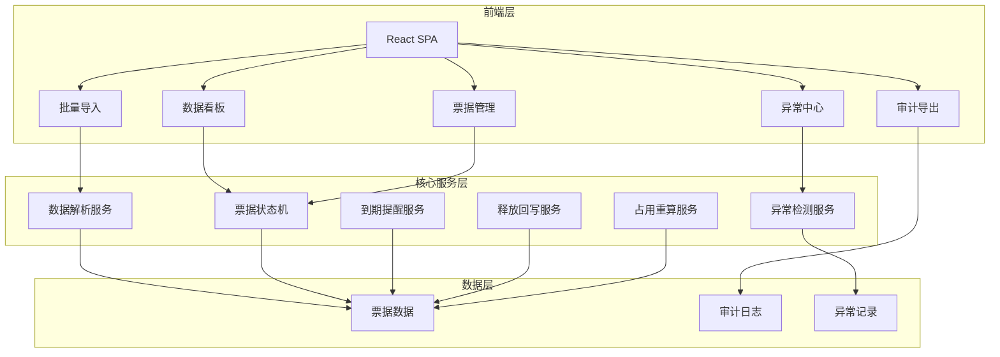
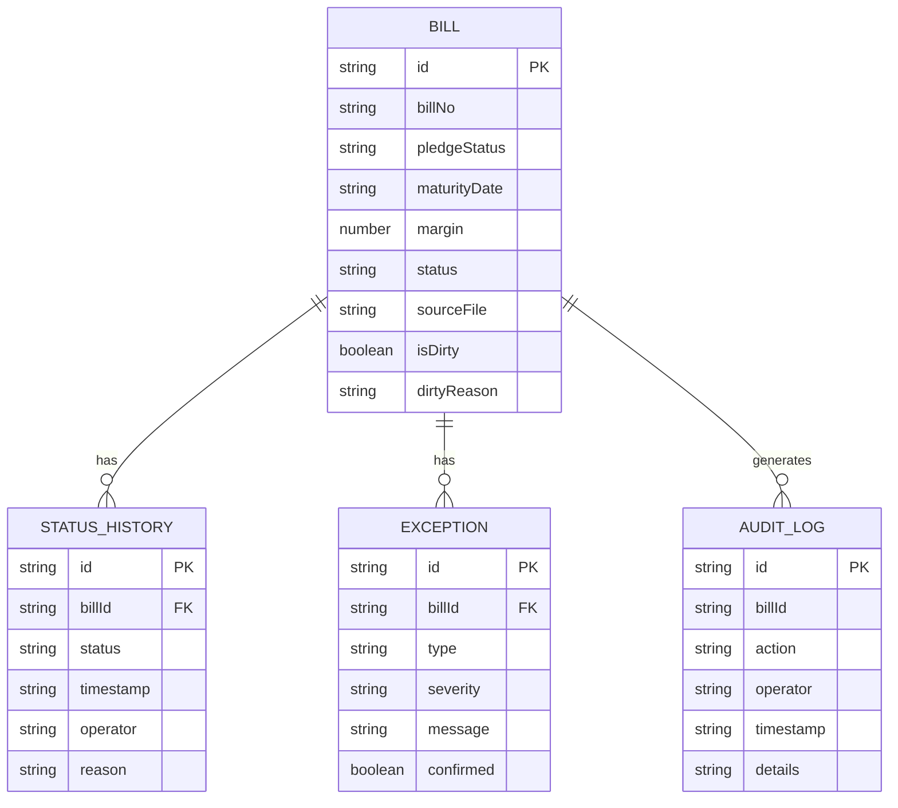

## 1. 架构设计



## 2. 技术描述

- **前端**：React@18 + TypeScript + TailwindCSS@3 + Vite
- **状态管理**：Zustand
- **图表库**：ECharts
- **Excel处理**：SheetJS (xlsx)
- **文件处理**：FileReader API + Papa Parse
- **UI组件**：Radix UI + Lucide Icons
- **后端**：无后端，纯前端实现（LocalStorage持久化）
- **数据存储**：LocalStorage + IndexedDB

## 3. 路由定义

| 路由 | 用途 |
|------|------|
| /dashboard | 数据看板 |
| /import | 批量导入 |
| /bills | 票据管理 |
| /exceptions | 异常中心 |
| /audit | 审计导出 |

## 4. 核心模块定义

### 4.1 票据状态机

```typescript
type BillStatus = 
  | 'pending'      // 待处理
  | 'pledged'      // 已质押
  | 'extended'     // 已展期
  | 'matured'      // 已到期
  | 'released'     // 已释放
  | 'to_confirm'   // 待确认
  | 'closed';      // 已结清

interface StateTransition {
  from: BillStatus[];
  to: BillStatus;
  condition: (bill: Bill) => boolean;
  action: string;
}
```

### 4.2 异常检测服务

```typescript
interface ExceptionCheck {
  type: 'overdue_not_released' | 'extended_still_matured' | 'duplicate_pledged';
  check: (bill: Bill, allBills: Bill[]) => boolean;
  severity: 'high' | 'medium' | 'low';
  message: string;
}
```

### 4.3 票据数据模型

```typescript
interface Bill {
  id: string;
  billNo: string;           // 票据编号
  pledgeStatus: string;     // 质押状态
  maturityDate: string;     // 到期日
  originalMaturityDate?: string; // 原始到期日
  margin: number;           // 保证金
  releaseApplication?: string; // 释放申请
  occupancyReport?: string;  // 占用报告
  status: BillStatus;       // 当前状态
  statusHistory: StatusHistoryItem[];
  exceptions: ExceptionItem[];
  createdAt: string;
  updatedAt: string;
  sourceFile: string;
  isDirty: boolean;
  dirtyReason?: string;
}

interface StatusHistoryItem {
  status: BillStatus;
  timestamp: string;
  operator: string;
  reason: string;
}

interface ExceptionItem {
  type: string;
  severity: string;
  message: string;
  detectedAt: string;
  confirmed: boolean;
  confirmedBy?: string;
  confirmedAt?: string;
}
```

## 5. 数据模型ER图



## 6. 核心业务规则

### 6.1 到期提醒规则
- 到期前7天：黄色预警
- 到期前3天：橙色预警
- 到期当天：红色预警
- 到期未释放：标记异常，状态转为待确认

### 6.2 异常检测规则
1. **到期未释放**：到期日已过且质押状态为已质押
2. **展期后仍提示到期**：展期后到期日已更新但系统仍提示原到期日
3. **同票重复质押**：同一票据编号存在多条质押记录

### 6.3 占用重算规则
- 每次状态变更自动重算
- 保证金释放需回写并重新计算
- 支持补传材料后重新计算
