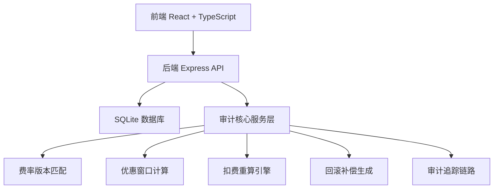
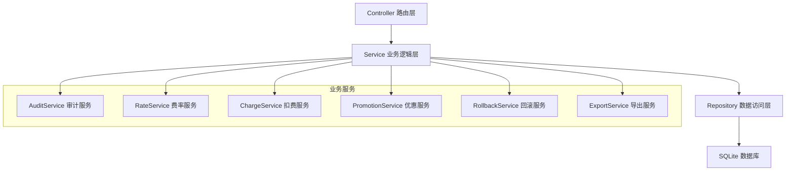
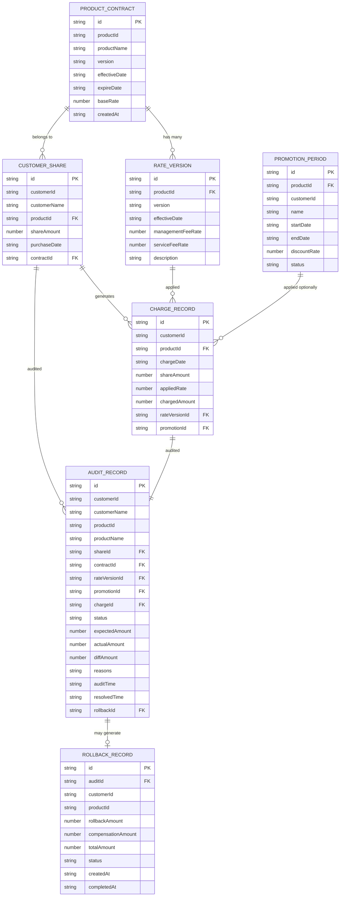

## 1. 架构设计



## 2. 技术描述

- **前端**：React@18 + TypeScript + Vite + TailwindCSS@3 + Zustand + React Router + Lucide React + xlsx
- **后端**：Express@4 + TypeScript + better-sqlite3 + cors
- **数据库**：SQLite（本地文件，无需额外服务）
- **初始化工具**：vite-init 模板 react-express-ts

## 3. 路由定义

| 路由 | 页面 | 说明 |
|-------|------|------|
| `/` | 审计工作台 | 审计任务列表、统计概览、筛选 |
| `/audit/:id` | 审计详情 | 全链路追溯、问题诊断、重算操作 |
| `/rate-versions` | 费率版本 | 产品费率版本配置列表 |
| `/export` | 审计导出 | 导出审计报告 |

## 4. API 定义

### 4.1 类型定义

```typescript
// 产品合同
interface ProductContract {
  id: string;
  productId: string;
  productName: string;
  version: string;
  effectiveDate: string;
  expireDate: string | null;
  baseRate: number;
  createdAt: string;
}

// 客户份额
interface CustomerShare {
  id: string;
  customerId: string;
  customerName: string;
  productId: string;
  shareAmount: number;
  purchaseDate: string;
  contractId: string;
}

// 费率版本
interface RateVersion {
  id: string;
  productId: string;
  version: string;
  effectiveDate: string;
  managementFeeRate: number;
  serviceFeeRate: number;
  description: string;
}

// 优惠期
interface PromotionPeriod {
  id: string;
  productId: string;
  customerId: string | null; // null 表示全员
  name: string;
  startDate: string;
  endDate: string;
  discountRate: number; // 折扣率，0.8表示8折
  status: 'active' | 'expired';
}

// 扣费流水
interface ChargeRecord {
  id: string;
  customerId: string;
  productId: string;
  chargeDate: string;
  shareAmount: number;
  appliedRate: number;
  chargedAmount: number;
  rateVersionId: string;
  promotionId: string | null;
}

// 审计记录
interface AuditRecord {
  id: string;
  customerId: string;
  customerName: string;
  productId: string;
  productName: string;
  shareId: string;
  contractId: string;
  rateVersionId: string;
  promotionId: string | null;
  chargeId: string;
  status: 'pending' | 'normal' | 'abnormal' | 'resolved';
  expectedAmount: number;
  actualAmount: number;
  diffAmount: number;
  reasons: string[];
  auditTime: string;
  resolvedTime: string | null;
  rollbackId: string | null;
}

// 回滚补偿
interface RollbackRecord {
  id: string;
  auditId: string;
  customerId: string;
  productId: string;
  rollbackAmount: number;
  compensationAmount: number;
  totalAmount: number;
  status: 'pending' | 'completed';
  createdAt: string;
  completedAt: string | null;
}

// 审计链路节点
interface AuditLinkNode {
  type: 'contract' | 'share' | 'rate' | 'promotion' | 'charge' | 'audit';
  data: any;
  status: 'ok' | 'warning' | 'error';
  message: string;
}
```

### 4.2 接口列表

| 方法 | 路径 | 说明 |
|------|------|------|
| GET | `/api/audits` | 获取审计记录列表（支持筛选） |
| GET | `/api/audits/:id` | 获取单条审计详情（含链路） |
| POST | `/api/audits` | 创建新的审计任务 |
| POST | `/api/audits/:id/recalculate` | 执行扣费重算 |
| POST | `/api/audits/:id/rollback` | 生成回滚补偿方案 |
| POST | `/api/audits/:id/resolve` | 标记审计问题已解决 |
| GET | `/api/audits/:id/chain` | 获取审计链路数据 |
| GET | `/api/rate-versions` | 获取费率版本列表 |
| GET | `/api/contracts` | 获取产品合同列表 |
| GET | `/api/export/audit/:id` | 导出单条审计报告 |
| GET | `/api/export/audits` | 批量导出审计报告 |
| GET | `/api/stats` | 获取审计统计数据 |

## 5. 服务端架构



## 6. 数据模型

### 6.1 ER 图



### 6.2 DDL 语句

```sql
-- 产品合同表
CREATE TABLE product_contract (
  id TEXT PRIMARY KEY,
  product_id TEXT NOT NULL,
  product_name TEXT NOT NULL,
  version TEXT NOT NULL,
  effective_date TEXT NOT NULL,
  expire_date TEXT,
  base_rate REAL NOT NULL,
  created_at TEXT NOT NULL,
  UNIQUE(product_id, version)
);

-- 客户份额表
CREATE TABLE customer_share (
  id TEXT PRIMARY KEY,
  customer_id TEXT NOT NULL,
  customer_name TEXT NOT NULL,
  product_id TEXT NOT NULL,
  share_amount REAL NOT NULL,
  purchase_date TEXT NOT NULL,
  contract_id TEXT NOT NULL,
  FOREIGN KEY (contract_id) REFERENCES product_contract(id)
);

-- 费率版本表
CREATE TABLE rate_version (
  id TEXT PRIMARY KEY,
  product_id TEXT NOT NULL,
  version TEXT NOT NULL,
  effective_date TEXT NOT NULL,
  management_fee_rate REAL NOT NULL,
  service_fee_rate REAL NOT NULL,
  description TEXT,
  FOREIGN KEY (product_id) REFERENCES product_contract(product_id),
  UNIQUE(product_id, version)
);

-- 优惠期表
CREATE TABLE promotion_period (
  id TEXT PRIMARY KEY,
  product_id TEXT NOT NULL,
  customer_id TEXT,
  name TEXT NOT NULL,
  start_date TEXT NOT NULL,
  end_date TEXT NOT NULL,
  discount_rate REAL NOT NULL,
  status TEXT NOT NULL DEFAULT 'active',
  FOREIGN KEY (product_id) REFERENCES product_contract(product_id)
);

-- 扣费流水表
CREATE TABLE charge_record (
  id TEXT PRIMARY KEY,
  customer_id TEXT NOT NULL,
  product_id TEXT NOT NULL,
  charge_date TEXT NOT NULL,
  share_amount REAL NOT NULL,
  applied_rate REAL NOT NULL,
  charged_amount REAL NOT NULL,
  rate_version_id TEXT NOT NULL,
  promotion_id TEXT,
  FOREIGN KEY (product_id) REFERENCES product_contract(product_id),
  FOREIGN KEY (rate_version_id) REFERENCES rate_version(id),
  FOREIGN KEY (promotion_id) REFERENCES promotion_period(id)
);

-- 审计记录表
CREATE TABLE audit_record (
  id TEXT PRIMARY KEY,
  customer_id TEXT NOT NULL,
  customer_name TEXT NOT NULL,
  product_id TEXT NOT NULL,
  product_name TEXT NOT NULL,
  share_id TEXT NOT NULL,
  contract_id TEXT NOT NULL,
  rate_version_id TEXT NOT NULL,
  promotion_id TEXT,
  charge_id TEXT NOT NULL,
  status TEXT NOT NULL DEFAULT 'pending',
  expected_amount REAL NOT NULL,
  actual_amount REAL NOT NULL,
  diff_amount REAL NOT NULL,
  reasons TEXT NOT NULL,
  audit_time TEXT NOT NULL,
  resolved_time TEXT,
  rollback_id TEXT,
  FOREIGN KEY (share_id) REFERENCES customer_share(id),
  FOREIGN KEY (contract_id) REFERENCES product_contract(id),
  FOREIGN KEY (rate_version_id) REFERENCES rate_version(id),
  FOREIGN KEY (promotion_id) REFERENCES promotion_period(id),
  FOREIGN KEY (charge_id) REFERENCES charge_record(id),
  FOREIGN KEY (rollback_id) REFERENCES rollback_record(id)
);

-- 回滚补偿表
CREATE TABLE rollback_record (
  id TEXT PRIMARY KEY,
  audit_id TEXT NOT NULL,
  customer_id TEXT NOT NULL,
  product_id TEXT NOT NULL,
  rollback_amount REAL NOT NULL,
  compensation_amount REAL NOT NULL,
  total_amount REAL NOT NULL,
  status TEXT NOT NULL DEFAULT 'pending',
  created_at TEXT NOT NULL,
  completed_at TEXT,
  FOREIGN KEY (audit_id) REFERENCES audit_record(id)
);

-- 索引
CREATE INDEX idx_audit_customer ON audit_record(customer_id);
CREATE INDEX idx_audit_product ON audit_record(product_id);
CREATE INDEX idx_audit_status ON audit_record(status);
CREATE INDEX idx_charge_customer ON charge_record(customer_id);
CREATE INDEX idx_charge_date ON charge_record(charge_date);
CREATE INDEX idx_promotion_dates ON promotion_period(start_date, end_date);
```
