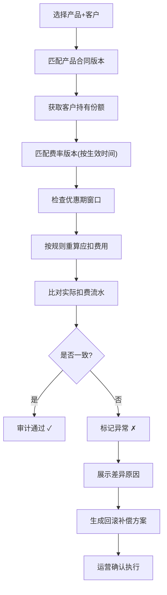

## 1. 产品概述

产品费率版本审计服务，用于资管产品费率调整后，对老客户、优惠期、新合同的扣费规则进行全链路审计追溯，确保收费合规准确。

- **核心痛点**：优惠期跨月计算错误、老合同误套新费率、扣费回滚缺失导致客户投诉
- **目标用户**：资管运营人员、合规审计人员
- **产品价值**：每条扣费记录可追溯至合同→费率版本→优惠期→扣费流水→审计结论的完整链路

## 2. 核心功能

### 2.1 用户角色

| 角色 | 注册方式 | 核心权限 |
|------|----------|----------|
| 运营人员 | 系统账号 | 费率审计、重算扣费、导出报告 |
| 审计人员 | 系统账号 | 查看审计记录、导出审计报告 |

### 2.2 功能模块

1. **审计工作台**：审计任务列表、筛选、状态总览
2. **费率版本管理**：产品费率版本配置、生效时间、费率参数
3. **审计详情**：单条审计记录全链路追溯、问题原因展示
4. **扣费重算**：按正确规则重算费用、生成补偿方案
5. **审计导出**：导出审计报告、支持Excel格式

### 2.3 页面详情

| 页面名称 | 模块名称 | 功能描述 |
|-----------|-------------|---------------------|
| 审计工作台 | 任务列表 | 展示审计记录、状态标签、快速筛选 |
| 审计工作台 | 统计概览 | 正常/异常/待处理数量统计 |
| 审计详情 | 链路追溯 | 合同→份额→费率→优惠→流水→审计 全链路可视化 |
| 审计详情 | 问题诊断 | 异常原因高亮、规则匹配失败说明 |
| 审计详情 | 重算操作 | 执行重算、查看差异、生成补偿 |
| 费率版本 | 版本列表 | 产品费率版本配置、生效时间段 |
| 审计导出 | 报告导出 | 按条件筛选导出审计报告 |

## 3. 核心流程

### 3.1 审计流程

运营人员选择产品和客户，系统自动匹配合同版本、客户持有份额、对应费率版本、优惠期规则，重算应扣费用并与实际扣费流水比对，生成审计结论。异常记录高亮原因并提供回滚补偿方案。

### 3.2 演示数据场景

**场景1：顺利流程**
- 客户A，产品X，合同v2（2024-01-01生效），费率1.5%，无优惠期
- 实际扣费与重算一致，审计通过

**场景2：异常流程（卡住的真实案例）**
- 客户B，产品Y，合同v1（老合同0.8%费率），优惠期2024-03-15至2024-04-15（跨月）
- 问题：系统误套用2024-04-01生效的新费率v2（1.2%），且优惠期跨月计算时4月整月未享优惠
- 结果：多扣费，需要回滚补偿

## 4. 用户界面设计

### 4.1 设计风格

- **主色调**：深蓝 `#1e3a5f`（专业可靠），辅助色：深青 `#0f766e`
- **状态色**：成功 `#059669`，警告 `#d97706`，危险 `#dc2626`，信息 `#2563eb`
- **字体**：标题用 `JetBrains Mono`（等宽专业），正文用 `Noto Sans SC`（清晰易读）
- **布局**：卡片式布局，数据密集区域使用表格，时间轴展示审计链路
- **风格**：深色主题，金融科技感，微交互动画，数据变化高亮

### 4.2 页面设计概览

| 页面名称 | 模块名称 | UI元素 |
|-----------|-------------|-------------|
| 审计工作台 | 统计概览 | 数据卡片、状态色块、数字动效 |
| 审计工作台 | 任务列表 | 数据表格、状态标签、行悬停效果 |
| 审计详情 | 链路追溯 | 垂直时间轴、节点连接线、点击展开详情 |
| 审计详情 | 问题诊断 | 红色高亮卡片、原因列表、差异对比表 |
| 费率版本 | 版本列表 | 时间线布局、生效区间可视化 |

### 4.3 响应式

- 桌面端优先（1280px+），适配运营人员大屏工作
- 表格区域支持横向滚动
- 筛选区域在小屏折叠为抽屉
