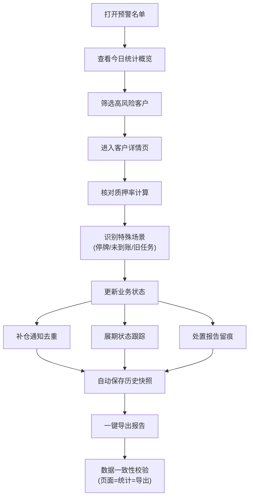
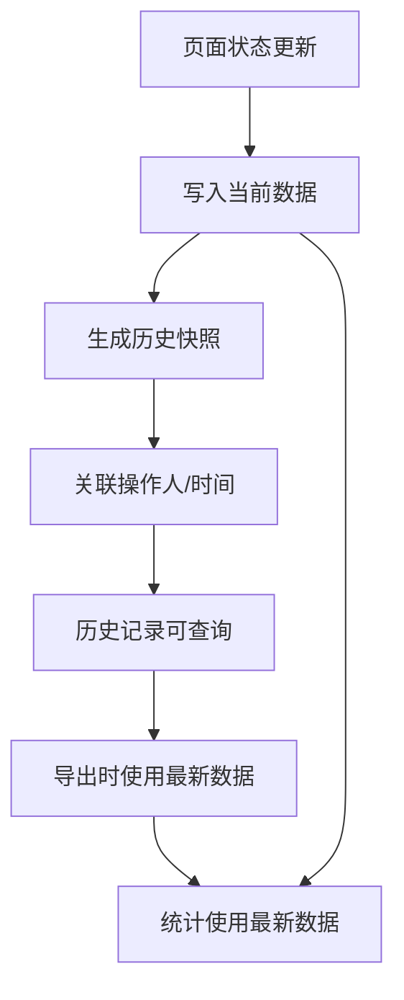

## 1. 产品概述

股票质押预警管理系统是为券商风控部门设计的一站式质押业务风险管理工具。系统围绕客户账户、质押股票、行情、警戒线、补仓记录、处置报告六大核心数据，实现导入、查询、导出的业务闭环，帮助风控人员在午后快速识别触线客户、管理补仓通知、跟踪展期状态、留存处置痕迹。

### 1.1 解决的核心问题
- 质押客户触线判断依赖人工计算，效率低下易出错
- 补仓通知、展期和处置状态分散在微信群，缺乏统一管理
- 特殊场景（停牌估值、补仓未到账、展期旧任务）容易遗漏
- 页面统计、详情、导出数据不一致，可信度低
- 历史变更无法追溯，操作留痕困难

### 1.2 目标用户
券商风控部门人员，负责股票质押业务的日常监控、风险处置和报告生成。

### 1.3 产品价值
- **效率提升**：质押率自动计算，预警名单实时生成
- **风险可控**：特殊场景智能识别，避免遗漏关键风险
- **数据一致**：页面、统计、导出使用同一数据源
- **全程留痕**：所有操作自动记录，历史可追溯
- **闭环管理**：导入-查询-处置-导出全流程打通

---

## 2. 核心功能

### 2.1 用户角色
| 角色 | 注册方式 | 核心权限 |
|------|----------|----------|
| 风控人员 | 系统内置 | 数据导入、预警查询、状态更新、报告导出、历史查看 |

### 2.2 功能模块

1. **预警名单主页**：当日预警客户列表、核心指标统计、快捷筛选
2. **客户详情页**：单客户质押明细、补仓记录、展期状态、处置历史
3. **数据导入**：六大核心数据导入、格式校验、异常识别
4. **数据导出**：标准化报告导出、支持多格式
5. **历史记录**：操作留痕、变更追溯、状态快照

### 2.3 页面详情
| 页面名称 | 模块名称 | 功能描述 |
|----------|----------|----------|
| 预警名单主页 | 顶部统计栏 | 今日触线总数、待补仓、待展期、待处置、异常识别数量 |
| 预警名单主页 | 筛选搜索区 | 按账户、股票、风险等级、状态、日期筛选 |
| 预警名单主页 | 预警列表 | 客户账户、质押股票、质押率、警戒线、触线状态、最新行情、操作按钮 |
| 预警名单主页 | 异常标签区 | 停牌估值、补仓未到账、展期旧任务等特殊场景高亮 |
| 客户详情页 | 基本信息卡 | 客户信息、质押合约信息、警戒线、平仓线 |
| 客户详情页 | 质押率计算区 | 实时行情、质押股票市值、融资本金、质押率计算过程 |
| 客户详情页 | 补仓记录区 | 补仓历史、到账状态、补仓后质押率 |
| 客户详情页 | 通知管理区 | 通知发送记录、去重标记、最新通知状态 |
| 客户详情页 | 展期管理区 | 展期申请、审批状态、展期后警戒线调整 |
| 客户详情页 | 处置记录区 | 处置报告、操作留痕、状态流转 |
| 数据导入页 | 导入向导 | 分类型导入、模板下载、进度显示 |
| 数据导入页 | 异常预览 | 导入前异常识别、错误提示、确认后导入 |
| 历史记录页 | 操作日志 | 所有操作时间线、变更前后对比 |

---

## 3. 核心业务流程

### 3.1 主流程描述
风控人员每日午后打开系统，首先查看当日预警名单统计概览，通过筛选快速定位高风险客户。点击客户进入详情页，核对质押率计算过程，查看补仓/展期/处置状态。根据实际情况更新状态（如标记补仓到账、提交展期申请、录入处置报告），所有操作自动留痕。最后一键导出标准化处置报告。

### 3.2 业务流程图

### 3.3 数据更新与历史追溯流程

---

## 4. 用户界面设计

### 4.1 设计风格

**整体定位**：专业、严谨、高效的金融风控工具界面

- **主色调**：深蓝（#1e3a5f）- 代表专业和信任
- **辅助色**：
  - 警戒红（#dc2626）- 触线预警
  - 关注橙（#f97316）- 待处理
  - 安全绿（#059669）- 正常
  - 信息蓝（#3b82f6）- 一般信息
  - 异常紫（#9333ea）- 特殊场景识别
- **中性色**：深灰（#1f2937）、中灰（#6b7280）、浅灰（#f3f4f6）、白色（#ffffff）

**字体选择**：
- 显示字体：Noto Serif SC - 专业金融感
- 正文字体：Noto Sans SC - 清晰易读
- 等宽字体：JetBrains Mono - 数字展示

**按钮风格**：
- 直角按钮，2px边框，4px圆角
- 主按钮：深蓝底白字，hover时加深10%
- 次要按钮：白底深蓝字边框，hover时浅蓝背景
- 危险按钮：红底白字

**布局风格**：
- 顶部固定导航 + 左侧筛选面板 + 右侧内容区
- 卡片式布局，卡片间8px间距，卡片内16px内边距
- 数据表格使用斑马纹，重要行高亮

**图标风格**：
- 使用Lucide图标库，线性风格
- 图标与文字间距4px，统一16px尺寸

### 4.2 页面设计概览

| 页面名称 | 模块名称 | UI元素 |
|----------|----------|--------|
| 预警名单主页 | 顶部统计栏 | 5个统计卡片，各带趋势箭头和环比数字，异常卡片紫色边框高亮 |
| 预警名单主页 | 筛选搜索区 | 下拉筛选器、日期范围、搜索框，紧凑排列 |
| 预警名单主页 | 预警列表 | 数据表格，行高48px，触线行红底淡色背景，异常行带紫色角标 |
| 预警名单主页 | 异常标签 | 悬浮提示框，显示异常详情和处理建议 |
| 客户详情页 | 基本信息卡 | 双列布局，关键字段加粗，警戒线/平仓线用进度条可视化 |
| 客户详情页 | 质押率计算区 | 分步计算展示，输入项可编辑，实时重算，公式透明可见 |
| 客户详情页 | 时间线区域 | 补仓、通知、展期、处置统一时间线，不同类型不同颜色标记 |
| 客户详情页 | 操作区 | 右侧固定操作栏，状态更新按钮，操作后自动刷新 |
| 数据导入页 | 导入向导 | 三步式引导，拖拽上传区域，进度条动画 |
| 数据导入页 | 异常预览 | 异常行红框标记，鼠标悬浮显示错误原因 |
| 历史记录页 | 时间线 | 垂直时间线，每次变更显示前后对比，支持筛选操作类型 |

### 4.3 交互细节

- **页面加载**：骨架屏加载，分区块渐入动画
- **状态更新**：操作后显示成功提示，数据区域淡入刷新
- **异常识别**：导入时实时计算，异常项抖动+高亮提示
- **表格交互**：行hover显示快捷操作按钮，点击展开详情预览
- **导出过程**：生成中显示进度条，完成后自动下载，校验文件完整性

### 4.4 响应式设计
- **桌面端优先**：最小支持1280px宽度，主要面向大屏显示器
- **平板适配**：1024px以上保持完整功能，筛选区可折叠
- **移动端**：768px以下转为单列布局，核心功能可用

---

## 5. 核心业务规则

### 5.1 质押率计算规则
- 质押率 = 融资本金 / (质押股数 × 最新股价) × 100%
- 停牌股票使用估值价格（最近收盘价 × 估值折扣）
- 补仓到账后实时重新计算质押率
- 展期后警戒线/平仓线可能调整

### 5.2 通知去重规则
- 同一客户同一触线原因24小时内只发送一次通知
- 客户状态变更（补仓到账、展期获批）后可重新发送
- 通知记录包含：发送时间、方式、内容、接收人

### 5.3 展期状态规则
- 展期申请中：保持原警戒线，标记"展期待批"
- 展期获批：更新警戒线，标记"已展期"，旧任务归档
- 展期后仍触线：生成新预警，保留旧预警历史

### 5.4 处置留痕规则
- 所有状态变更自动记录：操作人、时间、变更内容
- 处置报告上传后关联到对应预警记录
- 历史记录不可删除，只能追加

### 5.5 特殊场景识别规则
- **停牌估值**：股票状态为停牌，使用估值折扣计算
- **补仓未到账**：已有补仓记录但资金未到账，标记"待到账"
- **展期旧任务**：展期获批后原预警仍在列表，标记"已展期"并归档

### 5.6 数据一致性规则
- 页面展示、统计计算、导出报告使用同一数据源
- 状态更新后立即刷新统计数据
- 导出前进行数据校验，确保三方一致
