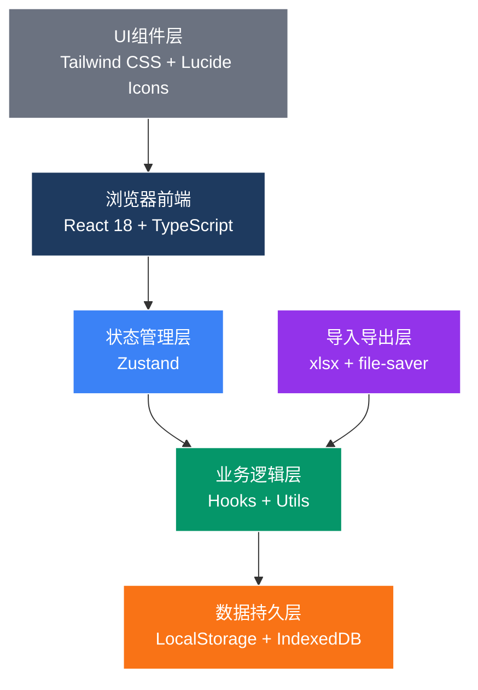
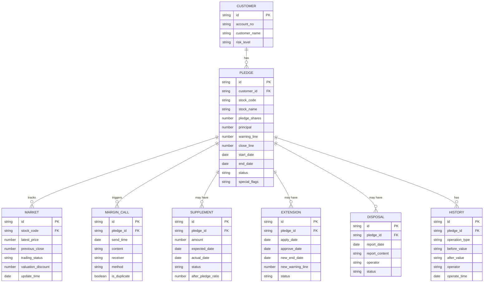

## 1. 架构设计



---

## 2. 技术选型说明

### 2.1 技术栈
- **前端框架**: React 18 + TypeScript - 类型安全，组件化开发
- **构建工具**: Vite - 快速开发构建
- **状态管理**: Zustand - 轻量级，易于调试
- **样式方案**: Tailwind CSS 3 - 原子化CSS，快速开发
- **图标库**: Lucide React - 线性图标，风格统一
- **Excel处理**: xlsx (SheetJS) - 导入导出Excel
- **文件保存**: file-saver - 客户端文件下载
- **日期处理**: date-fns - 轻量级日期库

### 2.2 项目初始化
- 使用 `vite-init` 脚手架创建 React + TypeScript 项目
- 包管理器: pnpm（优先）/ npm
- 纯前端应用，无需后端，数据存储在浏览器本地

### 2.3 数据存储方案
- **LocalStorage**: 存储配置信息、用户偏好
- **IndexedDB**: 存储大量业务数据（客户信息、交易记录等）
- **内存状态**: Zustand 管理运行时状态
- **数据导入**: 支持Excel格式导入，导入后存入IndexedDB

---

## 3. 路由定义

| 路由 | 页面名称 | 功能说明 |
|------|----------|----------|
| `/` | 预警名单主页 | 当日预警列表、统计概览、筛选搜索 |
| `/customer/:id` | 客户详情页 | 单客户质押明细、状态更新、历史记录 |
| `/import` | 数据导入页 | 六大核心数据导入、异常预览 |
| `/history` | 历史记录页 | 操作日志、变更追溯 |
| `/export` | 导出中心 | 报告导出、历史导出记录 |

---

## 4. 数据模型定义

### 4.1 核心数据实体关系



### 4.2 TypeScript 类型定义

```typescript
// 客户信息
interface Customer {
  id: string;
  accountNo: string;
  customerName: string;
  riskLevel: 'low' | 'medium' | 'high';
}

// 质押合约
interface Pledge {
  id: string;
  customerId: string;
  stockCode: string;
  stockName: string;
  pledgeShares: number;
  principal: number;
  warningLine: number;
  closeLine: number;
  startDate: string;
  endDate: string;
  status: 'normal' | 'warning' | 'close' | 'extended' | 'disposed';
  specialFlags: SpecialFlag[];
  createdAt: string;
  updatedAt: string;
}

// 特殊标记
type SpecialFlag = 'suspended' | 'supplement_pending' | 'extension_old' | 'extension_pending';

// 行情数据
interface MarketData {
  id: string;
  stockCode: string;
  latestPrice: number;
  previousClose: number;
  tradingStatus: 'normal' | 'suspended' | 'halted';
  valuationDiscount: number;
  updateTime: string;
}

// 补仓通知
interface MarginCall {
  id: string;
  pledgeId: string;
  sendTime: string;
  content: string;
  receiver: string;
  method: 'sms' | 'email' | 'phone';
  isDuplicate: boolean;
}

// 补仓记录
interface SupplementRecord {
  id: string;
  pledgeId: string;
  amount: number;
  expectedDate: string;
  actualDate?: string;
  status: 'pending' | 'received' | 'cancelled';
  afterPledgeRatio: number;
}

// 展期记录
interface ExtensionRecord {
  id: string;
  pledgeId: string;
  applyDate: string;
  approveDate?: string;
  newEndDate: string;
  newWarningLine: number;
  status: 'pending' | 'approved' | 'rejected';
}

// 处置报告
interface DisposalReport {
  id: string;
  pledgeId: string;
  reportDate: string;
  reportContent: string;
  operator: string;
  status: 'draft' | 'submitted' | 'completed';
}

// 历史记录
interface HistoryRecord {
  id: string;
  pledgeId: string;
  operationType: 'status_update' | 'supplement' | 'extension' | 'disposal' | 'import';
  fieldName: string;
  beforeValue: string;
  afterValue: string;
  operator: string;
  operateTime: string;
}

// 计算结果
interface PledgeCalculation {
  marketValue: number;
  effectivePrice: number;
  pledgeRatio: number;
  isWarning: boolean;
  isClose: boolean;
  warningBuffer: number;
  effectiveWarningLine: number;
}

// 统计数据
interface Statistics {
  totalWarning: number;
  pendingSupplement: number;
  pendingExtension: number;
  pendingDisposal: number;
  specialCases: number;
  lastUpdateTime: string;
}
```

---

## 5. 状态管理设计

### 5.1 Zustand Store 结构

```typescript
interface AppState {
  // 数据
  customers: Customer[];
  pledges: Pledge[];
  marketData: Record<string, MarketData>;
  marginCalls: MarginCall[];
  supplements: SupplementRecord[];
  extensions: ExtensionRecord[];
  disposals: DisposalReport[];
  history: HistoryRecord[];
  
  // 筛选状态
  filters: {
    searchText: string;
    riskLevel: string;
    status: string;
    specialFlag: string;
    dateRange: [string, string];
  };
  
  // UI 状态
  loading: boolean;
  selectedPledgeId: string | null;
  
  // 计算方法
  calculatePledge: (pledgeId: string) => PledgeCalculation;
  getStatistics: () => Statistics;
  getFilteredPledges: () => Pledge[];
  
  // 操作方法
  importData: (type: string, data: any[]) => ImportResult;
  updatePledgeStatus: (pledgeId: string, status: string) => void;
  addSupplement: (pledgeId: string, data: Partial<SupplementRecord>) => void;
  addExtension: (pledgeId: string, data: Partial<ExtensionRecord>) => void;
  addDisposal: (pledgeId: string, data: Partial<DisposalReport>) => void;
  sendMarginCall: (pledgeId: string, method: string) => { success: boolean; isDuplicate: boolean };
  exportReport: (filters: any) => Blob;
  
  // 存储方法
  saveToStorage: () => void;
  loadFromStorage: () => void;
}
```

---

## 6. 核心业务逻辑

### 6.1 质押率计算逻辑

```typescript
function calculatePledgeRatio(
  pledge: Pledge,
  marketData: MarketData | undefined,
  supplements: SupplementRecord[]
): PledgeCalculation {
  // 1. 确定有效价格
  let effectivePrice: number;
  if (!marketData) {
    effectivePrice = 0;
  } else if (marketData.tradingStatus === 'suspended') {
    // 停牌股票使用估值折扣
    effectivePrice = marketData.previousClose * marketData.valuationDiscount;
  } else {
    effectivePrice = marketData.latestPrice;
  }
  
  // 2. 计算市值
  const marketValue = pledge.pledgeShares * effectivePrice;
  
  // 3. 计算已到账补仓金额
  const receivedSupplements = supplements
    .filter(s => s.status === 'received')
    .reduce((sum, s) => sum + s.amount, 0);
  
  // 4. 调整后的本金
  const adjustedPrincipal = Math.max(0, pledge.principal - receivedSupplements);
  
  // 5. 计算质押率
  const pledgeRatio = marketValue > 0 ? (adjustedPrincipal / marketValue) * 100 : 100;
  
  // 6. 确定有效警戒线（考虑展期）
  const activeExtension = extensions.find(e => e.pledgeId === pledge.id && e.status === 'approved');
  const effectiveWarningLine = activeExtension?.newWarningLine ?? pledge.warningLine;
  
  // 7. 判断触线状态
  const isWarning = pledgeRatio >= effectiveWarningLine;
  const isClose = pledgeRatio >= pledge.closeLine;
  const warningBuffer = effectiveWarningLine - pledgeRatio;
  
  return {
    marketValue,
    effectivePrice,
    pledgeRatio,
    isWarning,
    isClose,
    warningBuffer,
    effectiveWarningLine
  };
}
```

### 6.2 通知去重逻辑

```typescript
function shouldSendMarginCall(
  pledgeId: string,
  existingCalls: MarginCall[]
): { shouldSend: boolean; reason?: string } {
  const now = new Date();
  const twentyFourHoursAgo = new Date(now.getTime() - 24 * 60 * 60 * 1000);
  
  // 查找24小时内的通知
  const recentCalls = existingCalls.filter(
    c => c.pledgeId === pledgeId && new Date(c.sendTime) > twentyFourHoursAgo
  );
  
  if (recentCalls.length > 0) {
    return {
      shouldSend: false,
      reason: `24小时内已发送${recentCalls.length}次通知，最后一次：${recentCalls[0].sendTime}`
    };
  }
  
  return { shouldSend: true };
}
```

### 6.3 特殊场景识别逻辑

```typescript
function identifySpecialFlags(
  pledge: Pledge,
  marketData: MarketData | undefined,
  supplements: SupplementRecord[],
  extensions: ExtensionRecord[]
): SpecialFlag[] {
  const flags: SpecialFlag[] = [];
  
  // 停牌估值
  if (marketData?.tradingStatus === 'suspended') {
    flags.push('suspended');
  }
  
  // 补仓未到账
  const pendingSupplements = supplements.filter(
    s => s.pledgeId === pledge.id && s.status === 'pending'
  );
  if (pendingSupplements.length > 0) {
    flags.push('supplement_pending');
  }
  
  // 展期旧任务
  const approvedExtension = extensions.find(
    e => e.pledgeId === pledge.id && e.status === 'approved'
  );
  if (approvedExtension && pledge.status !== 'extended') {
    flags.push('extension_old');
  }
  
  // 展期待批
  const pendingExtension = extensions.find(
    e => e.pledgeId === pledge.id && e.status === 'pending'
  );
  if (pendingExtension) {
    flags.push('extension_pending');
  }
  
  return flags;
}
```

### 6.4 历史记录生成逻辑

```typescript
function createHistoryRecord(
  pledgeId: string,
  operationType: HistoryRecord['operationType'],
  fieldName: string,
  beforeValue: string,
  afterValue: string,
  operator: string
): HistoryRecord {
  return {
    id: generateId(),
    pledgeId,
    operationType,
    fieldName,
    beforeValue,
    afterValue,
    operator,
    operateTime: new Date().toISOString()
  };
}
```

---

## 7. 目录结构

```
src/
├── components/           # 可复用组件
│   ├── layout/          # 布局组件
│   │   ├── Header.tsx
│   │   ├── Sidebar.tsx
│   │   └── Container.tsx
│   ├── tables/          # 表格组件
│   │   ├── WarningListTable.tsx
│   │   └── DataTable.tsx
│   ├── cards/           # 卡片组件
│   │   ├── StatCard.tsx
│   │   ├── CustomerInfoCard.tsx
│   │   └── CalculationCard.tsx
│   ├── forms/           # 表单组件
│   │   ├── SupplementForm.tsx
│   │   ├── ExtensionForm.tsx
│   │   └── DisposalForm.tsx
│   ├── timeline/        # 时间线组件
│   │   └── EventTimeline.tsx
│   ├── import/          # 导入组件
│   │   ├── ImportWizard.tsx
│   │   └── ErrorPreview.tsx
│   └── common/          # 通用组件
│       ├── StatusBadge.tsx
│       ├── SpecialFlagBadge.tsx
│       └── ProgressBar.tsx
├── pages/               # 页面组件
│   ├── WarningList.tsx
│   ├── CustomerDetail.tsx
│   ├── DataImport.tsx
│   ├── HistoryRecord.tsx
│   └── ExportCenter.tsx
├── hooks/               # 自定义Hooks
│   ├── usePledgeCalculation.ts
│   ├── useMarginCall.ts
│   ├── useDataImport.ts
│   ├── useExport.ts
│   └── useStatistics.ts
├── utils/               # 工具函数
│   ├── calculator.ts    # 质押率计算
│   ├── deduplicator.ts  # 通知去重
│   ├── flagDetector.ts  # 特殊场景识别
│   ├── history.ts       # 历史记录
│   ├── excel.ts         # Excel处理
│   ├── storage.ts       # 本地存储
│   ├── validation.ts    # 数据校验
│   └── consistency.ts   # 数据一致性校验
├── store/               # 状态管理
│   └── useAppStore.ts
├── types/               # 类型定义
│   └── index.ts
├── data/                # Mock数据
│   └── mockData.ts
├── App.tsx
├── main.tsx
└── index.css
```

---

## 8. 数据一致性保障方案

### 8.1 单一数据源原则
- 所有页面展示、统计计算、导出报告均从 Zustand Store 获取数据
- 禁止在组件内部维护独立的数据副本

### 8.2 状态更新机制
- 所有数据修改通过 Store 的 action 方法进行
- 每次更新后自动调用 `saveToStorage()` 持久化
- 更新后自动触发相关计算（质押率、统计等）

### 8.3 导出前校验
```typescript
function validateConsistency(store: AppState): boolean {
  const pageData = store.getFilteredPledges();
  const statistics = store.getStatistics();
  
  // 校验统计数据与列表数据一致
  const warningCount = pageData.filter(p => {
    const calc = store.calculatePledge(p.id);
    return calc.isWarning;
  }).length;
  
  if (warningCount !== statistics.totalWarning) {
    console.error('数据不一致：统计数与实际数不符');
    return false;
  }
  
  return true;
}
```

---

## 9. 导入导出规范

### 9.1 导入模板字段

| 数据类型 | 必填字段 | 可选字段 |
|----------|----------|----------|
| 客户账户 | 账户编号、客户姓名 | 风险等级、联系电话 |
| 质押股票 | 账户编号、股票代码、质押股数、融资本金 | 股票名称、开始日期、结束日期 |
| 行情数据 | 股票代码、最新价、交易状态 | 昨收价、估值折扣、更新时间 |
| 警戒线 | 账户编号、警戒线、平仓线 | 展期后警戒线 |
| 补仓记录 | 账户编号、补仓金额、预计到账日 | 实际到账日、状态 |
| 处置报告 | 账户编号、报告日期、报告内容 | 操作人、状态 |

### 9.2 导出报告格式
- **格式**: Excel (.xlsx)
- **Sheet 1**: 预警名单概览（含统计数据）
- **Sheet 2**: 客户明细数据
- **Sheet 3**: 补仓记录
- **Sheet 4**: 展期记录
- **Sheet 5**: 处置记录
- **Sheet 6**: 操作日志

---

## 10. 性能优化

### 10.1 计算优化
- 质押率计算使用 memoization 缓存
- 仅在依赖数据变化时重新计算
- 大数据量时使用虚拟滚动

### 10.2 存储优化
- IndexedDB 存储大量历史数据
- LocalStorage 仅存储配置和最新数据
- 定期清理过期历史记录
