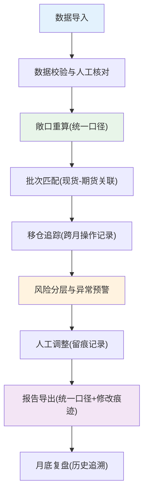

## 1. 产品概述

工厂财务期货套保铜价敞口复核系统，解决现货采购、期货持仓、基差表批次错配问题，统一计算口径，支持人工核对与修改追踪，降低套保操作风险。

- 核心目标：统一敞口计算口径，追踪期货移仓操作，匹配现货批次，减少人为疏漏
- 目标用户：工厂财务人员、套保交易员、风控复核人员

## 2. 核心功能

### 2.1 用户角色

| 角色 | 注册方式 | 核心权限 |
|------|----------|----------|
| 财务操作员 | 系统账号 | 数据导入、敞口计算、人工修改、报告导出 |
| 复核管理员 | 系统账号 | 数据审核、修改追溯、月底复盘 |

### 2.2 功能模块

1. **数据导入中心**：采购合同、期货持仓、基差数据、库存批次、交割月配置
2. **敞口重算引擎**：统一计算口径、筛选条件联动、实时预览
3. **批次匹配模块**：现货-期货批次关联、错配检测、人工核对区
4. **移仓追踪模块**：跨月移仓记录、移仓成本计算、历史追溯
5. **风险分层仪表盘**：敞口分布、基差风险、异常预警
6. **报告导出中心**：统一口径导出、修改痕迹、审计日志

### 2.3 页面详情

| 页面名称 | 模块名称 | 功能描述 |
|----------|----------|----------|
| 数据导入中心 | 批量导入 | 支持Excel批量导入采购合同、期货持仓、基差表，数据校验 |
| 数据导入中心 | 人工核对区 | 脏数据标注、异常值高亮、留空供人工确认 |
| 敞口重算 | 计算配置 | 统一设置计算口径、筛选条件、时间范围，实时生效 |
| 敞口重算 | 实时预览 | 计算结果即时展示，支持钻取查看明细 |
| 批次匹配 | 智能匹配 | 自动匹配现货与期货批次，错配自动标记 |
| 批次匹配 | 人工调整 | 支持手动调整匹配关系，记录修改理由 |
| 移仓追踪 | 移仓记录 | 记录跨月移仓操作，计算移仓成本、盈亏 |
| 移仓追踪 | 历史追溯 | 查看移仓前后对比，支持回滚查看 |
| 风险仪表盘 | 敞口分布 | 按合约、月份、风险等级分层展示敞口 |
| 风险仪表盘 | 异常预警 | 现货批次错配、基差重复扣减等人性化提示 |
| 报告导出 | 统一导出 | 导出口径与页面计算完全一致，支持多种格式 |
| 报告导出 | 修改追溯 | 导出文件包含所有人工修改记录、旧值、修改理由 |

## 3. 核心流程

用户从导入数据开始，经过统一口径的敞口重算，进行批次匹配与移仓追踪，查看风险分层，最后导出包含完整审计痕迹的报告。全程计算口径统一，人工修改全程留痕。

## 4. 用户界面设计

### 4.1 设计风格

- **主色调**：深蓝色(#1976d2)专业稳重，配合深青色(#00796b)风控警示
- **预警色**：橙黄(#f57c00)警告、红色(#d32f2f)错误、绿色(#388e3c)正常
- **按钮风格**：微立体圆角，hover有轻微上浮效果
- **字体**：思源宋体(标题) + JetBrains Mono(数字) + 系统无衬线(正文)
- **布局**：顶部导航 + 左侧菜单 + 主内容卡片式布局
- **图标风格**：线性图标，金融工具主题

### 4.2 页面设计概述

| 页面名称 | 模块名称 | UI元素 |
|----------|----------|--------|
| 数据导入中心 | 导入区域 | 拖拽上传、文件列表、进度条、校验结果表格 |
| 数据导入中心 | 人工核对区 | 可编辑表格、异常行高亮、备注输入框 |
| 敞口重算 | 配置面板 | 筛选条件组、计算口径选择器、应用按钮 |
| 敞口重算 | 结果展示 | 数据表格、汇总卡片、钻取弹窗 |
| 批次匹配 | 匹配视图 | 左右分栏(现货/期货)、连接线、匹配状态标签 |
| 风险仪表盘 | 可视化 | 分层饼图、趋势折线图、预警卡片列表 |
| 风险仪表盘 | 预警提示 | 人性化文案、影响说明、操作建议 |
| 报告导出 | 导出面板 | 格式选择、预览、包含选项(修改记录等) |

### 4.3 响应式

- 桌面端优先(1280px+)，财务人员多使用大屏显示器
- 平板端适配，表格支持横向滚动
- 移动端简化展示，仅支持查看报告与预警

### 4.4 交互细节

- 表格支持固定表头、列排序、筛选
- 人工修改时弹出对比框，显示旧值、输入新值、填写理由
- 预警提示采用卡片式，可展开查看详情与建议
- 数据加载采用骨架屏，提升体验
