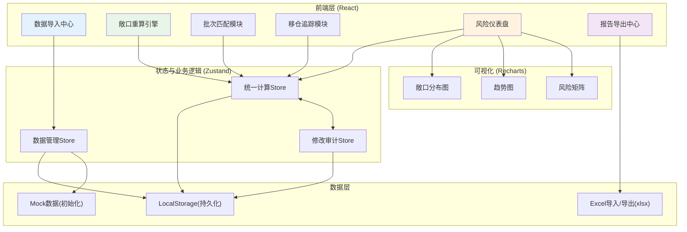
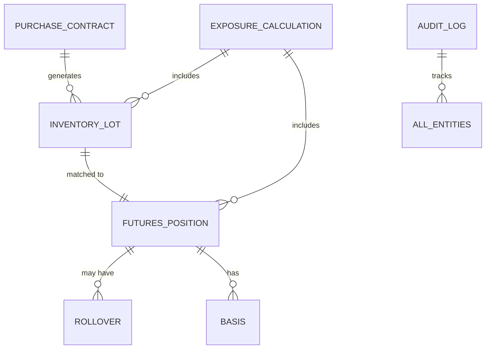

## 1. 架构设计



## 2. 技术描述

- **前端框架**：React@18 + TypeScript
- **构建工具**：Vite@5
- **样式方案**：TailwindCSS@3
- **状态管理**：Zustand@4 (轻量级，支持中间件)
- **UI组件库**：Ant Design@5 (企业级组件，适合财务系统)
- **数据可视化**：Recharts@2
- **Excel处理**：xlsx@0.18
- **日期处理**：dayjs@1
- **图标**：@ant-design/icons
- **数据持久化**：LocalStorage + zustand-persist

## 3. 路由定义

| 路由 | 页面名称 | 核心功能 |
|------|----------|----------|
| /dashboard | 风险仪表盘 | 敞口总览、风险分层、异常预警 |
| /import | 数据导入中心 | 多文件导入、数据校验、人工核对 |
| /exposure | 敞口重算 | 计算配置、实时计算、结果预览 |
| /matching | 批次匹配 | 现货-期货关联、错配检测、人工调整 |
| /rollover | 移仓追踪 | 移仓记录、成本计算、历史追溯 |
| /export | 报告导出 | 统一口径导出、审计痕迹、格式选择 |
| /audit | 修改追溯 | 人工修改记录、旧值对比、月底复盘 |

## 4. 核心数据模型

### 4.1 数据实体关系



### 4.2 TypeScript 类型定义

```typescript
// 采购合同
interface PurchaseContract {
  id: string;
  contractNo: string;
  supplier: string;
  copperGrade: string;
  quantity: number;
  price: number;
  deliveryDate: string;
  arrivalDate?: string;
  status: 'pending' | 'in_transit' | 'received';
  createdAt: string;
}

// 库存批次
interface InventoryLot {
  id: string;
  lotNo: string;
  contractId: string;
  quantity: number;
  warehouse: string;
  receiptDate: string;
  matchedPositionId?: string;
  matchStatus: 'unmatched' | 'matched' | 'mismatch';
  notes?: string;
}

// 期货持仓
interface FuturesPosition {
  id: string;
  contractMonth: string;
  direction: 'long' | 'short';
  quantity: number;
  openPrice: number;
  currentPrice: number;
  openDate: string;
  deliveryMonth: string;
  isRollover: boolean;
  rolloverFromId?: string;
  status: 'open' | 'closed' | 'rolled';
  hedgedLotId?: string;
}

// 移仓记录
interface RolloverRecord {
  id: string;
  fromPositionId: string;
  toPositionId: string;
  rolloverDate: string;
  closePrice: number;
  openPrice: number;
  rolloverCost: number;
  quantity: number;
  reason: string;
}

// 基差记录
interface BasisRecord {
  id: string;
  positionId: string;
  basisDate: string;
  spotPrice: number;
  futuresPrice: number;
  basisValue: number;
  isLocked: boolean;
}

// 敞口计算配置
interface ExposureConfig {
  id: string;
  name: string;
  calculationMethod: 'gross' | 'net' | 'weighted';
  includeUnmatched: boolean;
  dateRange: { start: string; end: string };
  deliveryMonths: string[];
  hedgingRatio: number;
  createdAt: string;
  updatedAt: string;
}

// 敞口计算结果
interface ExposureResult {
  configId: string;
  calculationDate: string;
  totalSpotExposure: number;
  totalFuturesHedge: number;
  netExposure: number;
  hedgingRatio: number;
  basisRisk: number;
  byDeliveryMonth: Record<string, { spot: number; futures: number; net: number }>;
  unmatchedLots: string[];
  warnings: WarningItem[];
}

// 预警项
interface WarningItem {
  id: string;
  type: 'mismatch' | 'rollover' | 'basis_duplicate' | 'other';
  severity: 'low' | 'medium' | 'high';
  title: string;
  description: string;
  suggestion: string;
  relatedEntityId?: string;
  isRead: boolean;
}

// 修改审计记录
interface AuditLog {
  id: string;
  entityType: string;
  entityId: string;
  fieldName: string;
  oldValue: any;
  newValue: any;
  reason: string;
  operator: string;
  timestamp: string;
}
```

## 5. 核心业务逻辑设计

### 5.1 统一计算引擎

```typescript
// 敞口计算核心逻辑
class ExposureCalculator {
  constructor(private config: ExposureConfig) {}
  
  calculate(lots: InventoryLot[], positions: FuturesPosition[]): ExposureResult {
    // 统一筛选逻辑
    const filteredLots = this.filterLots(lots);
    const filteredPositions = this.filterPositions(positions);
    
    // 计算现货敞口
    const spotExposure = this.calculateSpotExposure(filteredLots);
    
    // 计算期货套保
    const futuresHedge = this.calculateFuturesHedge(filteredPositions);
    
    // 计算净敞口
    const netExposure = spotExposure - futuresHedge * this.config.hedgingRatio;
    
    // 异常检测
    const warnings = this.detectWarnings(filteredLots, filteredPositions);
    
    return {
      configId: this.config.id,
      calculationDate: new Date().toISOString(),
      totalSpotExposure: spotExposure,
      totalFuturesHedge: futuresHedge,
      netExposure,
      hedgingRatio: this.config.hedgingRatio,
      basisRisk: this.calculateBasisRisk(),
      byDeliveryMonth: this.groupByDeliveryMonth(filteredLots, filteredPositions),
      unmatchedLots: this.getUnmatchedLots(filteredLots),
      warnings
    };
  }
  
  private detectWarnings(lots: InventoryLot[], positions: FuturesPosition[]): WarningItem[] {
    const warnings: WarningItem[] = [];
    
    // 批次错配检测
    const mismatched = lots.filter(l => l.matchStatus === 'mismatch');
    if (mismatched.length > 0) {
      warnings.push({
        id: `mismatch-${Date.now()}`,
        type: 'mismatch',
        severity: 'high',
        title: `发现 ${mismatched.length} 个现货批次匹配异常`,
        description: `这些批次的数量或日期与对应期货持仓不匹配，可能影响敞口计算准确性`,
        suggestion: '请前往批次匹配页面人工核对调整',
        isRead: false
      });
    }
    
    // 基差重复扣减检测
    const duplicateBasis = this.detectDuplicateBasis(positions);
    if (duplicateBasis.length > 0) {
      warnings.push({
        id: `basis-${Date.now()}`,
        type: 'basis_duplicate',
        severity: 'medium',
        title: '检测到基差可能重复扣减',
        description: `涉及 ${duplicateBasis.length} 个期货持仓，同一合约存在多笔基差记录`,
        suggestion: '请检查基差录入是否重复，避免重复计算影响套保效果',
        isRead: false
      });
    }
    
    // 移仓未完全平盘检测
    const rolloverIssues = this.detectRolloverIssues(positions);
    if (rolloverIssues.length > 0) {
      warnings.push({
        id: `rollover-${Date.now()}`,
        type: 'rollover',
        severity: 'medium',
        title: `发现 ${rolloverIssues.length} 笔移仓操作可能存在遗留敞口`,
        description: '跨月移仓后原合约未完全平盘，可能产生额外敞口',
        suggestion: '请在移仓追踪页面确认移仓是否完整',
        isRead: false
      });
    }
    
    return warnings;
  }
}
```

### 5.2 修改追踪机制

```typescript
// 审计中间件
const auditMiddleware = (config: { entityType: string }) => (config, options) => {
  return (set, get, api) => {
    const auditedSet = (partial, replace) => {
      const oldState = get();
      set(partial, replace);
      const newState = get();
      
      // 检测字段变化并记录审计日志
      Object.keys(partial).forEach(key => {
        if (JSON.stringify(oldState[key]) !== JSON.stringify(newState[key])) {
          addAuditLog({
            entityType: config.entityType,
            entityId: newState.id || 'global',
            fieldName: key,
            oldValue: oldState[key],
            newValue: newState[key],
            reason: newState.lastEditReason || '未填写',
            operator: 'currentUser',
            timestamp: new Date().toISOString()
          });
        }
      });
    };
    
    return config(auditedSet, get, api);
  };
};
```

## 6. 目录结构

```
src/
├── assets/              # 静态资源
├── components/          # 公共组件
│   ├── layout/         # 布局组件
│   ├── table/          # 增强表格组件
│   ├── charts/         # 图表组件
│   └── common/         # 通用组件
├── pages/              # 页面组件
│   ├── Dashboard/
│   ├── ImportCenter/
│   ├── Exposure/
│   ├── Matching/
│   ├── Rollover/
│   ├── Export/
│   └── Audit/
├── store/              # 状态管理
│   ├── calculationStore.ts
│   ├── dataStore.ts
│   └── auditStore.ts
├── types/              # TypeScript类型定义
│   └── index.ts
├── utils/              # 工具函数
│   ├── calculator.ts   # 敞口计算引擎
│   ├── excel.ts        # Excel导入导出
│   └── validator.ts    # 数据校验
├── hooks/              # 自定义Hooks
├── mock/               # Mock数据
└── App.tsx
```
