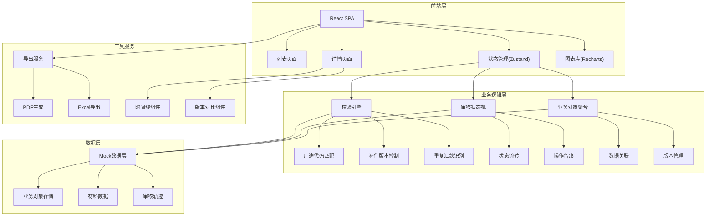
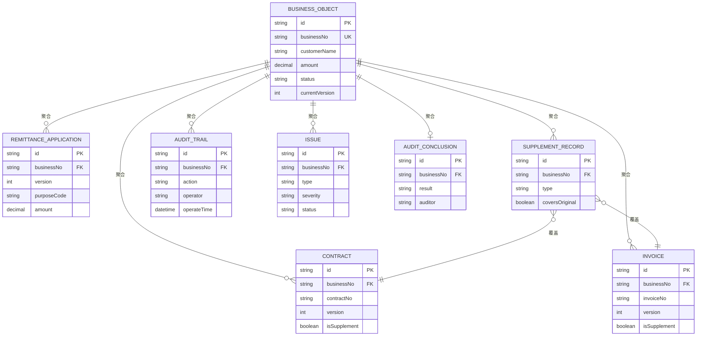

## 1. 架构设计



## 2. 技术描述

- 前端：React@18 + TypeScript + Vite
- 状态管理：zustand@4
- 路由：react-router-dom@6
- 样式：tailwindcss@3
- 图表：recharts@2
- 图标：lucide-react
- 后端：Express@4（可选，纯前端模式下使用Mock数据）
- 数据库：纯前端Mock，localStorage持久化

## 3. 路由定义

| 路由 | 用途 |
|------|------|
| `/` | 业务对象列表页（含仪表盘统计） |
| `/business/:id` | 业务对象详情页（三段式审核） |
| `/business/:id/version-compare` | 版本对比弹窗路由 |

## 4. 核心类型定义

```typescript
// 业务对象 - 所有材料的聚合根
interface BusinessObject {
  id: string;
  businessNo: string;          // 业务编号，用于关联所有材料
  customerName: string;
  customerId: string;
  amount: number;
  currency: string;
  purposeCode: string;
  purposeName: string;
  status: BusinessStatus;
  riskLevel: 'normal' | 'warning' | 'danger';
  createdAt: string;
  updatedAt: string;
  currentVersion: number;
  applications: RemittanceApplication[];
  contracts: Contract[];
  invoices: Invoice[];
  supplementRecords: SupplementRecord[];
  auditTrails: AuditTrail[];
  issues: Issue[];
  conclusion: AuditConclusion | null;
}

// 汇款申请
interface RemittanceApplication {
  id: string;
  businessNo: string;
  version: number;
  amount: number;
  currency: string;
  payeeName: string;
  payeeBank: string;
  purposeCode: string;
  purposeDescription: string;
  submitter: string;
  submitTime: string;
}

// 合同
interface Contract {
  id: string;
  businessNo: string;
  version: number;
  contractNo: string;
  contractDate: string;
  amount: number;
  currency: string;
  goodsDescription: string;
  signatoryA: string;
  signatoryB: string;
  isSupplement: boolean;
  uploader: string;
  uploadTime: string;
}

// 发票
interface Invoice {
  id: string;
  businessNo: string;
  version: number;
  invoiceNo: string;
  invoiceDate: string;
  amount: number;
  currency: string;
  goodsDescription: string;
  sellerName: string;
  buyerName: string;
  isSupplement: boolean;
  uploader: string;
  uploadTime: string;
}

// 补件记录
interface SupplementRecord {
  id: string;
  businessNo: string;
  version: number;
  supplementType: 'contract' | 'invoice' | 'purpose' | 'other';
  originalDocumentId: string;
  newDocumentId: string;
  reason: string;
  operator: string;
  operateTime: string;
  coversOriginal: boolean;
}

// 审核轨迹
interface AuditTrail {
  id: string;
  businessNo: string;
  action: AuditAction;
  operator: string;
  operateTime: string;
  remark: string;
  fromStatus: BusinessStatus;
  toStatus: BusinessStatus;
}

// 问题记录
interface Issue {
  id: string;
  businessNo: string;
  type: IssueType;
  severity: 'low' | 'medium' | 'high';
  description: string;
  detectedBy: 'system' | 'manual';
  detectedAt: string;
  status: 'open' | 'resolved' | 'ignored';
  resolution: string | null;
  resolvedAt: string | null;
  resolver: string | null;
}

// 审核结论
interface AuditConclusion {
  id: string;
  businessNo: string;
  result: 'pass' | 'reject' | 'supplement';
  remark: string;
  auditor: string;
  auditTime: string;
  reviewer: string | null;
  reviewTime: string | null;
  isFinal: boolean;
}

type BusinessStatus = 
  | 'pending'           // 待审核
  | 'processing'        // 审核中
  | 'issue_found'       // 发现问题
  | 'supplementing'     // 补录中
  | 'pending_review'    // 待复核
  | 'duplicate_check'   // 重复待核实
  | 'confirmed'         // 已确认
  | 'withdrawn'         // 已撤回
  | 'rejected'          // 已拒绝
  | 'closed';           // 已关闭

type AuditAction = 
  | 'create'
  | 'submit'
  | 'detect_issue'
  | 'request_supplement'
  | 'upload_supplement'
  | 'recheck'
  | 'review_pass'
  | 'review_reject'
  | 'confirm'
  | 'withdraw'
  | 'resubmit'
  | 'export';

type IssueType = 
  | 'purpose_mismatch'      // 用途代码不匹配
  | 'supplement_covers'     // 补件覆盖原件
  | 'duplicate_remittance'  // 同合同重复汇款
  | 'amount_mismatch'       // 金额不一致
  | 'date_invalid'          // 日期无效
  | 'document_missing'      // 材料缺失
  | 'manual_marked';        // 人工标注
```

## 5. 数据模型ER图



## 6. 状态机设计

### 6.1 状态流转规则

| 当前状态 | 触发事件 | 目标状态 | 操作人 |
|----------|----------|----------|--------|
| pending | 提交审核 | processing | 柜员 |
| processing | 校验无问题 | pending_review | 系统 |
| processing | 发现问题 | issue_found | 系统/柜员 |
| issue_found | 请求补件 | supplementing | 主管 |
| supplementing | 补件上传 | processing | 柜员 |
| pending_review | 复核通过 | confirmed | 主管 |
| pending_review | 复核退回 | issue_found | 主管 |
| processing | 检测重复 | duplicate_check | 系统 |
| duplicate_check | 确认重复 | rejected | 主管 |
| duplicate_check | 排除重复 | pending_review | 主管 |
| confirmed | 撤回 | withdrawn | 主管 |
| withdrawn | 重新提交 | pending | 柜员 |
| issue_found | 忽略问题 | pending_review | 主管 |

### 6.2 校验引擎规则

```typescript
// 用途代码匹配规则
const purposeMatchRules = [
  { code: '121010', keywords: ['货物贸易', '进口', '出口', '商品'] },
  { code: '122010', keywords: ['服务贸易', '运输', '旅游', '咨询'] },
  { code: '123010', keywords: ['收益', '工资', '利润', '股息'] },
  { code: '124010', keywords: ['经常转移', '捐赠', '赔偿'] },
  { code: '221010', keywords: ['直接投资', '设立', '并购'] },
  { code: '222010', keywords: ['证券投资', '股票', '债券'] },
  { code: '223010', keywords: ['其他投资', '贷款', '存款'] },
];

// 重复汇款检测维度
const duplicateCheckDimensions = [
  'contractNo',      // 同合同号
  'invoiceNo',       // 同发票号
  'payeeAccount',    // 同收款人账号
  'amount_range',    // 金额相近±10%
  'purpose_code',    // 同用途代码
];
```

## 7. Mock数据设计

### 7.1 测试场景覆盖

| 场景类型 | 业务编号 | 描述 |
|----------|----------|------|
| 正常通过 | BO20240001 | 材料齐全，用途匹配，一次性通过 |
| 用途代码不匹配 | BO20240002 | 合同写"货物进口"但用途代码选了"服务贸易" |
| 补件覆盖原件 | BO20240003 | 上传合同补件覆盖了原合同，金额变更 |
| 同合同重复汇款 | BO20240004 | 同一合同号下第二笔汇款，金额累计超合同 |
| 补录后通过 | BO20240005 | 首次缺材料→补件→通过 |
| 撤回后重提 | BO20240006 | 已确认后发现差错→撤回→修正→重提→确认 |
| 重复提交 | BO20240007 | 同一笔业务重复提交，系统检测到 |
| 多问题叠加 | BO20240008 | 用途不匹配+补件覆盖+疑似重复 |

### 7.2 初始化数据

系统启动时自动注入上述8条测试数据，覆盖所有重点场景。
