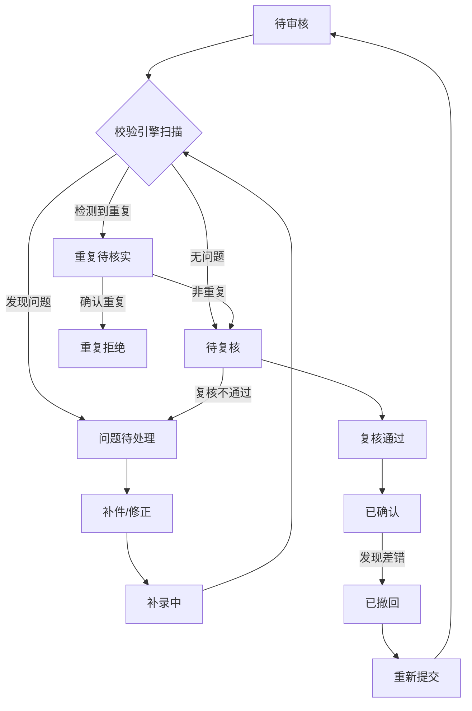
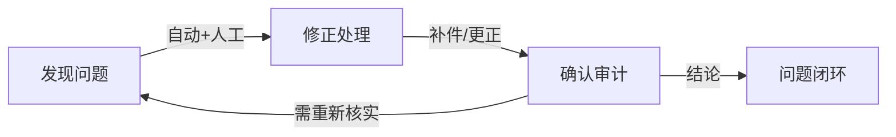

## 1. 产品概述

跨境汇款用途核验系统，解决银行柜员审核跨境汇款时合同、发票、监管分类口径不一致的问题，将分散的汇款申请、合同、发票、用途代码、补件记录、审核结论归到统一业务对象下，实现"发现问题-修正-确认"全链路可追溯。

- 核心目标：统一审核口径，解决补件打乱审核节奏问题，覆盖异常场景
- 目标用户：银行柜员、复核主管、合规审计人员
- 市场价值：降低合规风险，提升审核效率，留存完整审核轨迹

## 2. 核心特性

### 2.1 用户角色

| 角色 | 注册方式 | 核心权限 |
|------|----------|----------|
| 经办柜员 | 行内系统同步 | 录入申请、上传材料、发起补件、提交审核 |
| 复核主管 | 行内系统同步 | 审核申请、出具结论、退回补录、撤回确认 |
| 合规审计 | 行内系统同步 | 查询历史、导出报告、查看完整轨迹 |

### 2.2 功能模块

1. **业务对象列表页**：汇款申请总览、多维度筛选、异常场景高亮
2. **业务对象详情页**：统一视图聚合所有材料、三段式审核流程（发现问题-修正-确认）
3. **用途校验引擎**：用途代码与合同/发票内容自动匹配校验
4. **补件版本管理**：补件覆盖原件追踪、版本对比、历史回溯
5. **重复汇款识别**：同合同/同发票多笔汇款监测、金额累计预警
6. **审核状态机**：正常通过、补录中、已撤回、重复提交全状态流转
7. **结论导出**：审核报告生成、完整轨迹导出

### 2.3 页面详情

| 页面名称 | 模块名称 | 功能描述 |
|----------|----------|----------|
| 业务对象列表页 | 顶部筛选区 | 按状态、风险等级、日期、客户多维度筛选 |
| 业务对象列表页 | 统计概览卡 | 待审核、异常、已通过、今日新增数量统计 |
| 业务对象列表页 | 数据表格 | 业务对象列表，异常场景高亮显示 |
| 业务对象列表页 | 重点场景图表 | 用途不匹配趋势、补件覆盖统计、重复汇款分布 |
| 业务对象详情页 | 基本信息区 | 汇款申请核心信息展示 |
| 业务对象详情页 | 材料聚合区 | 合同、发票、用途代码、补件记录时间线聚合 |
| 业务对象详情页 | 问题发现区 | 校验引擎自动识别的问题清单，支持人工标注 |
| 业务对象详情页 | 修正操作区 | 补件上传、用途代码调整、信息更正操作 |
| 业务对象详情页 | 确认审计区 | 审核结论录入、双人复核、最终确认 |
| 业务对象详情页 | 版本对比区 | 原件与补件对比、历史版本追溯 |

## 3. 核心流程

### 3.1 主流程描述

柜员接收跨境汇款申请后，系统创建唯一业务对象，自动关联录入的汇款申请、合同、发票、用途代码。校验引擎自动运行，识别用途代码不匹配、补件覆盖、重复汇款等问题。柜员根据问题清单要求客户补件或修正信息，所有操作留痕。复核主管审核通过后出具最终结论，支持后续撤回和重复提交处理。完整轨迹可导出供审计。

### 3.2 审核状态流转图

### 3.3 三段式审核闭环

## 4. 用户界面设计

### 4.1 设计风格

- 主色调：深蓝 `#0F3460`（专业金融感）、辅助色：琥珀橙 `#E94560`（异常警示）、成功绿 `#16C79A`（确认通过）
- 按钮风格：直角极简，重边框弱填充，hover时轻微上浮
- 字体：思源宋体（标题）+ 思源黑体（正文），强化银行专业感
- 布局：左侧固定导航 + 右侧内容区，卡片式信息聚合
- 图标：lucide线性图标，异常场景使用实心图标强化警示

### 4.2 页面设计概述

| 页面名称 | 模块名称 | UI元素 |
|----------|----------|--------|
| 列表页 | 统计卡片 | 四色区分状态，数字放大显示，趋势箭头微动效 |
| 列表页 | 数据表格 | 斑马纹行，异常行背景高亮，鼠标悬停展开问题摘要 |
| 列表页 | 图表区 | 三栏布局，用途不匹配折线、补件覆盖柱状、重复汇款饼图 |
| 详情页 | 问题发现区 | 红色边栏，问题条目带严重程度标签，可展开详情 |
| 详情页 | 修正操作区 | 时间线布局，补件版本可左右滑动对比 |
| 详情页 | 确认审计区 | 底部固定操作栏，双人复核签名区，确认按钮二次确认 |

### 4.3 响应式

- 桌面端优先，1920px为基准设计
- 平板端折叠侧边栏为图标模式
- 移动端简化表格为卡片列表，图表单列堆叠

### 4.4 动效指引

- 页面加载：内容区从下往上淡入， staggered 延迟20ms
- 问题高亮：异常条目脉冲呼吸动画（每3秒一次）
- 版本切换：左右滑动过渡，旧版本淡出新版本淡入
- 状态变更：顶部Toast通知，进度条动画显示流转过程
