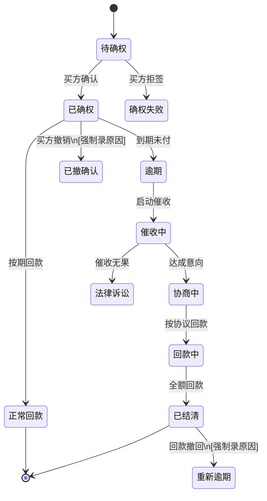

## 1. 产品概述

供应链保理追偿系统，解决保理公司处理买方逾期时，发票、收货确认和追偿进度数据分散在多个微信群的问题，通过统一的数据中台实现全链路数据关联、状态追踪和风险管控。

- 核心问题：数据碎片化导致对账难、追责难、决策慢
- 目标用户：保理公司风控专员、催收专员、运营主管
- 产品价值：将分散数据串联为可追溯的追偿链条，确保图表、明细、导出围绕同一批数据实时刷新

## 2. 核心功能

### 2.1 用户角色

| 角色 | 注册方式 | 核心权限 |
|------|----------|----------|
| 风控专员 | 企业账号 | 数据导入、确权审核、风险报告查看 |
| 催收专员 | 企业账号 | 追偿进度更新、催办记录、回款登记 |
| 运营主管 | 企业账号 | 全量数据查看、报表导出、审批操作 |
| 系统管理员 | 企业账号 | 用户管理、参数配置 |

### 2.2 功能模块

1. **数据导入与关联页**：批量导入发票/确权/合同/回款计划，自动关联匹配，可视化展示数据链路
2. **追偿工作台**：案件列表、状态机流转、待办催办、异常告警
3. **回款核销页**：多维度核销匹配、部分回款处理、核销历史追溯
4. **风险分析页**：确权版本对比、状态倒退分析、影响范围评估
5. **报告导出页**：标准报告模板、自定义导出、批量生成
6. **历史追溯页**：操作审计、变更记录、版本对比

### 2.3 页面详情

| 页面名称 | 模块名称 | 功能描述 |
|-----------|-------------|---------------------|
| 数据导入与关联 | 导入模块 | 支持Excel批量导入发票、买方确认、保理合同、回款计划、追偿备注、风险报告六类数据 |
| 数据导入与关联 | 关联图谱 | 可视化展示单笔业务从发票→确权→合同→回款→追偿的完整链路，支持点击穿透查看详情 |
| 数据导入与关联 | 异常识别 | 自动识别买方撤确认、数据缺失、重复导入等异常并高亮标记 |
| 追偿工作台 | 案件列表 | 按追偿状态、逾期天数、金额等多维度筛选，支持批量操作 |
| 追偿工作台 | 状态机面板 | 可视化状态流转图，支持正向/逆向状态变更，强制录入变更原因 |
| 追偿工作台 | 催办去重 | 自动识别同一买方多笔逾期的合并催办，避免重复打扰 |
| 回款核销页 | 智能匹配 | 自动关联回款与对应账款，支持手动调整核销顺序 |
| 回款核销页 | 部分回款处理 | 支持多批次部分回款，自动计算剩余本金/利息/违约金 |
| 风险分析页 | 确权版本对比 | 并列展示同一债权的多版确权信息，标注差异点和变更原因 |
| 风险分析页 | 状态倒退分析 | 当追偿状态出现倒退（如已确权→已撤确认）时，自动分析影响范围并给出处置建议 |
| 报告导出页 | 标准报告 | 一键生成追偿进度报告、风险评估报告、回款明细表 |
| 历史追溯页 | 操作审计 | 全量记录数据导入、修改、审批的时间、人员、操作内容 |
| 历史追溯页 | 版本对比 | 支持任意两个版本的数据字段级对比，高亮显示变更内容 |

## 3. 核心流程

### 3.1 数据导入与关联流程

业务人员批量导入六类数据 → 系统自动按业务编号/买方/金额等维度关联匹配 → 生成可视化关联图谱 → 异常数据高亮提醒 → 人工确认/修正关联关系 → 数据正式入库

### 3.2 追偿状态机流转

正常流转：待确权→已确权→逾期→催收中→协商中→回款中→已结清
异常流转：已确权→已撤确认（需录入原因）、已结清→重新逾期（需录入原因）

### 3.3 异常处理流程

系统检测到异常（撤确认/部分回款/状态倒退）→ 自动分析影响范围 → 生成处置建议 → 推送相关人员 → 处理后更新状态 → 记录处理轨迹

## 4. 用户界面设计

### 4.1 设计风格

- 主色调：深蓝 #0F172A（专业稳重）+ 琥珀 #F59E0B（风险警示）+ 翠绿 #10B981（正常状态）+ 赤红 #EF4444（高危告警）
- 辅助色：深灰 #334155、中灰 #64748B、浅灰 #E2E8F0
- 按钮风格：直角切边设计，hover时有微妙的边框光效，危险按钮采用红色渐变
- 字体：标题采用"思源黑体 Bold"，正文采用"Inter Regular"，数字采用等宽字体"JetBrains Mono"
- 布局风格：三栏式工作台布局 + 卡片式信息分组 + 数据表格高密度展示
- 图标风格：线性细边图标，状态图标采用实心圆角方块
- 设计调性：金融级专业感、数据驱动、风险可视化、操作可追溯

### 4.2 页面设计概述

| 页面名称 | 模块名称 | UI元素 |
|-----------|-------------|-------------|
| 数据导入与关联 | 导入模块 | 拖拽上传区、文件列表、导入进度条、字段映射配置面板 |
| 数据导入与关联 | 关联图谱 | 节点链路图（横向树状布局）、节点悬停卡片、点击展开详情、异常节点红色脉冲动画 |
| 追偿工作台 | 案件列表 | 固定列表头、斑马纹、状态标签（彩色圆角）、行内快捷操作按钮 |
| 追偿工作台 | 状态机面板 | 垂直时间线布局、状态节点（带图标）、连线动画、变更原因弹窗表单 |
| 回款核销页 | 核销面板 | 左右分栏（待核销/已核销）、拖拽匹配、金额自动计算、核销确认模态框 |
| 风险分析页 | 版本对比 | 双列并排布局、差异行高亮（新增绿/删除红/修改黄）、变更原因时间戳 |
| 报告导出页 | 导出中心 | 报告卡片网格、预览缩略图、导出进度环形图、批量操作工具栏 |
| 历史追溯页 | 时间线 | 垂直时间轴、操作人头像、操作类型标签、变更前后对比按钮 |

### 4.3 响应式

- 桌面端（1920+）：三栏布局完整展示，侧边栏可折叠
- 笔记本（1280-1920）：双栏布局，次要模块收起到抽屉
- 平板（768-1280）：单栏滚动布局，底部导航
- 移动端（<768）：列表极简模式，仅展示核心数据和操作

### 4.4 数据可视化设计

- 数据链路图谱：采用D3.js力导向图，节点大小代表金额，连线粗细代表关联强度
- 状态流转：SVG渐变路径动画，已完成状态显示绿色对勾，当前状态显示脉冲动画
- 风险热力图：按买方、行业、区域等维度展示逾期分布，颜色深浅代表风险等级
- 回款预测：面积图展示未来30/60/90天预期回款，置信区间用半透明阴影表示
- 变更历史：瀑布图展示数据字段变更轨迹，支持时间轴缩放
