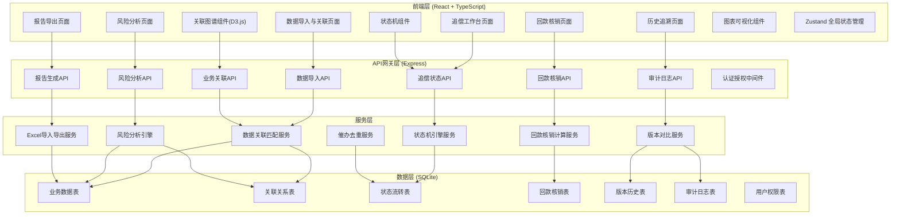
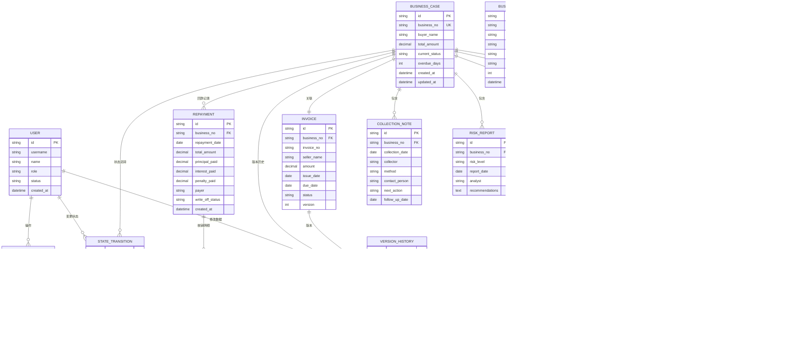

## 1. 架构设计



## 2. 技术描述

### 2.1 技术栈

- **前端框架**: React@18 + TypeScript
- **构建工具**: Vite@5
- **路由管理**: react-router-dom@6
- **状态管理**: zustand@4
- **UI框架**: tailwindcss@3
- **图表可视化**: recharts@2 + d3@7
- **图标库**: lucide-react@0.344
- **Excel处理**: xlsx@0.18
- **后端框架**: Express@4 + TypeScript
- **数据库**: SQLite3（文件型，便于部署）+ better-sqlite3
- **ORM**: 原生SQL + 参数化查询
- **接口调用**: axios@1

### 2.2 初始化方式

使用 react-express-ts 模板，命令：
```bash
npm init vite-init@latest -y . -- --template react-express-ts --force
```

## 3. 路由定义

| Route | 页面名称 | 核心功能 |
|-------|----------|----------|
| /dashboard | 追偿工作台 | 案件总览、状态机、待办列表、异常告警 |
| /import | 数据导入与关联 | 批量导入、关联图谱、异常识别 |
| /collection | 回款核销 | 回款登记、智能匹配、部分回款处理 |
| /risk | 风险分析 | 版本对比、状态倒退分析、影响范围 |
| /report | 报告导出 | 报告模板、批量导出、导出历史 |
| /history | 历史追溯 | 操作审计、变更记录、版本对比 |
| /case/:id | 案件详情 | 单案件全链路视图、状态流转 |

## 4. API 定义

### 4.1 核心数据类型定义

```typescript
// 六类核心业务数据类型
type BusinessDataType = 'invoice' | 'confirmation' | 'contract' | 'repayment_plan' | 'collection_note' | 'risk_report';

interface BusinessRecord {
  id: string;
  type: BusinessDataType;
  businessNo: string;          // 业务编号（关联键）
  buyerName: string;           // 买方名称
  amount: number;              // 金额（元）
  issueDate: string;           // 签发日期
  dueDate: string;             // 到期日期
  status: string;              // 当前状态
  version: number;             // 版本号
  metadata: Record<string, any>; // 扩展字段
  createdAt: string;
  updatedAt: string;
}

interface Invoice extends BusinessRecord {
  invoiceNo: string;
  sellerName: string;
  taxAmount: number;
  goodsDescription: string;
}

interface Confirmation extends BusinessRecord {
  confirmDate: string;
  confirmAmount: number;
  goodsReceived: boolean;
  qualityIssue: boolean;
  confirmer: string;
}

interface FactoringContract extends BusinessRecord {
  contractNo: string;
  factoringRate: number;
  financingAmount: number;
  startDate: string;
  endDate: string;
}

interface RepaymentPlan extends BusinessRecord {
  instalmentNo: number;
  principalAmount: number;
  interestAmount: number;
  plannedRepayDate: string;
}

interface CollectionNote extends BusinessRecord {
  collectionDate: string;
  collector: string;
  collectionMethod: 'phone' | 'email' | 'visit' | 'legal';
  contactPerson: string;
  nextAction: string;
  followUpDate: string;
}

interface RiskReport extends BusinessRecord {
  riskLevel: 'low' | 'medium' | 'high' | 'critical';
  reportDate: string;
  analyst: string;
  recommendations: string;
}

// 关联关系
interface BusinessLink {
  id: string;
  sourceId: string;
  sourceType: BusinessDataType;
  targetId: string;
  targetType: BusinessDataType;
  linkType: 'belong_to' | 'confirm' | 'finance' | 'repay' | 'collect' | 'risk_assess';
  confidence: number; // 关联置信度 0-100
  createdAt: string;
}

// 状态流转记录
interface StateTransition {
  id: string;
  businessNo: string;
  fromStatus: string;
  toStatus: string;
  transitionType: 'normal' | 'reverse' | 'exception';
  reason: string;           // 变更原因（强制录入）
  impactScope: string;      // 影响范围
  nextStep: string;         // 下一步动作
  operatorId: string;
  operatorName: string;
  timestamp: string;
}

// 回款核销记录
interface Repayment {
  id: string;
  businessNo: string;
  repaymentDate: string;
  totalAmount: number;
  principalPaid: number;
  interestPaid: number;
  penaltyPaid: number;
  payer: string;
  remark: string;
  writeOffStatus: 'pending' | 'partial' | 'full';
  createdAt: string;
}

// 版本历史
interface VersionHistory {
  id: string;
  recordId: string;
  recordType: BusinessDataType;
  version: number;
  beforeData: Record<string, any>;
  afterData: Record<string, any>;
  changedFields: string[];
  operatorId: string;
  operatorName: string;
  changeReason: string;
  timestamp: string;
}

// 审计日志
interface AuditLog {
  id: string;
  userId: string;
  userName: string;
  action: string;
  targetType: string;
  targetId: string;
  ipAddress: string;
  userAgent: string;
  timestamp: string;
  detail: string;
}
```

### 4.2 API 接口清单

| Method | Path | 描述 | 请求参数 | 响应格式 |
|--------|------|------|----------|----------|
| POST | /api/import/upload | 上传Excel文件 | FormData: file, type | { success, total, imported, errors } |
| POST | /api/import/preview | 预览导入数据 | { type, fileId } | { columns, rows, previewCount } |
| GET | /api/business/links | 获取业务关联图谱 | { businessNo? } | { nodes, links } |
| GET | /api/business/list | 业务数据列表 | { type, page, pageSize, filters } | { list, total, page, pageSize } |
| GET | /api/business/:id | 获取单条业务详情 | { id } | BusinessRecord |
| POST | /api/business/link | 手动建立关联 | { sourceId, targetId, linkType } | { linkId } |
| DELETE | /api/business/link/:id | 删除关联 | { id } | { success } |
| GET | /api/case/list | 案件列表 | { status, page, pageSize } | { list, total } |
| GET | /api/case/:id | 案件详情 | { id } | { caseInfo, records, transitions, repayments } |
| POST | /api/case/status | 变更案件状态 | { businessNo, toStatus, reason, nextStep } | { transitionId } |
| GET | /api/repayment/list | 回款列表 | { businessNo?, status } | { list, total } |
| POST | /api/repayment | 登记回款 | { businessNo, amount, date, ... } | { repaymentId } |
| POST | /api/repayment/write-off | 核销回款 | { repaymentId, targets } | { success, writeOffDetails } |
| GET | /api/risk/version-compare | 版本对比 | { recordId, version1, version2 } | { diffs, before, after } |
| GET | /api/risk/regression | 状态倒退分析 | { businessNo } | { analysis, impactScope, suggestions } |
| GET | /api/risk/dashboard | 风险仪表盘 | { period } | { stats, charts } |
| POST | /api/report/generate | 生成报告 | { template, filters } | { reportId, downloadUrl } |
| GET | /api/report/templates | 获取报告模板 |  | { templates } |
| GET | /api/report/history | 导出历史 | { page, pageSize } | { list, total } |
| GET | /api/audit/logs | 审计日志 | { userId?, targetType?, startTime } | { list, total } |
| GET | /api/history/changes | 变更记录 | { recordId? } | { changes } |

## 5. 服务器架构图

```mermaid
graph TD
    subgraph "Express Server"
        A[app.ts 入口] --> B[路由层 Routes]
        B --> B1[/api/import/*]
        B --> B2[/api/business/*]
        B --> B3[/api/case/*]
        B --> B4[/api/repayment/*]
        B --> B5[/api/risk/*]
        B --> B6[/api/report/*]
        B --> B7[/api/audit/*]
        B --> B8[/api/history/*]
    end

    subgraph "中间件"
        M1[认证中间件]
        M2[日志中间件]
        M3[错误处理中间件]
        M4[请求校验中间件]
    end

    subgraph "服务层 Services"
        S1[ImportService]
        S2[LinkService]
        S3[StateMachineService]
        S4[RepaymentService]
        S5[RiskService]
        S6[ReportService]
        S7[AuditService]
        S8[VersionService]
    end

    subgraph "数据访问层 DAO"
        D1[BusinessDAO]
        D2[LinkDAO]
        D3[CaseDAO]
        D4[RepaymentDAO]
        D5[VersionDAO]
        D6[AuditDAO]
    end

    subgraph "数据库 SQLite"
        DB[(factoring.db)]
    end

    A --> M1
    A --> M2
    A --> M3
    A --> M4
    B1 --> S1
    B2 --> S2
    B3 --> S3
    B4 --> S4
    B5 --> S5
    B6 --> S6
    B7 --> S7
    B8 --> S8
    S1 --> D1
    S2 --> D2
    S3 --> D3
    S4 --> D4
    S5 --> D1
    S5 --> D2
    S6 --> D1
    S6 --> D3
    S7 --> D6
    S8 --> D5
    D1 --> DB
    D2 --> DB
    D3 --> DB
    D4 --> DB
    D5 --> DB
    D6 --> DB
```

## 6. 数据模型

### 6.1 ER 图



### 6.2 DDL 语句

```sql
-- 用户表
CREATE TABLE user (
  id TEXT PRIMARY KEY,
  username TEXT UNIQUE NOT NULL,
  name TEXT NOT NULL,
  role TEXT NOT NULL CHECK (role IN ('risk_officer', 'collection_officer', 'supervisor', 'admin')),
  status TEXT NOT NULL DEFAULT 'active',
  password_hash TEXT NOT NULL,
  created_at DATETIME DEFAULT CURRENT_TIMESTAMP
);

-- 业务案件主表
CREATE TABLE business_case (
  id TEXT PRIMARY KEY,
  business_no TEXT UNIQUE NOT NULL,
  buyer_name TEXT NOT NULL,
  seller_name TEXT,
  total_amount DECIMAL(15,2) NOT NULL,
  financing_amount DECIMAL(15,2),
  current_status TEXT NOT NULL,
  overdue_days INTEGER DEFAULT 0,
  risk_level TEXT DEFAULT 'medium',
  created_at DATETIME DEFAULT CURRENT_TIMESTAMP,
  updated_at DATETIME DEFAULT CURRENT_TIMESTAMP
);
CREATE INDEX idx_case_buyer ON business_case(buyer_name);
CREATE INDEX idx_case_status ON business_case(current_status);
CREATE INDEX idx_case_overdue ON business_case(overdue_days);

-- 发票表
CREATE TABLE invoice (
  id TEXT PRIMARY KEY,
  business_no TEXT NOT NULL REFERENCES business_case(business_no),
  invoice_no TEXT NOT NULL,
  seller_name TEXT NOT NULL,
  amount DECIMAL(15,2) NOT NULL,
  tax_amount DECIMAL(15,2),
  goods_description TEXT,
  issue_date DATE NOT NULL,
  due_date DATE NOT NULL,
  status TEXT NOT NULL,
  version INTEGER NOT NULL DEFAULT 1,
  created_at DATETIME DEFAULT CURRENT_TIMESTAMP,
  updated_at DATETIME DEFAULT CURRENT_TIMESTAMP,
  UNIQUE(business_no, version)
);

-- 买方确认表
CREATE TABLE confirmation (
  id TEXT PRIMARY KEY,
  business_no TEXT NOT NULL REFERENCES business_case(business_no),
  confirm_date DATE,
  confirm_amount DECIMAL(15,2),
  goods_received BOOLEAN DEFAULT false,
  quality_issue BOOLEAN DEFAULT false,
  quality_issue_desc TEXT,
  confirmer TEXT,
  is_withdrawn BOOLEAN DEFAULT false,
  withdraw_reason TEXT,
  withdraw_date DATE,
  status TEXT NOT NULL,
  version INTEGER NOT NULL DEFAULT 1,
  created_at DATETIME DEFAULT CURRENT_TIMESTAMP,
  updated_at DATETIME DEFAULT CURRENT_TIMESTAMP,
  UNIQUE(business_no, version)
);

-- 保理合同表
CREATE TABLE factoring_contract (
  id TEXT PRIMARY KEY,
  business_no TEXT NOT NULL REFERENCES business_case(business_no),
  contract_no TEXT NOT NULL,
  factoring_rate DECIMAL(5,4) NOT NULL,
  financing_amount DECIMAL(15,2) NOT NULL,
  start_date DATE NOT NULL,
  end_date DATE NOT NULL,
  status TEXT NOT NULL,
  version INTEGER NOT NULL DEFAULT 1,
  created_at DATETIME DEFAULT CURRENT_TIMESTAMP,
  updated_at DATETIME DEFAULT CURRENT_TIMESTAMP,
  UNIQUE(business_no, version)
);

-- 回款计划表
CREATE TABLE repayment_plan (
  id TEXT PRIMARY KEY,
  business_no TEXT NOT NULL REFERENCES business_case(business_no),
  instalment_no INTEGER NOT NULL,
  principal DECIMAL(15,2) NOT NULL,
  interest DECIMAL(15,2) NOT NULL,
  planned_date DATE NOT NULL,
  status TEXT NOT NULL,
  version INTEGER NOT NULL DEFAULT 1,
  created_at DATETIME DEFAULT CURRENT_TIMESTAMP,
  updated_at DATETIME DEFAULT CURRENT_TIMESTAMP,
  UNIQUE(business_no, instalment_no, version)
);

-- 催收记录表
CREATE TABLE collection_note (
  id TEXT PRIMARY KEY,
  business_no TEXT NOT NULL REFERENCES business_case(business_no),
  collection_date DATE NOT NULL,
  collector TEXT NOT NULL,
  collection_method TEXT NOT NULL CHECK (collection_method IN ('phone', 'email', 'visit', 'legal', 'other')),
  contact_person TEXT,
  contact_result TEXT,
  next_action TEXT,
  follow_up_date DATE,
  created_at DATETIME DEFAULT CURRENT_TIMESTAMP
);
CREATE INDEX idx_collection_business ON collection_note(business_no);
CREATE INDEX idx_collection_followup ON collection_note(follow_up_date);

-- 风险报告表
CREATE TABLE risk_report (
  id TEXT PRIMARY KEY,
  business_no TEXT NOT NULL REFERENCES business_case(business_no),
  risk_level TEXT NOT NULL CHECK (risk_level IN ('low', 'medium', 'high', 'critical')),
  report_date DATE NOT NULL,
  analyst TEXT NOT NULL,
  key_findings TEXT,
  recommendations TEXT,
  created_at DATETIME DEFAULT CURRENT_TIMESTAMP
);

-- 状态流转表
CREATE TABLE state_transition (
  id TEXT PRIMARY KEY,
  business_no TEXT NOT NULL REFERENCES business_case(business_no),
  from_status TEXT NOT NULL,
  to_status TEXT NOT NULL,
  transition_type TEXT NOT NULL CHECK (transition_type IN ('normal', 'reverse', 'exception')),
  reason TEXT NOT NULL,
  impact_scope TEXT,
  next_step TEXT,
  operator_id TEXT NOT NULL REFERENCES user(id),
  operator_name TEXT NOT NULL,
  timestamp DATETIME DEFAULT CURRENT_TIMESTAMP
);
CREATE INDEX idx_transition_business ON state_transition(business_no);
CREATE INDEX idx_transition_type ON state_transition(transition_type);
CREATE INDEX idx_transition_time ON state_transition(timestamp);

-- 回款记录表
CREATE TABLE repayment (
  id TEXT PRIMARY KEY,
  business_no TEXT NOT NULL REFERENCES business_case(business_no),
  repayment_date DATE NOT NULL,
  total_amount DECIMAL(15,2) NOT NULL,
  principal_paid DECIMAL(15,2) DEFAULT 0,
  interest_paid DECIMAL(15,2) DEFAULT 0,
  penalty_paid DECIMAL(15,2) DEFAULT 0,
  payer TEXT,
  remark TEXT,
  write_off_status TEXT NOT NULL DEFAULT 'pending' CHECK (write_off_status IN ('pending', 'partial', 'full')),
  created_at DATETIME DEFAULT CURRENT_TIMESTAMP
);
CREATE INDEX idx_repayment_business ON repayment(business_no);
CREATE INDEX idx_repayment_date ON repayment(repayment_date);
CREATE INDEX idx_repayment_status ON repayment(write_off_status);

-- 回款核销明细表
CREATE TABLE repayment_write_off (
  id TEXT PRIMARY KEY,
  repayment_id TEXT NOT NULL REFERENCES repayment(id),
  target_type TEXT NOT NULL,
  target_id TEXT NOT NULL,
  amount DECIMAL(15,2) NOT NULL,
  created_at DATETIME DEFAULT CURRENT_TIMESTAMP
);

-- 版本历史表
CREATE TABLE version_history (
  id TEXT PRIMARY KEY,
  record_id TEXT NOT NULL,
  record_type TEXT NOT NULL,
  version INTEGER NOT NULL,
  before_data TEXT,
  after_data TEXT,
  changed_fields TEXT,
  operator_id TEXT NOT NULL REFERENCES user(id),
  operator_name TEXT NOT NULL,
  change_reason TEXT,
  timestamp DATETIME DEFAULT CURRENT_TIMESTAMP
);
CREATE INDEX idx_version_record ON version_history(record_id, record_type);
CREATE INDEX idx_version_time ON version_history(timestamp);

-- 审计日志表
CREATE TABLE audit_log (
  id TEXT PRIMARY KEY,
  user_id TEXT NOT NULL REFERENCES user(id),
  user_name TEXT NOT NULL,
  action TEXT NOT NULL,
  target_type TEXT,
  target_id TEXT,
  ip_address TEXT,
  user_agent TEXT,
  detail TEXT,
  timestamp DATETIME DEFAULT CURRENT_TIMESTAMP
);
CREATE INDEX idx_audit_user ON audit_log(user_id);
CREATE INDEX idx_audit_action ON audit_log(action);
CREATE INDEX idx_audit_time ON audit_log(timestamp);

-- 业务关联表
CREATE TABLE business_link (
  id TEXT PRIMARY KEY,
  source_id TEXT NOT NULL,
  source_type TEXT NOT NULL,
  target_id TEXT NOT NULL,
  target_type TEXT NOT NULL,
  link_type TEXT NOT NULL,
  confidence INTEGER DEFAULT 100,
  created_at DATETIME DEFAULT CURRENT_TIMESTAMP,
  UNIQUE(source_id, target_id, link_type)
);

-- 初始化测试用户
INSERT INTO user (id, username, name, role, status, password_hash) VALUES
('u001', 'risk01', '张明', 'risk_officer', 'active', '123456'),
('u002', 'coll01', '李华', 'collection_officer', 'active', '123456'),
('u003', 'super01', '王芳', 'supervisor', 'active', '123456'),
('u004', 'admin01', '系统管理员', 'admin', 'active', '123456');
```
