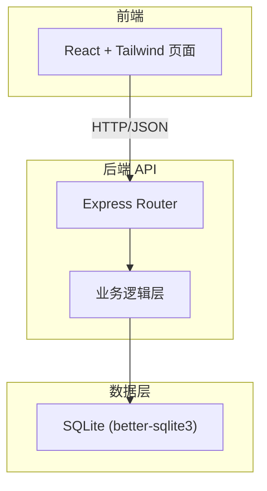
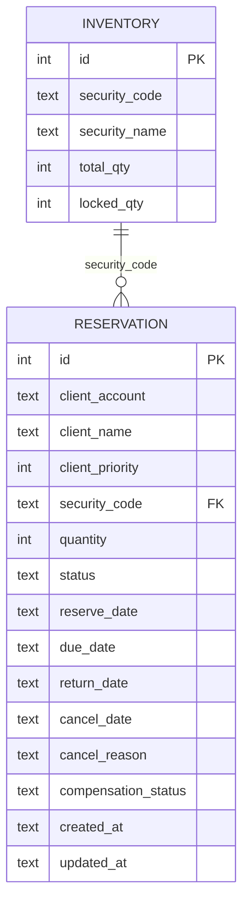

## 1. 架构设计



前端通过 REST API 与后端交互，后端负责所有业务逻辑（库存锁定、状态机、归还回写、撤单补偿），数据持久化到 SQLite 文件数据库。

## 2. 技术说明

- 前端：React@18 + TailwindCSS@3 + Vite + Zustand
- 初始化工具：vite-init
- 后端：Express@4 + TypeScript (ESM)
- 数据库：SQLite (better-sqlite3)，单文件持久化
- 导出：后端生成 CSV，前端触发下载

## 3. 路由定义

| 路由 | 用途 |
|------|------|
| `/` | 券源预约总览页（含五个 Tab） |

前端为单页应用，Tab 切换在前端完成，不涉及路由跳转。

## 4. API 定义

### 4.1 券源库存

| 方法 | 路径 | 说明 |
|------|------|------|
| GET | `/api/inventory` | 获取所有券源库存（含可用/已锁定/总数） |

### 4.2 预约单

| 方法 | 路径 | 说明 |
|------|------|------|
| GET | `/api/reservations` | 获取预约单列表，支持筛选参数 |
| POST | `/api/reservations` | 新建预约（含库存锁定校验） |
| PUT | `/api/reservations/:id` | 修正预约（数量/日期变更，重新锁定） |
| POST | `/api/reservations/:id/return` | 确认归还（释放库存锁定） |
| POST | `/api/reservations/:id/cancel` | 撤单（释放库存锁定 + 回补） |

### 4.3 报告导出

| 方法 | 路径 | 说明 |
|------|------|------|
| GET | `/api/reports/export` | 按筛选条件导出 CSV |

### 4.4 类型定义

```typescript
interface Inventory {
  id: number;
  security_code: string;
  security_name: string;
  total_qty: number;
  locked_qty: number;
  available_qty: number;
}

type ReservationStatus = "pending" | "locked" | "returned" | "overdue" | "cancelled" | "compensation_error";

interface Reservation {
  id: number;
  client_account: string;
  client_name: string;
  client_priority: number;
  security_code: string;
  security_name: string;
  quantity: number;
  status: ReservationStatus;
  reserve_date: string;
  due_date: string;
  return_date: string | null;
  cancel_date: string | null;
  cancel_reason: string | null;
  compensation_status: "success" | "failed" | null;
  created_at: string;
  updated_at: string;
}

interface ReservationFilter {
  security_code?: string;
  client_account?: string;
  status?: ReservationStatus;
  date_from?: string;
  date_to?: string;
}

interface ApiError {
  code: string;
  message: string;
  detail?: Record<string, unknown>;
}
```

## 5. 服务器架构

```mermaid
graph LR
    "Router" --> "ReservationService"
    "Router" --> "InventoryService"
    "Router" --> "ReportService"
    "ReservationService" --> "Database"
    "InventoryService" --> "Database"
    "ReportService" --> "Database"
```

- Router：处理 HTTP 请求参数解析和响应格式化
- ReservationService：预约状态机、库存锁定/释放、归还回写、撤单补偿
- InventoryService：库存查询与更新
- ReportService：按筛选条件生成 CSV 导出

## 6. 数据模型

### 6.1 ER 图



### 6.2 DDL

```sql
CREATE TABLE IF NOT EXISTS inventory (
  id INTEGER PRIMARY KEY AUTOINCREMENT,
  security_code TEXT NOT NULL UNIQUE,
  security_name TEXT NOT NULL,
  total_qty INTEGER NOT NULL CHECK(total_qty >= 0),
  locked_qty INTEGER NOT NULL DEFAULT 0 CHECK(locked_qty >= 0 AND locked_qty <= total_qty)
);

CREATE TABLE IF NOT EXISTS reservation (
  id INTEGER PRIMARY KEY AUTOINCREMENT,
  client_account TEXT NOT NULL,
  client_name TEXT NOT NULL,
  client_priority INTEGER NOT NULL DEFAULT 5,
  security_code TEXT NOT NULL,
  security_name TEXT NOT NULL,
  quantity INTEGER NOT NULL CHECK(quantity > 0),
  status TEXT NOT NULL DEFAULT 'pending' CHECK(status IN ('pending','locked','returned','overdue','cancelled','compensation_error')),
  reserve_date TEXT NOT NULL,
  due_date TEXT NOT NULL,
  return_date TEXT,
  cancel_date TEXT,
  cancel_reason TEXT,
  compensation_status TEXT CHECK(compensation_status IS NULL OR compensation_status IN ('success','failed')),
  created_at TEXT NOT NULL DEFAULT (datetime('now','localtime')),
  updated_at TEXT NOT NULL DEFAULT (datetime('now','localtime')),
  FOREIGN KEY (security_code) REFERENCES inventory(security_code)
);

-- 券源库存初始数据
INSERT OR IGNORE INTO inventory (security_code, security_name, total_qty, locked_qty) VALUES
  ('600519', '贵州茅台', 5000, 0),
  ('000858', '五粮液', 8000, 0),
  ('601318', '中国平安', 12000, 0),
  ('000001', '平安银行', 15000, 0),
  ('600036', '招商银行', 10000, 0);

-- 预约单初始数据
INSERT INTO reservation (client_account, client_name, client_priority, security_code, security_name, quantity, status, reserve_date, due_date) VALUES
  ('ACC001', '星辰资本', 1, '600519', '贵州茅台', 1000, 'locked', '2026-05-20', '2026-06-20'),
  ('ACC002', '远航投资', 2, '600519', '贵州茅台', 2000, 'locked', '2026-05-18', '2026-05-25'),
  ('ACC003', '朝阳基金', 3, '000858', '五粮液', 3000, 'locked', '2026-05-15', '2026-06-15'),
  ('ACC004', '蓝海资管', 2, '601318', '中国平安', 5000, 'locked', '2026-05-10', '2026-06-10'),
  ('ACC001', '星辰资本', 1, '601318', '中国平安', 2000, 'returned', '2026-04-01', '2026-05-01', '2026-04-28', NULL, NULL),
  ('ACC005', '鼎信证券', 4, '000001', '平安银行', 4000, 'cancelled', '2026-05-05', '2026-06-05', NULL, '2026-05-22', '客户主动撤单', 'success'),
  ('ACC006', '盛和投资', 3, '600036', '招商银行', 6000, 'locked', '2026-05-01', '2026-05-27', NULL, NULL, NULL, NULL);

-- 更新库存锁定数量以匹配预约单
UPDATE inventory SET locked_qty = 3000 WHERE security_code = '600519';
UPDATE inventory SET locked_qty = 3000 WHERE security_code = '000858';
UPDATE inventory SET locked_qty = 5000 WHERE security_code = '601318';
UPDATE inventory SET locked_qty = 0 WHERE security_code = '000001';
UPDATE inventory SET locked_qty = 6000 WHERE security_code = '600036';
```
