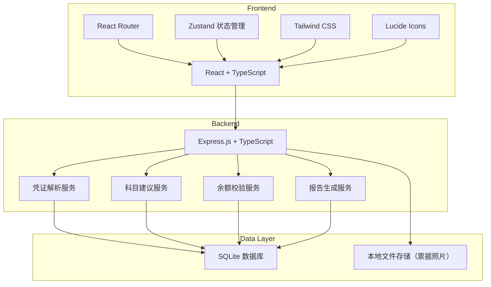
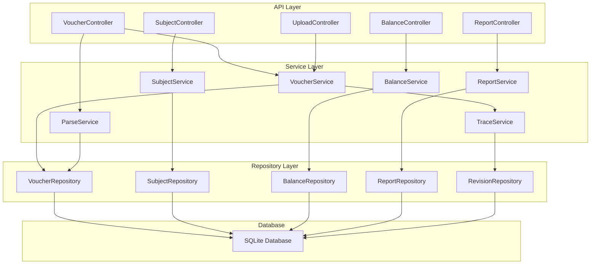
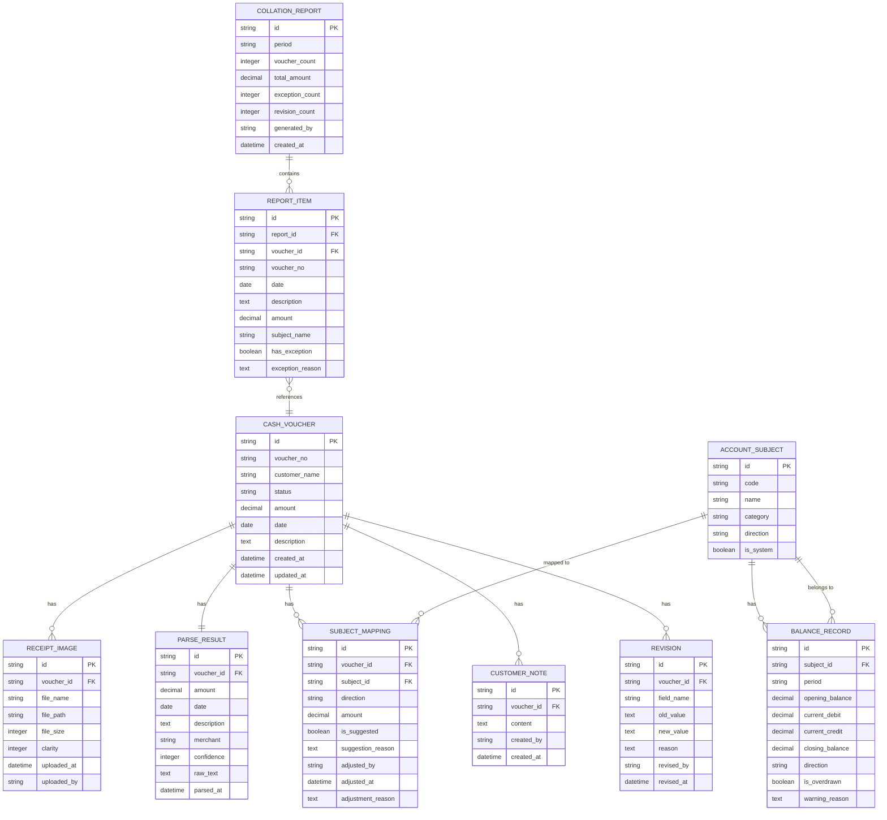

## 1. 架构设计



## 2. 技术描述

- **前端**：React@18 + TypeScript + TailwindCSS@3 + Vite
- **状态管理**：Zustand
- **路由**：React Router DOM
- **图标**：lucide-react
- **后端**：Express@4 + TypeScript
- **数据库**：SQLite3（本地文件存储，便于单机启动）
- **文件存储**：本地文件系统（uploads 目录）
- **初始化工具**：vite-init

## 3. 路由定义

### 前端路由

| 路由 | 页面 | 用途 |
|-------|------|---------|
| / | 凭证列表页 | 现金凭证概览、筛选、状态统计 |
| /voucher/:id | 凭证详情页 | 票据预览、解析结果、科目映射、修订历史 |
| /balance | 余额校验页 | 余额表展示、倒挂预警、调整建议 |
| /report | 报告导出页 | 整理报告生成、导出、历史记录 |
| /subjects | 科目映射页 | 标准科目库、映射规则管理 |

### 后端API路由

| 方法 | 路由 | 用途 |
|-------|------|---------|
| GET | /api/vouchers | 获取凭证列表（支持筛选） |
| GET | /api/vouchers/:id | 获取凭证详情（含关联数据） |
| POST | /api/vouchers | 创建新凭证 |
| PUT | /api/vouchers/:id | 更新凭证信息 |
| POST | /api/vouchers/:id/parse | 触发凭证解析 |
| POST | /api/vouchers/:id/subject | 更新科目映射 |
| POST | /api/vouchers/:id/revise | 创建修订记录 |
| GET | /api/vouchers/:id/history | 获取修订历史 |
| GET | /api/balance | 获取余额表 |
| POST | /api/balance/verify | 执行余额校验 |
| GET | /api/subjects | 获取科目列表 |
| POST | /api/report/generate | 生成整理报告 |
| GET | /api/report/:id | 获取报告详情 |
| GET | /api/report/:id/export | 导出报告 |
| POST | /api/upload | 上传票据照片 |

## 4. API 类型定义

```typescript
// 凭证状态
type VoucherStatus = 'pending' | 'parsing' | 'reviewing' | 'revised' | 'completed' | 'exception';

// 票据照片
interface ReceiptImage {
  id: string;
  voucherId: string;
  fileName: string;
  filePath: string;
  fileSize: number;
  clarity: number; // 0-100 清晰度
  uploadedAt: string;
  uploadedBy: string;
}

// 凭证解析结果
interface ParseResult {
  id: string;
  voucherId: string;
  amount: number;
  date: string;
  description: string;
  merchant: string;
  confidence: number; // 置信度 0-100
  rawText: string;
  parsedAt: string;
}

// 科目
interface AccountSubject {
  id: string;
  code: string;
  name: string;
  category: 'asset' | 'liability' | 'equity' | 'revenue' | 'expense';
  direction: 'debit' | 'credit';
  isSystem: boolean;
}

// 科目映射
interface SubjectMapping {
  id: string;
  voucherId: string;
  subjectId: string;
  direction: 'debit' | 'credit';
  amount: number;
  isSuggested: boolean;
  suggestionReason: string;
  adjustedBy: string;
  adjustedAt: string;
  adjustmentReason: string;
}

// 客户备注
interface CustomerNote {
  id: string;
  voucherId: string;
  content: string;
  createdBy: string;
  createdAt: string;
}

// 修订记录
interface Revision {
  id: string;
  voucherId: string;
  fieldName: string;
  oldValue: string;
  newValue: string;
  reason: string;
  revisedBy: string;
  revisedAt: string;
}

// 余额记录
interface BalanceRecord {
  id: string;
  subjectId: string;
  period: string;
  openingBalance: number;
  currentDebit: number;
  currentCredit: number;
  closingBalance: number;
  direction: 'debit' | 'credit';
  isOverdrawn: boolean;
  warningReason: string;
}

// 整理报告
interface CollationReport {
  id: string;
  period: string;
  voucherCount: number;
  totalAmount: number;
  exceptionCount: number;
  revisionCount: number;
  generatedBy: string;
  createdAt: string;
  items: ReportItem[];
}

interface ReportItem {
  voucherId: string;
  voucherNo: string;
  date: string;
  description: string;
  amount: number;
  subjectName: string;
  hasException: boolean;
  exceptionReason: string;
}

// 凭证主表
interface CashVoucher {
  id: string;
  voucherNo: string;
  customerName: string;
  status: VoucherStatus;
  amount: number;
  date: string;
  description: string;
  createdAt: string;
  updatedAt: string;
  images: ReceiptImage[];
  parseResult: ParseResult | null;
  mappings: SubjectMapping[];
  notes: CustomerNote[];
  revisions: Revision[];
}
```

## 5. 服务端架构图



## 6. 数据模型

### 6.1 ER 图



### 6.2 DDL 语句

```sql
-- 科目表
CREATE TABLE account_subject (
    id TEXT PRIMARY KEY,
    code TEXT NOT NULL UNIQUE,
    name TEXT NOT NULL,
    category TEXT NOT NULL CHECK (category IN ('asset', 'liability', 'equity', 'revenue', 'expense')),
    direction TEXT NOT NULL CHECK (direction IN ('debit', 'credit')),
    is_system INTEGER NOT NULL DEFAULT 1
);

-- 现金凭证主表
CREATE TABLE cash_voucher (
    id TEXT PRIMARY KEY,
    voucher_no TEXT NOT NULL UNIQUE,
    customer_name TEXT NOT NULL,
    status TEXT NOT NULL CHECK (status IN ('pending', 'parsing', 'reviewing', 'revised', 'completed', 'exception')),
    amount REAL NOT NULL,
    date TEXT NOT NULL,
    description TEXT,
    created_at TEXT NOT NULL,
    updated_at TEXT NOT NULL
);

-- 票据照片表
CREATE TABLE receipt_image (
    id TEXT PRIMARY KEY,
    voucher_id TEXT NOT NULL,
    file_name TEXT NOT NULL,
    file_path TEXT NOT NULL,
    file_size INTEGER NOT NULL,
    clarity INTEGER NOT NULL DEFAULT 100,
    uploaded_at TEXT NOT NULL,
    uploaded_by TEXT NOT NULL,
    FOREIGN KEY (voucher_id) REFERENCES cash_voucher(id)
);

-- 解析结果表
CREATE TABLE parse_result (
    id TEXT PRIMARY KEY,
    voucher_id TEXT NOT NULL UNIQUE,
    amount REAL,
    date TEXT,
    description TEXT,
    merchant TEXT,
    confidence INTEGER NOT NULL DEFAULT 0,
    raw_text TEXT,
    parsed_at TEXT NOT NULL,
    FOREIGN KEY (voucher_id) REFERENCES cash_voucher(id)
);

-- 科目映射表
CREATE TABLE subject_mapping (
    id TEXT PRIMARY KEY,
    voucher_id TEXT NOT NULL,
    subject_id TEXT NOT NULL,
    direction TEXT NOT NULL CHECK (direction IN ('debit', 'credit')),
    amount REAL NOT NULL,
    is_suggested INTEGER NOT NULL DEFAULT 1,
    suggestion_reason TEXT,
    adjusted_by TEXT,
    adjusted_at TEXT,
    adjustment_reason TEXT,
    FOREIGN KEY (voucher_id) REFERENCES cash_voucher(id),
    FOREIGN KEY (subject_id) REFERENCES account_subject(id)
);

-- 客户备注表
CREATE TABLE customer_note (
    id TEXT PRIMARY KEY,
    voucher_id TEXT NOT NULL,
    content TEXT NOT NULL,
    created_by TEXT NOT NULL,
    created_at TEXT NOT NULL,
    FOREIGN KEY (voucher_id) REFERENCES cash_voucher(id)
);

-- 修订历史表
CREATE TABLE revision (
    id TEXT PRIMARY KEY,
    voucher_id TEXT NOT NULL,
    field_name TEXT NOT NULL,
    old_value TEXT,
    new_value TEXT NOT NULL,
    reason TEXT NOT NULL,
    revised_by TEXT NOT NULL,
    revised_at TEXT NOT NULL,
    FOREIGN KEY (voucher_id) REFERENCES cash_voucher(id)
);

-- 余额记录表
CREATE TABLE balance_record (
    id TEXT PRIMARY KEY,
    subject_id TEXT NOT NULL,
    period TEXT NOT NULL,
    opening_balance REAL NOT NULL DEFAULT 0,
    current_debit REAL NOT NULL DEFAULT 0,
    current_credit REAL NOT NULL DEFAULT 0,
    closing_balance REAL NOT NULL DEFAULT 0,
    direction TEXT NOT NULL CHECK (direction IN ('debit', 'credit')),
    is_overdrawn INTEGER NOT NULL DEFAULT 0,
    warning_reason TEXT,
    FOREIGN KEY (subject_id) REFERENCES account_subject(id),
    UNIQUE(subject_id, period)
);

-- 整理报告表
CREATE TABLE collation_report (
    id TEXT PRIMARY KEY,
    period TEXT NOT NULL,
    voucher_count INTEGER NOT NULL DEFAULT 0,
    total_amount REAL NOT NULL DEFAULT 0,
    exception_count INTEGER NOT NULL DEFAULT 0,
    revision_count INTEGER NOT NULL DEFAULT 0,
    generated_by TEXT NOT NULL,
    created_at TEXT NOT NULL
);

-- 报告明细表
CREATE TABLE report_item (
    id TEXT PRIMARY KEY,
    report_id TEXT NOT NULL,
    voucher_id TEXT NOT NULL,
    voucher_no TEXT NOT NULL,
    date TEXT NOT NULL,
    description TEXT,
    amount REAL NOT NULL,
    subject_name TEXT NOT NULL,
    has_exception INTEGER NOT NULL DEFAULT 0,
    exception_reason TEXT,
    FOREIGN KEY (report_id) REFERENCES collation_report(id),
    FOREIGN KEY (voucher_id) REFERENCES cash_voucher(id)
);

-- 导出日志表
CREATE TABLE export_log (
    id TEXT PRIMARY KEY,
    report_id TEXT,
    voucher_id TEXT,
    export_type TEXT NOT NULL,
    file_name TEXT NOT NULL,
    file_path TEXT NOT NULL,
    exported_by TEXT NOT NULL,
    exported_at TEXT NOT NULL,
    FOREIGN KEY (report_id) REFERENCES collation_report(id),
    FOREIGN KEY (voucher_id) REFERENCES cash_voucher(id)
);

-- 索引
CREATE INDEX idx_voucher_customer ON cash_voucher(customer_name);
CREATE INDEX idx_voucher_status ON cash_voucher(status);
CREATE INDEX idx_voucher_date ON cash_voucher(date);
CREATE INDEX idx_image_voucher ON receipt_image(voucher_id);
CREATE INDEX idx_mapping_voucher ON subject_mapping(voucher_id);
CREATE INDEX idx_revision_voucher ON revision(voucher_id);
CREATE INDEX idx_balance_period ON balance_record(period);
```

### 6.3 初始数据

```sql
-- 预置标准科目
INSERT INTO account_subject (id, code, name, category, direction, is_system) VALUES
('sub_001', '1001', '库存现金', 'asset', 'debit', 1),
('sub_002', '1002', '银行存款', 'asset', 'debit', 1),
('sub_003', '1122', '应收账款', 'asset', 'debit', 1),
('sub_004', '1221', '其他应收款', 'asset', 'debit', 1),
('sub_005', '1403', '原材料', 'asset', 'debit', 1),
('sub_006', '1601', '固定资产', 'asset', 'debit', 1),
('sub_007', '2202', '应付账款', 'liability', 'credit', 1),
('sub_008', '2203', '预收账款', 'liability', 'credit', 1),
('sub_009', '2211', '应付职工薪酬', 'liability', 'credit', 1),
('sub_010', '2221', '应交税费', 'liability', 'credit', 1),
('sub_011', '4001', '实收资本', 'equity', 'credit', 1),
('sub_012', '6001', '主营业务收入', 'revenue', 'credit', 1),
('sub_013', '6051', '其他业务收入', 'revenue', 'credit', 1),
('sub_014', '6401', '主营业务成本', 'expense', 'debit', 1),
('sub_015', '6601', '销售费用', 'expense', 'debit', 1),
('sub_016', '6602', '管理费用', 'expense', 'debit', 1),
('sub_017', '6603', '财务费用', 'expense', 'debit', 1);
```
