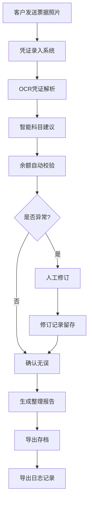
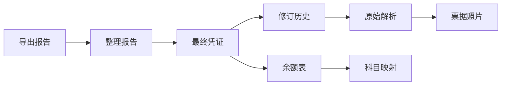

## 1. 产品概述

代理记账现金凭证管理系统，专为代账会计处理小微客户现金收支票据而设计。解决票据模糊识别、科目错挂、余额倒挂等核心风险问题，实现从凭证录入到报告导出的全链路可追溯。

- 目标用户：代账会计、小微企业财务人员
- 核心价值：降低错账风险，提高记账效率，全流程数据可追溯

## 2. 核心特性

### 2.1 用户角色

| 角色 | 注册方式 | 核心权限 |
|------|----------|----------|
| 代账会计 | 系统预置 | 凭证录入、科目映射、余额校验、人工修订、报告导出 |

### 2.2 功能模块

1. **凭证列表页**：现金凭证概览、待办提醒、状态筛选
2. **凭证详情页**：票据照片展示、OCR解析结果、科目映射、客户备注、修订历史
3. **科目映射页**：标准科目库、智能科目建议、人工调整
4. **余额校验页**：余额表展示、倒挂预警、调整建议
5. **报告导出页**：整理报告生成、导出追溯、历史报告

### 2.3 页面详情

| 页面名称 | 模块名称 | 功能描述 |
|-----------|-------------|---------------------|
| 凭证列表页 | 概览卡片 | 显示待处理、异常、已完成凭证数量统计 |
| 凭证列表页 | 凭证表格 | 凭证日期、客户名称、金额、状态、操作列 |
| 凭证列表页 | 筛选区域 | 按状态、日期范围、客户名称筛选 |
| 凭证详情页 | 票据预览 | 照片展示、清晰度标记、放大查看 |
| 凭证详情页 | 解析结果 | OCR识别内容、置信度、可编辑字段 |
| 凭证详情页 | 科目映射 | 系统建议科目、人工调整、映射依据 |
| 凭证详情页 | 客户备注 | 历史备注展示、新增备注 |
| 凭证详情页 | 修订历史 | 操作人、时间、变更内容、追溯链路 |
| 余额校验页 | 余额表 | 科目余额、方向、异常标记 |
| 余额校验页 | 倒挂预警 | 余额异常科目高亮、原因分析 |
| 报告导出页 | 报告预览 | 整理报告内容、数据来源追溯 |
| 报告导出页 | 导出操作 | 支持Excel/PDF导出、记录导出日志 |

## 3. 核心流程

### 主业务流程

小微客户发送现金收支照片 → 代账会计录入系统 → 系统OCR解析凭证 → 智能科目建议 → 余额自动校验 → 人工修订确认 → 生成整理报告 → 导出存档

### 数据追溯流程

## 4. 用户界面设计

### 4.1 设计风格

- 主色调：专业深蓝 `#1e40af`，代表财务专业感
- 辅助色：警示橙 `#f97316`（异常标记）、成功绿 `#10b981`（正常）、警告红 `#ef4444`（错误）
- 中性色： slate 系列，保持阅读舒适度
- 字体：标题使用 Lora（专业衬线），正文使用 Noto Sans SC（清晰易读）
- 按钮风格：圆角 6px，hover 状态阴影加深
- 布局风格：卡片式布局，左侧导航 + 主内容区
- 图标：lucide-react 线性图标，保持简洁统一

### 4.2 页面设计概述

| 页面名称 | 模块名称 | UI元素 |
|-----------|-------------|-------------|
| 凭证列表页 | 概览卡片 | 渐变背景、数据动画、状态色标 |
| 凭证列表页 | 凭证表格 | 斑马纹、状态标签、操作按钮组 |
| 凭证详情页 | 票据预览 | 图片放大、清晰度标记、EXIF信息 |
| 凭证详情页 | 解析结果 | 置信度进度条、可编辑输入框、建议标签 |
| 凭证详情页 | 修订历史 | 时间轴布局、变更对比、操作人签名 |
| 余额校验页 | 余额表 | 异常行高亮、方向箭头、预警图标 |
| 报告导出页 | 追溯链路 | 面包屑导航、数据来源标记、点击跳转 |

### 4.3 响应式

- 桌面端优先设计（1280px+）
- 平板端：表格横向滚动，侧边栏可收起
- 移动端：卡片堆叠布局，底部导航栏
- 触摸优化：按钮最小 44x44px，列表项点击区域扩大

## 5. 风险控制设计

### 5.1 票据模糊检测

- 自动检测图片清晰度，置信度低于 70% 标记为"待复核"
- 提供手动标记"模糊"功能，记录识别困难原因
- 模糊票据在列表中置顶显示，提醒优先处理

### 5.2 科目错挂防护

- 系统根据凭证内容给出 3 个最可能的科目建议
- 记录每次科目调整的原因和依据
- 异常科目组合（如现金收入挂应付账款）自动预警

### 5.3 余额倒挂检测

- 实时计算科目余额，出现负数自动标记
- 分析倒挂原因（时间差、科目错挂、漏记凭证）
- 提供调整建议，需人工确认后才能生成报告
