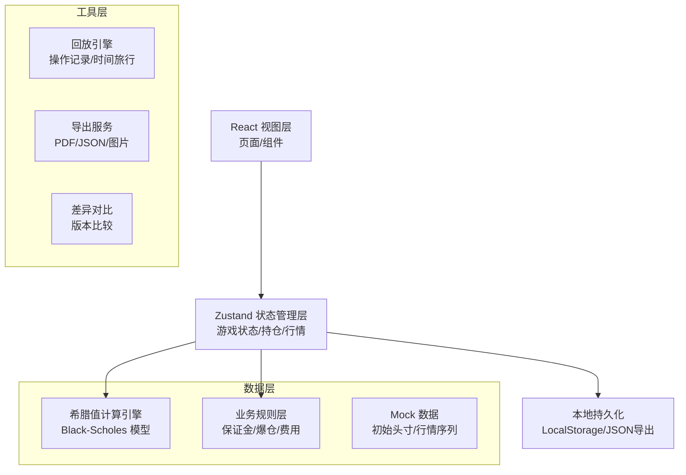
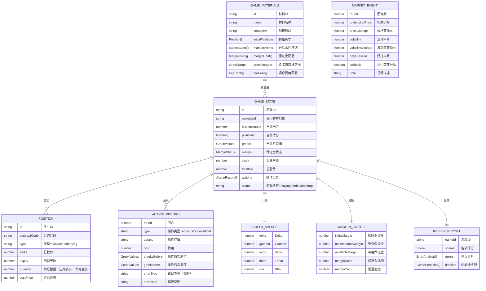

## 1. 架构设计



## 2. 技术栈说明

- **前端框架**：React@18 + TypeScript@5
- **构建工具**：Vite@5
- **样式方案**：TailwindCSS@3 + PostCSS
- **状态管理**：Zustand@4（轻量级，支持时间旅行便于回放）
- **图表库**：Recharts@2（用于保证金趋势图和结果对比图）
- **图标**：Lucide React（简洁图标）
- **字体**：Google Fonts（JetBrains Mono + Caveat + Noto Sans SC）
- **后端**：无（纯前端应用，所有数据本地处理）
- **数据库**：LocalStorage + 本地JSON文件导入导出

## 3. 路由定义

| 路由 | 页面 | 主要功能 |
|-------|------|----------|
| / | 首页/游戏入口 | 游戏介绍、开始游戏、加载存档、材料管理入口 |
| /game | 游戏主界面 | 头寸管理、希腊值监控、行情卡、操作面板 |
| /review | 复盘报告页 | 时间线、错误分析、多维度评分、回放功能 |
| /materials | 材料管理页 | 原始材料编辑、版本对比、差异可视化 |

## 4. 核心数据模型

### 4.1 数据模型定义



### 4.2 关键类型定义 (TypeScript)

```typescript
// 期权类型
type OptionType = 'call' | 'put' | 'underlying';

// 头寸接口
interface Position {
  id: string;
  contractCode: string;
  type: OptionType;
  strike: number;
  expiryDays: number;
  quantity: number;
  costPrice: number;
  currentPrice?: number;
  marketValue?: number;
  pnl?: number;
  individualGreeks?: GreekValues;
}

// 希腊值接口
interface GreekValues {
  delta: number;
  gamma: number;
  vega: number;
  theta: number;
  rho: number;
}

// 行情事件接口
interface MarketEvent {
  round: number;
  underlyingPrice: number;
  priceChange: number;
  volatility: number;
  volatilityChange: number;
  daysPassed: number;
  isShock: boolean;
  description: string;
}

// 保证金配置
interface MarginConfig {
  initialMarginRate: number;  // 初始保证金比例
  maintenanceMarginRate: number;  // 维持保证金比例
  marginCallThreshold: number;   // 追缴阈值
}

// 费用配置
interface FeeConfig {
  optionTradingFee: number;   // 期权交易费率
  underlyingTradingFee: number; // 标的交易费率
  exerciseFee: number;       // 行权费用
  slippage: number;        // 滑点
}

// 希腊值目标区间
interface GreekTarget {
  delta: { min: number; max: number };
  gamma: { min: number; max: number };
  vega: { min: number; max: number };
}

// 游戏材料（原始材料）
interface GameMaterials {
  id: string;
  name: string;
  description: string;
  createdAt: number;
  initialUnderlyingPrice: number;
  initialPositions: Position[];
  marketEvents: MarketEvent[];
  marginConfig: MarginConfig;
  feeConfig: FeeConfig;
  greekTargets: GreekTarget;
  initialCash: number;
}

// 游戏状态
interface GameState {
  id: string;
  materialId: string;
  materialName: string;
  currentRound: number;
  totalRounds: number;
  status: 'idle' | 'playing' | 'ended' | 'bankrupt';
  positions: Position[];
  currentGreeks: GreekValues;
  marginStatus: MarginStatus;
  cash: number;
  totalPnL: number;
  realizedPnL: number;
  unrealizedPnL: number;
  actionHistory: ActionRecord[];
  marketHistory: MarketSnapshot[];
  currentMarket: MarketEvent | null;
}

// 操作记录
interface ActionRecord {
  round: number;
  timestamp: number;
  type: 'adjust' | 'stopLoss' | 'hold';
  positionChanges: PositionChange[];
  totalCost: number;
  greeksBefore: GreekValues;
  greeksAfter: GreekValues;
  errorType?: string;
  errorNote?: string;
}

// 复盘报告
interface ReviewReport {
  gameId: string;
  scores: {
    riskManagement: number;
    costControl: number;
    decisionTiming: number;
    greekStability: number;
    overall: number;
  };
  errors: ErrorAnalysis[];
  timeline: GameSnapshot[];
}
```

## 5. 核心算法说明

### 5.1 Black-Scholes 希腊值计算引擎

```typescript
// 核心计算函数
function calculateBlackScholes(
  S: number,      // 标的价格
  K: number,      // 行权价
  T: number,      // 到期时间（年）
  r: number,      // 无风险利率
  sigma: number,  // 波动率
  type: 'call' | 'put'
): {
  price: number;
  delta: number;
  gamma: number;
  vega: number;
  theta: number;
  rho: number;
}

// 组合希腊值计算
function calculatePortfolioGreeks(
  positions: Position[],
  underlyingPrice: number,
  volatility: number,
  riskFreeRate: number
): GreekValues

// 正态分布累积函数
function normalCDF(x: number): number

// 正态分布概率密度函数
function normalPDF(x: number): number
```

### 5.2 保证金计算

```typescript
// 保证金计算
function calculateMargin(
  positions: Position[],
  config: MarginConfig,
  underlyingPrice: number
): MarginStatus
```

### 5.3 评分算法

```typescript
// 风险管理评分：基于希腊值在目标区间内的时间占比
function calculateRiskManagementScore(
  history: GreekValues[],
  targets: GreekTarget
): number

// 成本控制评分：基于调仓费用占总盈亏的比例
function calculateCostControlScore(
  actions: ActionRecord[],
  totalPnL: number
): number
```

## 6. 目录结构

```
src/
├── assets/              # 静态资源
├── components/        # 通用组件
│   ├── game/       # 游戏相关组件
│   ├── review/     # 复盘相关组件
│   └── materials/  # 材料管理相关组件
│   └── ui/         # 基础UI组件
├── engine/          # 计算引擎
│   ├── blackScholes.ts    # BS模型
│   ├── greekCalculator.ts # 希腊值计算
│   ├── marginCalculator.ts # 保证金计算
│   └── feeCalculator.ts # 费用计算
├── store/           # 状态管理
│   ├── useGameStore.ts # 游戏状态
│   └── useMaterialStore.ts # 材料状态
├── types/           # TypeScript类型定义
├── utils/           # 工具函数
├── data/            # Mock数据
│   ├── defaultMaterials.ts # 默认材料
├── pages/           # 页面组件
│   ├── Home.tsx
│   ├── Game.tsx
│   ├── Review.tsx
│   └── Materials.tsx
├── App.tsx
├── main.tsx
└── index.css
```

## 7. 关键技术决策

1. **纯前端架构**：无需后端，所有数据本地存储，便于培训师在无网络环境下使用
2. **Zustand状态管理**：轻量级，内置devtools，支持时间旅行，便于实现回放功能
3. **Black-Scholes模型**：实现完整的希腊值计算，确保金融模型的准确性
4. **LocalStorage持久化**：自动保存游戏进度和材料配置
5. **JSON导入导出**：支持材料的分享和复用
6. **Recharts图表**：实现保证金趋势、希腊值趋势的可视化
7. **TailwindCSS**：快速实现复杂的UI样式，支持深色主题
8. **TypeScript**：类型安全，减少金融计算中的错误
