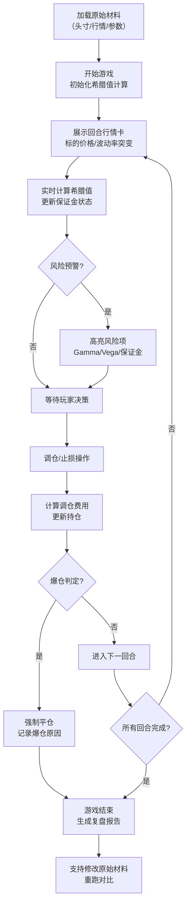

## 1. 产品概述

"期权希腊字母防线"是一款面向金融培训场景的回合制策略游戏，学员通过管理期权头寸的Delta、Gamma、Vega等希腊值，在行情突变时做出调仓或止损决策，深度理解期权风险管理的核心逻辑。游戏强调"犯错即学习"，通过实时暴露风险、详细复盘和可追溯的操作记录，让培训成本大幅降低。

- 核心目标：将抽象的希腊字母风险转化为可感知的游戏压力，让学员在安全的模拟环境中体会Gamma暴露过高、保证金不足、调仓费用漏算等常见错误的后果
- 目标用户：金融机构培训师、期权交易学员、金融专业学生
- 市场价值：填补期权风险管理实操培训的空白，比传统案例教学更具沉浸感和决策压力

## 2. 核心 Features

### 2.1 用户角色

| 角色 | 使用方式 | 核心权限 |
|------|----------|----------|
| 培训师 | 本地运行/投影演示 | 配置原始材料、修改参数、对比多轮结果、导出复盘报告 |
| 学员 | 单人操作/小组协作 | 查看头寸、执行调仓/止损、查看实时希腊值、阅读个人复盘 |

### 2.2 功能模块

1. **游戏主界面**：头寸管理面板、希腊值实时监控板、行情卡展示区、保证金仪表盘
2. **回合控制系统**：回合进度、行情突变触发、决策倒计时、调仓动作记录
3. **风险预警系统**：Gamma暴露过高警告、保证金不足预警、调仓费用实时估算
4. **结算复盘系统**：多维度结算评分、操作回放、错误标注、复盘报告导出
5. **材料管理系统**：原始材料编辑、版本对比、变动前后结果差异可视化

### 2.3 页面详情

| 页面名称 | 模块名称 | 功能描述 |
|---------|----------|----------|
| 游戏主界面 | 头寸面板 | 展示当前持有的期权合约清单，包括合约类型、行权价、到期日、持仓数量、成本价、市值、盈亏 |
| 游戏主界面 | 希腊值监控板 | 实时显示组合Delta、Gamma、Vega、Theta、Rho的当前值、目标区间、风险敞口百分比、偏离度 |
| 游戏主界面 | 行情卡区域 | 展示当前回合的市场行情：标的价格变动、波动率变动、时间衰减，带"突变"标记和手写批注风格 |
| 游戏主界面 | 保证金仪表盘 | 实时保证金占用、可用余额、维持保证金比例、追缴预警线、爆仓线 |
| 游戏主界面 | 操作面板 | 调仓按钮（买/卖期权、买/卖标的）、止损按钮、持仓调整滑块、费用预估、确认弹窗 |
| 复盘报告页 | 回合时间线 | 按回合展示操作记录、行情变动、希腊值变化、保证金变化的完整时间轴 |
| 复盘报告页 | 错误分析 | 标注每个错误决策的类型（Gamma暴露过高/保证金不足/调仓费用漏算等）、后果、正确做法建议 |
| 复盘报告页 | 多维度评分 | 风险管理分、成本控制分、决策时效分、希腊值稳定性分、综合评级 |
| 材料管理页 | 原始材料编辑 | 可修改初始头寸、行情序列、保证金参数、希腊值目标区间、调仓费率 |
| 材料管理页 | 版本对比 | 展示修改前后的参数差异，以及两轮游戏结果的对比图表 |

## 3. 核心流程

玩家操作流程：
1. 培训师加载或编辑原始材料（初始头寸、行情卡序列、保证金规则）
2. 游戏开始，展示初始头寸和希腊值
3. 每一回合翻开一张行情卡，标的价格和波动率发生变化
4. 系统自动计算新的希腊值和保证金占用，高亮超出安全区间的指标
5. 玩家在倒计时内决定：调仓（买/卖期权或标的）、止损（部分或全部平仓）、或持仓不动
6. 系统计算调仓费用、更新持仓、检查保证金是否充足
7. 若保证金低于维持线，触发追加保证金通知；若低于爆仓线，强制平仓
8. 所有回合结束后，生成详细的复盘报告，标注每个错误决策及其后果
9. 培训师可修改原始材料中的任意参数，重跑游戏，对比两次结果的差异

## 4. 用户界面设计

### 4.1 设计风格

- **整体调性**：真实交易台风格，带"使用痕迹"的脏感设计——手写批注、胶带贴纸、咖啡渍质感的阴影、轻微歪斜的卡片、荧光笔高亮效果
- **主色调**：深绿底色（#0B1E14）模拟彭博终端，配合交易员红（#E63946）绿（#2ECC71）盈亏色
- **强调色**：警告橙（#FF9F1C）用于风险预警，荧光黄（#FFE066）用于重点标注，胶带蓝（#4EA8DE）用于可交互元素
- **字体**：
  - 标题/数字："JetBrains Mono" 等宽字体，模拟交易终端
  - 手写批注："Caveat" 手写字体，营造培训师现场批改感
  - 正文："Noto Sans SC" 清晰易读
- **布局风格**：非对称栅格布局，卡片轻微重叠，模拟真实交易桌上散落的材料
- **动效**：行情突变时的屏幕震动、风险预警时的脉冲闪烁、调仓确认时的纸片飞入效果

### 4.2 页面设计概述

| 页面名称 | 模块名称 | UI Elements |
|---------|----------|-------------|
| 游戏主界面 | 希腊值监控板 | 五个希腊值卡片横向排列，每个卡片显示：名称、当前值、进度条（绿=安全，黄=警告，红=危险）、偏离目标的百分比数字。Gamma和Vega卡片额外放大突出。卡片边缘有手写批注贴纸。 |
| 游戏主界面 | 行情卡区域 | 大尺寸卡片，正面显示当前回合的行情变动："标的 +3.2%"、"IV +5%"、"时间衰减 2天"。突变行情时卡片带闪电图标，边缘有烧焦效果。卡片可点击翻牌，背面有手写风险提示。 |
| 游戏主界面 | 头寸面板 | 表格形式展示持仓，每行可展开查看该合约对组合希腊值的贡献。盈亏列用红绿色区分，鼠标悬停显示盈亏构成（内在价值+时间价值）。 |
| 游戏主界面 | 保证金仪表盘 | 半圆形仪表盘，指针指向当前保证金使用率。0-60%绿色，60-80%黄色，80-100%红色。旁边列出占用明细：初始保证金、维持保证金、可用余额。 |
| 复盘报告页 | 时间线 | 垂直时间轴，每个节点是一个回合。节点颜色表示该回合的决策质量（绿=良好，黄=一般，红=错误）。点击节点展开详情：行情、操作、希腊值变化、错误标注。 |
| 材料管理页 | 版本对比 | 左右分栏布局，左侧显示修改前的参数和结果，右侧显示修改后的。中间用箭头连接差异项，底部是结果对比柱状图。 |

### 4.3 响应式

- **桌面优先**：主界面采用四栏布局（头寸+希腊值+行情+操作），充分利用宽屏
- **平板适配**：自动调整为两栏布局，操作面板移至底部
- **移动端**：单页滚动模式，通过Tab切换不同模块，保留核心数据展示
- **触控优化**：调仓滑块支持手势拖动，按钮最小尺寸44px，重要操作需二次确认

### 4.4 关键交互细节

1. **风险暴露动画**：当Gamma超过安全阈值2倍时，Gamma卡片开始红色脉冲闪烁，同时屏幕边缘出现红色渐变光晕，持续直到风险解除
2. **调仓费用实时估算**：拖动调仓数量滑块时，实时显示预估的交易费用、对希腊值的影响、保证金变化
3. **爆仓慢动作**：触发爆仓时，屏幕先变白闪烁0.5秒，然后慢动作展示强制平仓的过程，每个合约平仓时显示亏损金额
4. **复盘回放**：支持倍速回放整个游戏过程，关键决策点自动暂停并弹出讲解
5. **手写批注**：培训师模式下可在任意界面添加手写批注，保存后随复盘报告一起导出
