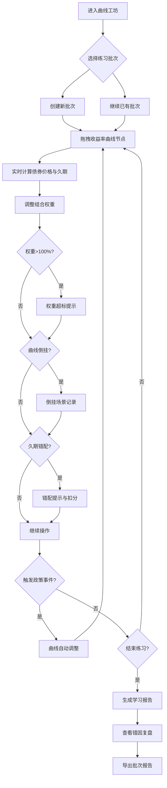

## 1. 产品概述

国债收益率曲线工坊是一款面向投教课堂的交互式练习工具，让学生通过拖拽收益率曲线节点、配置债券组合权重，直观感受利率变动对债券价格与组合久期的影响。产品核心解决"纸上谈债"的问题——将曲线倒挂、久期错配、权重超标等真实风险场景变成可操作、可复盘的练习。

- 目标用户：投教课堂学生、培训讲师
- 核心价值：以真实操作替代看文字记公式，练习结果可导出、可追溯、可交接

## 2. 核心功能

### 2.1 用户角色

| 角色 | 进入方式 | 核心权限 |
|------|----------|----------|
| 学生 | 直接使用 | 编辑曲线、配置组合、查看评分、导出报告 |
| 讲师 | 直接使用 | 预设场景、查看所有报告、批量导出 |

### 2.2 功能模块

1. **曲线工坊页**：收益率曲线编辑器、债券价格面板、组合久期仪表盘、政策事件触发器
2. **练习复盘页**：错因提示卡片、场景回放、评分明细
3. **学习报告页**：批次报告列表、单次报告详情、批量导出

### 2.3 页面详情

| 页面名称 | 模块名称 | 功能描述 |
|----------|----------|----------|
| 曲线工坊页 | 收益率曲线编辑器 | 拖拽7个关键期限（3M/6M/1Y/3Y/5Y/10Y/30Y）的收益率节点，实时绘制平滑曲线；短端/长端节点颜色区分；倒挂时曲线变红并弹出提示 |
| 曲线工坊页 | 债券卡面板 | 展示5只典型国债（短/中/长/超长+浮息），每只卡显示面值、票息率、剩余期限、麦考利久期、当前价格；价格随曲线拖拽实时联动 |
| 曲线工坊页 | 组合权重编辑器 | 滑块或数字输入调整每只债券权重，权重之和超100%时变红报警；显示组合加权久期 |
| 曲线工坊页 | 政策事件栏 | 点击触发预设事件（如"央行降息50bp"、"缩表预期上升"），自动调整曲线形态并提示影响方向 |
| 曲线工坊页 | 价格曲线图 | 展示选中债券价格随曲线变化的历史折线图，标记关键变动点 |
| 曲线工坊页 | 久期评分面板 | 实时显示组合久期与目标久期偏差，评分0-100；偏差越大扣分越多 |
| 练习复盘页 | 错因提示卡片 | 三类场景卡片：曲线倒挂、久期错配、权重超标；每张卡显示发生时间、具体数值、正确做法 |
| 练习复盘页 | 场景回放 | 按时间轴回放曲线变化过程，标注出错节点 |
| 学习报告页 | 批次报告列表 | 按"批次名+日期"展示所有练习报告；批次名自动生成（如"2026年5月-第3次练习"） |
| 学习报告页 | 单次报告详情 | 曲线快照图、组合配置表、评分明细、错因清单、操作时间轴 |
| 学习报告页 | 批量导出 | 选择多个报告导出为JSON文件，文件名含批次标识和日期 |

## 3. 核心流程

学生进入工坊 → 选择/创建练习批次 → 拖拽收益率节点 → 观察债券价格和久期变化 → 调整组合权重 → 触发政策事件 → 系统检测倒挂/错配/超标并记录 → 完成练习 → 查看错因复盘 → 导出批次报告

## 4. 用户界面设计

### 4.1 设计风格

- 主色调：深蓝灰底色(#0f1729) + 金色强调(#d4a843)，模拟金融终端质感
- 辅助色：翠绿(#22c55e)表示正常、红色(#ef4444)表示风险/错误
- 按钮：圆角8px，轻微阴影，hover时金色边框
- 字体：标题用等宽字体(JetBrains Mono)，正文用思源黑体/系统无衬线
- 布局：左侧曲线编辑区(60%)，右侧信息面板(40%)，底部操作栏
- 图标风格：线条图标(lucide)，金融主题

### 4.2 页面设计概览

| 页面名称 | 模块名称 | UI元素 |
|----------|----------|--------|
| 曲线工坊页 | 收益率曲线编辑器 | SVG曲线图，可拖拽圆形节点(直径16px)，短端蓝/长端金，倒挂时曲线描红+脉冲动画 |
| 曲线工坊页 | 债券卡面板 | 5张紧凑卡片，每张含进度条式久期条、价格数字(大号等宽)、票息标签 |
| 曲线工坊页 | 组合权重编辑器 | 5个滑块+百分比数字输入，总权重进度条(超100%变红+抖动) |
| 曲线工坊页 | 政策事件栏 | 水平滚动标签栏，点击后弹出影响说明浮层 |
| 曲线工坊页 | 价格曲线图 | 小型折线图，带时间轴标注 |
| 曲线工坊页 | 久期评分面板 | 圆环进度条(0-100)，偏差文字，目标久期虚线 |
| 练习复盘页 | 错因提示卡片 | 三列卡片布局，每类错因独立颜色标签(倒挂-红/错配-橙/超标-黄) |
| 练习复盘页 | 场景回放 | 时间轴滑块+播放按钮，回放时曲线动画重绘 |
| 学习报告页 | 批次报告列表 | 表格布局，行含批次名/日期/评分/状态标签 |
| 学习报告页 | 导出按钮 | 底部固定栏，含"导出选中"和"导出全部" |

### 4.3 响应式设计

- 桌面优先(1280px+)，左右分栏布局
- 平板(768-1280px)：上下堆叠，曲线区全宽
- 手机(<768px)：基本可用，曲线区触控拖拽优化

### 4.4 3D场景

不适用
