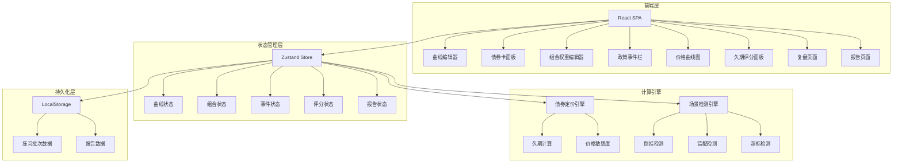
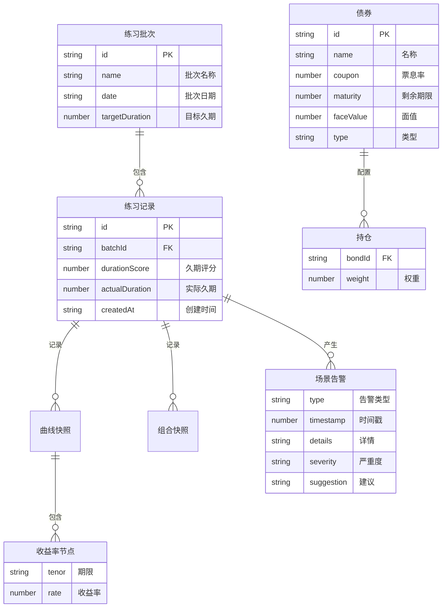

## 1. 架构设计



## 2. 技术说明

- 前端：React@18 + TypeScript + Tailwind CSS@3 + Vite
- 初始化工具：vite-init (react-ts模板)
- 后端：无（纯前端，数据持久化到LocalStorage）
- 数据库：无（LocalStorage模拟）
- 图表：自绘SVG曲线 + Canvas价格折线图
- 状态管理：Zustand

## 3. 路由定义

| 路由 | 用途 |
|------|------|
| / | 曲线工坊主页，含曲线编辑器和所有实时面板 |
| /review | 练习复盘页，错因提示和场景回放 |
| /reports | 学习报告页，批次列表和导出 |

## 4. API定义

无后端API，所有数据和计算在前端完成。

核心函数接口：

```typescript
interface YieldCurvePoint {
  tenor: '3M' | '6M' | '1Y' | '3Y' | '5Y' | '10Y' | '30Y'
  rate: number
}

interface Bond {
  id: string
  name: string
  coupon: number
  maturity: number
  faceValue: number
  type: 'fixed' | 'floating'
}

interface PortfolioPosition {
  bondId: string
  weight: number
}

interface ScenarioAlert {
  type: 'inversion' | 'duration_mismatch' | 'weight_overflow'
  timestamp: number
  details: string
  severity: 'warning' | 'error'
  suggestion: string
}

interface PracticeSession {
  id: string
  batchName: string
  batchDate: string
  curveSnapshots: YieldCurvePoint[][]
  portfolioHistory: PortfolioPosition[][]
  alerts: ScenarioAlert[]
  durationScore: number
  targetDuration: number
  actualDuration: number
}

function calculateBondPrice(bond: Bond, curve: YieldCurvePoint[]): number
function calculateMacaulayDuration(bond: Bond, curve: YieldCurvePoint[]): number
function calculatePortfolioDuration(positions: PortfolioPosition[], bonds: Bond[], curve: YieldCurvePoint[]): number
function detectInversion(curve: YieldCurvePoint[]): boolean
function detectDurationMismatch(actual: number, target: number, threshold: number): boolean
function detectWeightOverflow(positions: PortfolioPosition[]): boolean
```

## 5. 服务器架构

无服务器架构，纯前端应用。

## 6. 数据模型

### 6.1 数据模型定义



### 6.2 数据初始化

应用启动时在内存中初始化5只典型国债和默认收益率曲线，LocalStorage存储练习批次和报告数据。

债券初始数据：
- 25国债01：票息1.8%，剩余期限0.25年，短债
- 25国债05：票息2.1%，剩余期限3年，中短债
- 25国债10：票息2.5%，剩余期限5年，中债
- 25国债20：票息2.9%，剩余期限10年，长债
- 25国债30：票息3.2%，剩余期限30年，超长债

默认收益率曲线：
- 3M: 1.60%, 6M: 1.70%, 1Y: 1.80%, 3Y: 2.10%, 5Y: 2.30%, 10Y: 2.60%, 30Y: 2.90%
