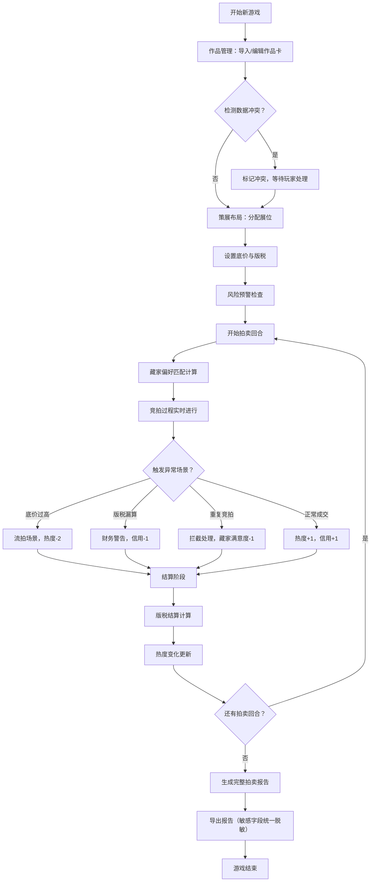

## 1. 产品概述

NFT策展拍卖局是一款数字艺术社群经营模拟游戏，玩家扮演策展人，通过策略性安排作品展位、设定底价与版税、匹配藏家偏好，在多轮拍卖中达成经营目标。

- 核心玩法：深度策略经营而非简单点击，拍卖机制影响实际局势变化
- 目标用户：数字艺术爱好者、游戏化学习用户
- 核心价值：理解拍卖经营的复杂性，练习资源配置与风险决策

## 2. 核心功能

### 2.1 用户角色

| 角色 | 注册方式 | 核心权限 |
|------|----------|----------|
| 策展人（玩家） | 本地游客模式 | 管理拍品、安排展位、设置拍卖参数、查看完整报告 |

### 2.2 功能模块

1. **作品管理页**：作品卡展示、属性编辑、冲突标记
2. **策展布局页**：展位热度系统、拖拽布局、策略规划
3. **拍卖进行页**：实时竞拍、藏家偏好匹配、异常场景触发
4. **结算复盘页**：版税结算、热度变化计算、场景复盘分析
5. **报告导出页**：完整拍卖报告、敏感字段统一处理、导出功能

### 2.3 页面详情

| 页面名称 | 模块名称 | 功能描述 |
|----------|----------|----------|
| 作品管理页 | 作品卡列表 | 展示NFT作品属性（艺术家、流派、估值、版税率），支持编辑和冲突标记 |
| 作品管理页 | 数据冲突处理 | 当作品数据存在不一致时（如重复ID、估值区间冲突），高亮标记不自动合并 |
| 策展布局页 | 展位网格 | 6个热度等级展位，拖拽分配作品，实时显示热度加成 |
| 策展布局页 | 参数设置 | 为每件作品设置起拍底价、版税率，实时风险预警 |
| 拍卖进行页 | 竞拍面板 | 多件作品同时竞拍，藏家出价实时显示，偏好匹配度影响出价 |
| 拍卖进行页 | 异常场景 | 底价过高流拍、版税漏算警告、同藏家重复竞拍拦截 |
| 结算复盘页 | 场景回放 | 可回溯的关键决策节点，每件作品的竞拍过程回放 |
| 结算复盘页 | 财务结算 | 成交价、佣金、版税、展位成本的明细计算 |
| 报告导出页 | 完整报告 | 多维度统计，敏感字段脱敏，支持JSON/CSV导出 |

## 3. 核心流程

## 4. 用户界面设计

### 4.1 设计风格

- **主色调**：深靛蓝 (#1a1a2e) 作为背景，营造画廊氛围
- **强调色**：金色 (#d4af37) 用于重要数据和操作按钮
- **辅助色**：珊瑚红 (#ff6b6b) 标记警告和冲突，翡翠绿 (#2ed573) 标记成功
- **字体**：Playfair Display（标题）+ IBM Plex Mono（数据展示）
- **按钮风格**：微立体边框，悬停时有金色光晕效果
- **布局风格**：卡片式模块化布局，类似艺术画廊导览册
- **图标风格**：线性细边图标，搭配emoji增强视觉识别

### 4.2 页面设计概览

| 页面名称 | 模块名称 | UI 元素 |
|----------|----------|----------|
| 作品管理页 | 作品卡列表 | 艺术品缩略图、属性标签、冲突角标、编辑按钮 |
| 策展布局页 | 展位网格 | 热度色阶（冷色到暖色）、拖拽占位符、热度加成数值 |
| 拍卖进行页 | 竞拍面板 | 实时出价走势图、藏家头像、偏好匹配度指示器 |
| 结算复盘页 | 时间线 | 关键事件节点、可展开详情、场景回放按钮 |
| 报告导出页 | 数据面板 | 统计图表、敏感字段脱敏切换、导出格式选择 |

### 4.3 响应式

- **桌面优先设计**：核心玩法在1280px以上屏幕完整呈现
- **平板适配**：1024px时调整网格布局为单列
- **移动端**：768px以下简化界面，保留核心操作流程
- **触摸优化**：拖拽区域最小48x48px，关键按钮增加触控反馈

### 4.4 动效设计

- **页面加载**：卡片依次淡入上浮（staggered reveal），营造策展氛围
- **展位拖拽**：吸附动画 + 热度光环扩散效果
- **竞拍出价**：数字滚动动画，出价时脉冲闪光
- **异常场景**：红色边框闪烁 + 轻微震动反馈
- **结算动画**：数字从0滚动到最终值，进度条平滑填充
