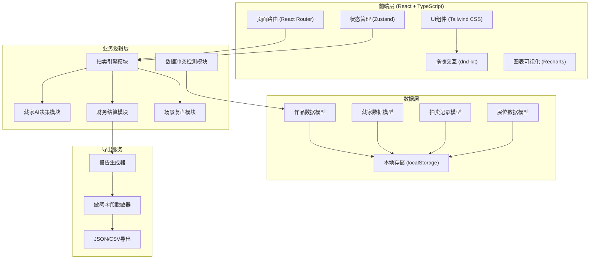
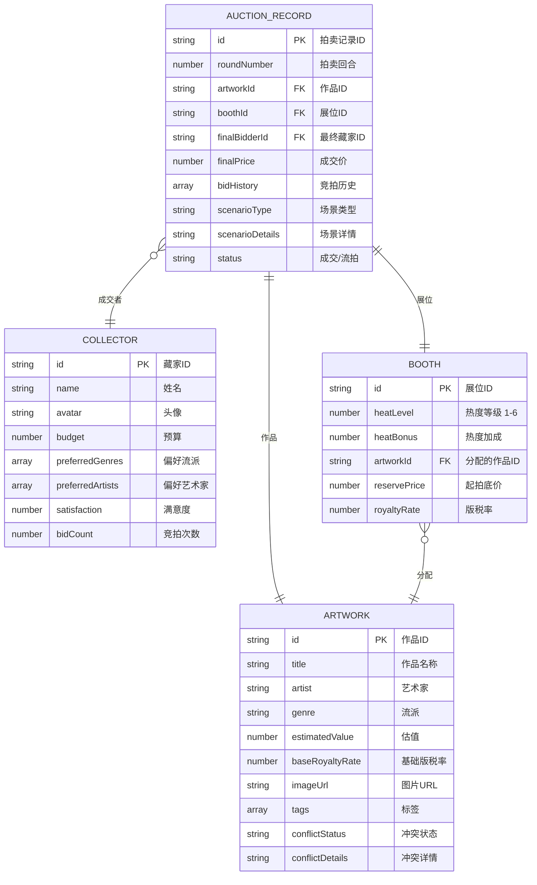

## 1. 架构设计



## 2. 技术选型说明

- **前端框架**：React@18 + TypeScript@5 + Vite@5
- **样式方案**：Tailwind CSS@3 + 自定义CSS变量
- **状态管理**：Zustand（轻量级，适合游戏状态）
- **路由管理**：react-router-dom@6
- **拖拽库**：@dnd-kit/core（展位拖拽）
- **图表库**：Recharts（竞拍走势图、统计图表）
- **图标库**：lucide-react
- **后端**：无（纯前端游戏，数据本地存储）
- **数据库**：localStorage + IndexedDB（可选扩展）

## 3. 路由定义

| 路由路径 | 页面名称 | 核心功能 |
|----------|----------|----------|
| `/` | 游戏首页 | 新游戏、继续游戏、规则说明 |
| `/artworks` | 作品管理页 | 作品卡列表、编辑、冲突标记 |
| `/curation` | 策展布局页 | 展位拖拽、底价版税设置 |
| `/auction` | 拍卖进行页 | 实时竞拍、异常场景处理 |
| `/settlement` | 结算复盘页 | 财务结算、场景回放 |
| `/report` | 报告导出页 | 统计报告、数据导出 |

## 4. 数据模型

### 4.1 数据模型ER图



### 4.2 游戏状态模型

```typescript
interface GameState {
  currentRound: number;
  totalRounds: number;
  phase: 'setup' | 'curation' | 'auction' | 'settlement' | 'report';
  totalRevenue: number;
  totalRoyalties: number;
  galleryReputation: number;
  boothHeatMultipliers: number[];
}
```

### 4.3 场景复盘模型

```typescript
interface ReplayScene {
  id: string;
  type: 'reserve_too_high' | 'royalty_missing' | 'duplicate_bidder' | 'normal';
  round: number;
  artworkId: string;
  timestamp: number;
  decisionPoint: {
    reservePrice: number;
    estimatedValue: number;
    royaltyRate: number;
    boothHeat: number;
  };
  outcome: {
    status: 'sold' | 'unsold';
    finalPrice: number;
    collectorSatisfaction: number;
    heatChange: number;
  };
  learnings: string[];
}
```

## 5. 核心模块设计

### 5.1 拍卖引擎模块

```typescript
// 拍卖核心算法
interface AuctionEngine {
  calculateMatchScore(artwork: Artwork, collector: Collector): number;
  generateBid(collector: Collector, matchScore: number, currentPrice: number): number | null;
  checkScenarioTriggers(auctionState: AuctionState): ScenarioTrigger | null;
  executeAuctionRound(booths: Booth[], collectors: Collector[]): AuctionResult[];
}
```

### 5.2 冲突检测模块

```typescript
interface ConflictDetector {
  checkDuplicateIds(artworks: Artwork[]): Conflict[];
  checkValueRangeConflicts(artwork: Artwork): Conflict[];
  checkRoyaltyRateConflicts(artwork: Artwork): Conflict[];
  markConflicts(artworks: Artwork[]): Artwork[];
}
```

### 5.3 敏感字段脱敏器

```typescript
interface SensitiveFieldHandler {
  fieldRules: {
    collectorBudget: 'mask' | 'hash' | 'remove';
    artistPersonalInfo: 'mask' | 'hash' | 'remove';
    transactionIds: 'mask' | 'hash' | 'remove';
  };
  maskValue(value: string | number): string;
  hashValue(value: string): string;
  sanitizeReport(data: ReportData): ReportData;
}
```

## 6. 状态管理设计

使用 Zustand 管理全局游戏状态：

```typescript
// store/gameStore.ts
import { create } from 'zustand';

interface GameStore {
  // 状态
  gameState: GameState;
  artworks: Artwork[];
  collectors: Collector[];
  booths: Booth[];
  auctionRecords: AuctionRecord[];
  replayScenes: ReplayScene[];
  
  // 动作
  setPhase: (phase: GameState['phase']) => void;
  assignArtworkToBooth: (artworkId: string, boothId: string) => void;
  setReservePrice: (boothId: string, price: number) => void;
  setRoyaltyRate: (boothId: string, rate: number) => void;
  startAuctionRound: () => void;
  calculateSettlement: () => SettlementResult;
  generateReport: () => ReportData;
  exportReport: (format: 'json' | 'csv', sanitized: boolean) => void;
}
```

## 7. 性能优化

- 组件懒加载：拍卖和结算页面使用 React.lazy
- 状态分片：使用 Zustand selectors 避免不必要重渲染
- 虚拟滚动：作品列表数量较多时使用 react-window
- Web Worker：复杂拍卖算法在后台线程执行
- 本地存储防抖：频繁状态变更合并后写入
