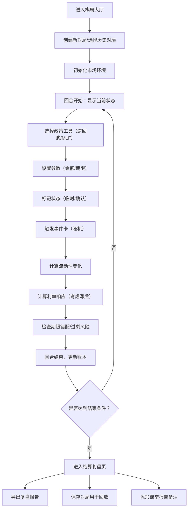

## 1. 产品概述

央行公开市场棋局是一款面向经济学社学生的货币政策模拟教学工具。通过回合制棋局形式，让学生直观理解逆回购、MLF等政策工具对银行流动性和市场利率的传导机制，培养宏观经济思维。

- 目标用户：经济学专业学生、教师、对货币政策感兴趣的学习者
- 核心价值：将抽象的货币政策操作具象化，通过互动式学习掌握流动性管理的核心逻辑

## 2. 核心特征

### 2.1 用户角色

| 角色 | 注册方式 | 核心权限 |
|------|----------|----------|
| 学生用户 | 无需注册，本地存储 | 进行棋局、查看回放、导出复盘报告 |
| 教师用户 | 无需注册，本地存储 | 查看学生棋局、管理课堂报告 |

### 2.2 功能模块

1. **棋局大厅**：新局创建、历史对局列表、棋局回放
2. **对局界面**：政策工具面板、流动性账本、利率走势图、事件卡、回合控制
3. **结算复盘页**：关键决策回顾、流动性变化分析、利率传导效果、导出报告
4. **课堂报告**：对局标记、备注管理、学习总结

### 2.3 页面详情

| 页面名称 | 模块名称 | 功能描述 |
|---------|---------|----------|
| 棋局大厅 | 新局创建 | 选择难度、初始市场环境、开始新对局 |
| 棋局大厅 | 历史对局 | 对局列表、筛选、删除、回放入口 |
| 对局界面 | 政策工具面板 | 逆回购/MLF操作、期限选择、金额输入、状态标记（已确认/临时） |
| 对局界面 | 流动性账本 | 银行体系流动性余额、期限结构、错配警示 |
| 对局界面 | 利率响应 | DR007/10Y国债走势、反馈滞后提示、利率锚定状态 |
| 对局界面 | 事件卡系统 | 随机经济事件、政策响应选项、效果预览 |
| 对局界面 | 回合控制 | 下一回合、临时保存、确认提交、重新开局 |
| 结算复盘页 | 决策回顾 | 关键回合政策选择对比、时间线展示 |
| 结算复盘页 | 数据分析 | 流动性曲线、利率传导效率、风险指标评分 |
| 结算复盘页 | 报告导出 | 生成复盘报告、复制分享、保存本地 |
| 课堂报告 | 状态管理 | 区分已确认/临时备注的各项数据 |
| 课堂报告 | 学习总结 | 批注、重点标记、知识点关联 |

## 3. 核心流程

## 4. 用户界面设计

### 4.1 设计风格
- **主色调**：深海军蓝（#0A2463）代表金融专业感，搭配金色（#D4AF37）强调关键数据
- **辅助色**：流动绿（#2ECC71）表示流动性充裕，警示红（#E74C3C）表示风险，中性灰（#7F8C8D）表示临时状态
- **按钮风格**：圆角矩形，确认按钮有金色描边，临时按钮为半透明样式
- **字体**：标题使用 Noto Serif SC（宋体风格，体现专业感），正文使用 JetBrains Mono（等宽字体，数据清晰）
- **布局风格**：棋盘式网格布局，左侧政策面板、中间核心数据区、右侧事件与日志
- **图标风格**：线性图标，政策工具使用传统金融符号（🏦📈⚠️）

### 4.2 页面设计概览

| 页面名称 | 模块名称 | UI元素 |
|---------|---------|--------|
| 棋局大厅 | 新局创建 | 卡片式选择器、渐变背景、悬停放大动画 |
| 对局界面 | 政策面板 | 折叠式工具组、滑块输入、状态切换开关 |
| 对局界面 | 流动性账本 | 数据表格、风险高亮行、期限结构条形图 |
| 对局界面 | 利率走势 | SVG曲线图、实时更新动画、滞后区域灰度显示 |
| 结算复盘页 | 决策时间线 | 垂直时间轴、关键节点卡片、对比柱状图 |
| 结算复盘页 | 报告导出 | 预览区域、格式选择、下载动效 |

### 4.3 响应式设计
- 桌面端优先（1200px+）：四栏布局完整展示
- 平板端（768-1199px）：左右面板可折叠，中间区域自适应
- 移动端（<768px）：垂直堆叠布局，核心数据优先展示

### 4.4 动效设计
- 页面加载：元素交错淡入（staggered fade-in）
- 政策提交：按钮波纹扩散效果
- 流动性变化：数字滚动动画、进度条平滑过渡
- 风险警示：脉冲闪烁提醒（不干扰操作）
- 事件卡触发：滑入动画+轻微震动反馈

## 5. 特殊规则与测试覆盖

### 5.1 关键业务规则
1. **状态区分**：所有操作可标记为"临时"或"已确认"，临时状态数据显示为灰色斜体，可修改；已确认数据锁定并高亮
2. **期限错配检测**：自动计算流动性缺口的加权平均期限，超过阈值显示警示
3. **流动性过剩检测**：超额准备金率超过设定区间时显示提示
4. **利率反馈滞后**：当前回合的政策效果在下一回合才完全显现，用虚线标注预期值

### 5.2 测试用例覆盖
1. **重复提交测试**：同一回合重复点击确认应被拦截并提示
2. **缺字段测试**：提交时必填项（金额/期限）为空时的错误提示与焦点定位
3. **状态不允许测试**：已确认的操作无法修改，临时状态可编辑，状态切换时的二次确认
