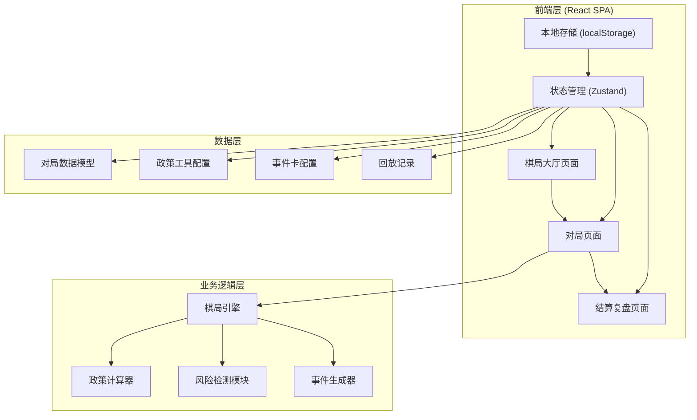
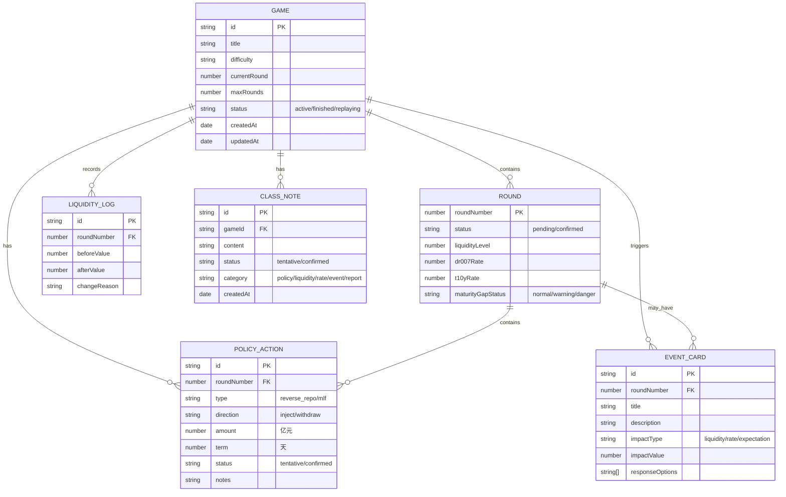

## 1. 架构设计



## 2. 技术描述

- **前端框架**：React@18 + TypeScript + Vite
- **状态管理**：Zustand（轻量级，适合棋局状态管理）
- **样式方案**：TailwindCSS@3 + CSS变量主题系统
- **图表库**：Recharts（利率走势、流动性曲线）
- **动画库**：Framer Motion（页面过渡、微交互）
- **数据持久化**：localStorage + 导出JSON
- **表单验证**：React Hook Form + Zod
- **测试框架**：Vitest + React Testing Library

## 3. 路由定义

| 路由 | 页面 | 用途 |
|------|------|------|
| `/` | 棋局大厅 | 新局创建、历史对局列表 |
| `/game/:gameId` | 对局页面 | 进行中的棋局、政策操作 |
| `/replay/:gameId` | 回放页面 | 历史对局回放 |
| `/result/:gameId` | 结算复盘 | 对局结果、数据分析、报告导出 |

## 4. 数据模型

### 4.1 核心数据结构



### 4.2 TypeScript 类型定义

```typescript
// 棋局状态
type GameStatus = 'active' | 'finished' | 'replaying';
type RoundStatus = 'pending' | 'confirmed';
type ActionStatus = 'tentative' | 'confirmed';
type RiskStatus = 'normal' | 'warning' | 'danger';
type NoteCategory = 'policy' | 'liquidity' | 'rate' | 'event' | 'report';

interface Game {
  id: string;
  title: string;
  difficulty: 'easy' | 'normal' | 'hard';
  currentRound: number;
  maxRounds: number;
  status: GameStatus;
  createdAt: Date;
  updatedAt: Date;
}

interface PolicyAction {
  id: string;
  roundNumber: number;
  type: 'reverse_repo' | 'mlf';
  direction: 'inject' | 'withdraw';
  amount: number;
  term: number;
  status: ActionStatus;
  notes?: string;
}

interface MarketState {
  roundNumber: number;
  liquidity: number;
  dr007: number;
  t10y: number;
  excessReserveRatio: number;
  maturityGap: number;
  liquidityRisk: RiskStatus;
  rateLagEffect: number; // 0-1, 0表示完全滞后
}

interface EventCard {
  id: string;
  roundNumber: number;
  title: string;
  description: string;
  impactType: 'liquidity' | 'rate' | 'expectation';
  impactValue: number;
  options: EventOption[];
}

interface EventOption {
  id: string;
  label: string;
  effectDescription: string;
  liquidityModifier: number;
  rateModifier: number;
}

interface ClassNote {
  id: string;
  gameId: string;
  content: string;
  status: ActionStatus;
  category: NoteCategory;
  createdAt: Date;
}
```

## 5. 棋局引擎核心算法

### 5.1 流动性计算公式

```
流动性变化 = 政策工具注入/收回 + 事件影响 + 自然波动
当期流动性 = 上期流动性 + 流动性变化
```

### 5.2 利率传导模型（考虑滞后效应）

```
理论利率变化 = f(流动性变化, 预期变化, 市场情绪)
实际利率变化 = 理论利率变化 × (1 - rateLagEffect) + 上期未传导部分
rateLagEffect 随回合递减
```

### 5.3 期限错配检测

```
加权平均期限 = Σ(各期限工具金额 × 期限) / Σ工具金额
期限错配程度 = |目标期限 - 加权平均期限|
风险等级:
  - 正常: 错配程度 < 7天
  - 警告: 7天 ≤ 错配程度 < 14天
  - 危险: 错配程度 ≥ 14天
```

### 5.4 流动性过剩检测

```
超额准备金率 = 当期流动性 / 存款基数
过剩状态:
  - 不足: 超额准备金率 < 1.5%
  - 正常: 1.5% ≤ 超额准备金率 ≤ 2.5%
  - 过剩: 超额准备金率 > 2.5%
```

## 6. 测试策略

### 6.1 单元测试覆盖

| 测试类别 | 测试点 | 关键断言 |
|---------|--------|---------|
| 重复提交 | 同一回合多次确认 | 应抛出错误，状态不变 |
| 缺字段验证 | 金额为空时提交 | 应提示错误，焦点定位到金额输入框 |
| 状态转换 | 临时→确认 | 数据锁定，不可编辑 |
| 状态转换 | 确认→临时 | 应被拦截，提示二次确认 |
| 流动性计算 | 逆回购注入 | 流动性正确增加 |
| 利率滞后 | 政策效果验证 | 当期仅部分生效，下期完全生效 |
| 风险检测 | 期限错配边界值 | 7天、14天阈值正确触发 |

### 6.2 集成测试

- 完整对局流程测试（创建→操作→结算→回放）
- 数据持久化测试（刷新页面后数据不丢失）
- 导出导入测试（JSON格式正确性）
