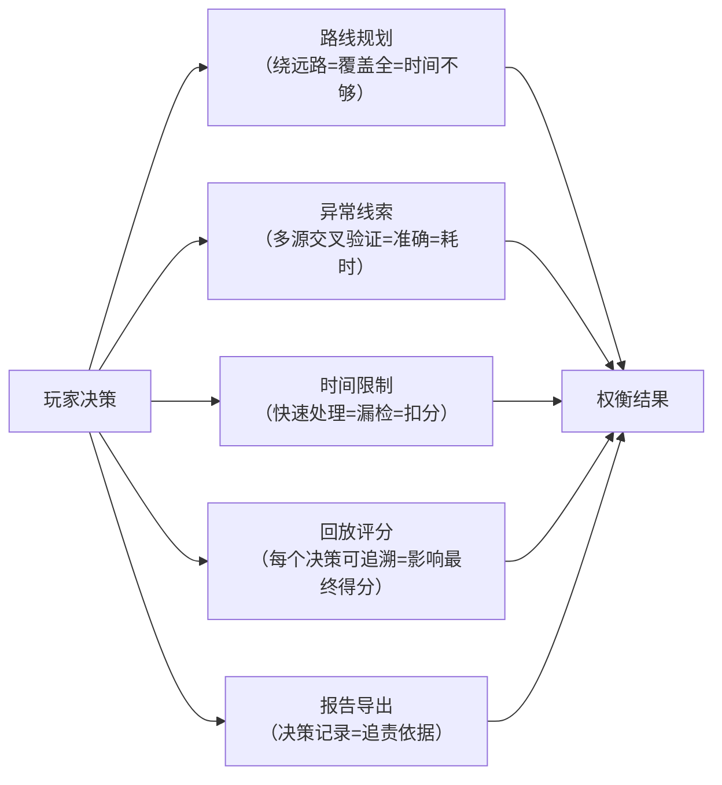

## 1. 产品概述

美术馆夜巡解谜游戏是一款面向安保培训的严肃游戏，玩家扮演夜班安保人员，在限时内根据多源传感器数据（灯光、门禁、作品震动传感器、巡逻路线、夜巡报告）排查展厅异常。游戏强调数据溯源与责任界定，将路线规划、异常线索、时间限制、回放评分、报告导出作为核心权衡机制，而非单纯背景设定。

- 核心目标：通过游戏化方式培训安保人员识别和处理三类高频异常（漏巡角落、门禁误报、作品震动未处理），形成可追溯的决策记录
- 目标用户：美术馆安保团队、培训师
- 市场价值：将枯燥的安保流程转化为可重复、可评分、可复盘的训练工具，保留完整决策链供事后追责分析

---

## 2. 核心功能

### 2.1 用户角色

| 角色 | 注册方式 | 核心权限 |
|------|----------|----------|
| 学员（玩家） | 无需注册，本地运行 | 进行游戏、查看结算、回放复盘 |
| 培训师 | 无需注册 | 查看学员报告、导出培训记录 |

### 2.2 功能模块

1. **游戏主页**：开始游戏、重新开局、历史复盘入口、规则说明
2. **游戏主界面**：展厅地图、多源数据面板（6个独立来源）、巡逻路线规划、时间倒计时、异常处理交互
3. **结算页**：关键选择时间线、评分明细、异常处理统计、报告导出
4. **复盘回放页**：逐帧回放、决策点标注、正确/错误对比、原理解释

### 2.3 页面详情

| 页面名称 | 模块名称 | 功能描述 |
|----------|----------|----------|
| 游戏主页 | 开局选择 | 新游戏 / 加载历史复盘 / 规则说明 |
| 游戏主页 | 规则展示 | 动态展示五类权衡规则（路线/线索/时间/评分/导出） |
| 游戏主界面 | 展厅地图 | 可交互平面图，显示当前位置、已巡区域、未巡角落告警 |
| 游戏主界面 | 六源数据面板 | 独立分区展示：展厅状态、作品传感器、门禁记录、灯光控制、巡逻路线、夜巡报告草稿 |
| 游戏主界面 | 路线规划器 | 点击规划巡逻顺序，实时计算剩余时间与路线权重 |
| 游戏主界面 | 异常处理中心 | 弹窗展示异常详情，提供"确认异常"/"标记误报"/"忽略"三种选择，记录决策时间 |
| 游戏主界面 | 时间系统 | 倒计时 + 时间加速控制，巡逻移动消耗时间，处理异常消耗时间 |
| 结算页 | 关键选择时间线 | 按时间顺序展示所有关键决策（处理了什么、何时处理、选择了什么） |
| 结算页 | 评分明细 | 漏巡扣分、误报扣分、未处理震动扣分、处理效率加分 |
| 结算页 | 报告导出 | 导出JSON/CSV格式完整决策记录，包含数据来源标记 |
| 复盘回放页 | 时间轴控制 | 播放/暂停/进度拖动/逐帧前进后退 |
| 复盘回放页 | 决策标注 | 在关键决策点暂停，显示当时的六源数据状态与正确处理方式对比 |
| 复盘回放页 | 原理解释 | 每个错误决策点提供培训注解，说明为何该处理是错误的 |

---

## 3. 核心流程

### 3.1 游戏主流程

玩家从主页选择"新游戏" → 系统随机生成异常场景（包含3-5个异常，分布在不同展厅和时间段） → 玩家查看初始六源数据 → 规划第一轮巡逻路线 → 开始巡逻，时间流逝 → 途中触发异常事件 → 玩家根据六源数据判断并做出处理选择 → 继续巡逻直至时间结束或所有异常处理完毕 → 进入结算页查看评分与关键选择 → 可选择导出报告、重新开局、或进入复盘回放。

### 3.2 权衡规则设计（核心玩法）

---

## 4. 用户界面设计

### 4.1 设计风格

- **主色调**：深夜蓝（#0a1628）作为背景，模拟美术馆夜间环境；警示红（#dc2626）标记异常；安全绿（#059669）标记正常；琥珀黄（#f59e0b）标记待确认
- **辅助色**：冷灰系列（#1e293b, #334155, #64748b）区分不同数据来源面板
- **字体**：标题使用 "JetBrains Mono" 等宽字体营造监控系统氛围；正文使用 "Noto Sans SC" 保证中文可读性
- **按钮风格**：扁平直角设计，1px边框，hover时有微光效果，模拟工业监控UI
- **布局风格**：网格化分区布局，六个数据源面板有明确边框分隔，每个面板左上角有来源标签（如"[门禁系统]"），便于追责时快速定位数据来源
- **图标风格**：使用线性图标，统一2px描边，保持监控系统的冷峻感

### 4.2 页面设计概览

| 页面名称 | 模块名称 | UI元素 |
|----------|----------|--------|
| 游戏主页 | 开局选择 | 暗色渐变背景 + 美术馆剪影 + 三个大按钮垂直排列 + 规则卡片横向滚动 |
| 游戏主界面 | 整体布局 | 三栏布局：左栏（25%）六源数据面板（可折叠）、中栏（50%）展厅地图、右栏（25%）路线规划+时间+异常队列 |
| 游戏主界面 | 六源数据面板 | 每个来源独立卡片，带标题栏、来源标签、状态指示点；点击可展开查看详情 |
| 游戏主界面 | 展厅地图 | SVG可交互平面图，展厅hover高亮，已巡区域半透明绿色遮罩，未巡角落闪烁红点，异常位置脉冲动画 |
| 结算页 | 关键时间线 | 垂直时间轴，每个节点带决策图标、时间戳、处理结果、数据来源引用 |
| 复盘回放页 | 控制栏 | 底部固定控制条，含播放按钮、进度条、时间显示、速度控制（0.5x/1x/2x） |

### 4.3 响应式

- 桌面端优先设计，最小支持1280px宽度
- 平板端（768px-1279px）：改为上下布局，地图在上，数据面板在下可横向滚动
- 移动端（<768px）：简化为单页滚动，核心功能保留（地图+异常处理），高级功能（路线规划器）可折叠

### 4.4 动效设计

- 异常告警：红色脉冲动画 + 低频闪烁，每秒1次
- 巡逻移动：位置平滑过渡（1s）+ 轨迹渐显
- 数据更新：新数据从顶部滑入，旧数据上移，数字变化时滚动动画
- 页面切换：渐隐渐显（300ms），结算页从底部滑入
- 悬停反馈：面板边框发光，按钮背景微亮

---

## 5. 数据来源分离规范（追责要求）

所有数据必须标记来源，在UI和导出数据中保持可追溯：

| 数据来源 | 标签 | 颜色标记 | 存储前缀 |
|----------|------|----------|----------|
| 展厅状态 | [展厅] | 蓝色边框 | hall_ |
| 作品传感器 | [作品] | 紫色边框 | art_ |
| 门禁记录 | [门禁] | 绿色边框 | door_ |
| 灯光控制 | [灯光] | 黄色边框 | light_ |
| 巡逻路线 | [路线] | 青色边框 | route_ |
| 夜巡报告 | [报告] | 灰色边框 | report_ |
