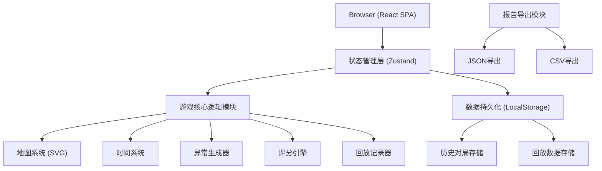

## 1. 架构设计



---

## 2. 技术描述

- **前端**：React@18 + TypeScript + Vite
- **样式**：Tailwind CSS@3 + CSS Variables
- **状态管理**：Zustand（轻量级，适合游戏状态快照）
- **路由**：React Router DOM@6
- **图标**：Lucide React
- **数据持久化**：LocalStorage（无需后端，纯前端运行）
- **图表/可视化**：原生 SVG（展厅地图）+ CSS 动画
- **初始化工具**：vite-init
- **后端**：无（纯前端单页应用，所有逻辑在浏览器端运行）
- **数据库**：LocalStorage 作为持久化存储

---

## 3. 路由定义

| 路由 | 页面组件 | 用途 |
|------|----------|------|
| `/` | `HomePage` | 游戏主页，开局选择、历史复盘入口 |
| `/game` | `GamePage` | 游戏主界面 |
| `/result` | `ResultPage` | 结算页，评分与关键选择 |
| `/replay/:id` | `ReplayPage` | 复盘回放页 |

---

## 4. 数据模型

### 4.1 核心类型定义

```typescript
// 数据来源枚举
enum DataSource {
  HALL = 'hall',      // 展厅状态
  ART = 'art',        // 作品传感器
  DOOR = 'door',      // 门禁记录
  LIGHT = 'light',    // 灯光控制
  ROUTE = 'route',    // 巡逻路线
  REPORT = 'report',  // 夜巡报告
}

// 异常类型
enum AnomalyType {
  MISSED_CORNER = 'missed_corner',    // 漏巡角落
  DOOR_FALSE_ALARM = 'door_false_alarm',  // 门禁误报
  ART_VIBRATION = 'art_vibration',    // 作品震动
  LIGHT_ABNORMAL = 'light_abnormal',  // 灯光异常
}

// 异常处理状态
enum AnomalyStatus {
  PENDING = 'pending',      // 待处理
  CONFIRMED = 'confirmed',  // 确认异常
  FALSE_ALARM = 'false_alarm',  // 标记误报
  IGNORED = 'ignored',      // 忽略
}

// 展厅
interface Hall {
  id: string;
  name: string;
  position: { x: number; y: number; width: number; height: number };
  corners: string[];  // 角落ID列表
  isPatrolled: boolean;
  patrolTime: number | null;
}

// 作品
interface Artwork {
  id: string;
  name: string;
  hallId: string;
  position: { x: number; y: number };
  vibrationSensor: {
    enabled: boolean;
    threshold: number;
    currentValue: number;
    lastTriggered: number | null;
  };
}

// 门禁
interface Door {
  id: string;
  name: string;
  hallId: string;
  position: { x: number; y: number };
  status: 'open' | 'closed' | 'locked';
  lastAccess: number | null;
  accessLog: DoorAccessLog[];
  falseAlarmCount: number;
}

// 门禁记录
interface DoorAccessLog {
  id: string;
  timestamp: number;
  type: 'open' | 'close' | 'alarm' | 'unlock';
  source: DataSource.DOOR;
  details: string;
}

// 灯光
interface Light {
  id: string;
  name: string;
  hallId: string;
  position: { x: number; y: number };
  status: 'on' | 'off' | 'dimmed' | 'fault';
  brightness: number;
  lastChanged: number;
}

// 巡逻路线节点
interface RouteNode {
  id: string;
  hallId: string;
  position: { x: number; y: number };
  type: 'hall' | 'corner' | 'door' | 'artwork';
  estimatedTime: number;  // 到达所需时间（秒）
}

// 异常事件
interface Anomaly {
  id: string;
  type: AnomalyType;
  source: DataSource;
  relatedEntityId: string;  // 关联的展厅/作品/门禁/灯光ID
  triggerTime: number;      // 游戏内触发时间（秒）
  detectedTime: number | null;  // 玩家发现时间
  resolvedTime: number | null;  // 玩家处理时间
  status: AnomalyStatus;
  playerChoice: AnomalyStatus | null;
  isTrueAnomaly: boolean;   // 是否为真异常（用于评分）
  description: string;
  evidence: {
    source: DataSource;
    data: any;
    timestamp: number;
  }[];
}

// 玩家决策记录
interface Decision {
  id: string;
  timestamp: number;        // 游戏内时间
  realTimestamp: number;    // 真实时间
  anomalyId: string;
  choice: AnomalyStatus;
  evidenceUsed: DataSource[];  // 决策时查看过的数据源
  timeSpent: number;        // 决策耗时（秒）
  isCorrect: boolean;
}

// 评分项
interface ScoreItem {
  category: string;
  description: string;
  points: number;
  maxPoints: number;
}

// 游戏状态
interface GameState {
  id: string;
  startTime: number;        // 真实开始时间
  endTime: number | null;   // 真实结束时间
  gameTime: number;         // 游戏内当前时间（秒）
  totalTime: number;        // 游戏总时长（秒）
  timeScale: number;        // 时间加速倍数
  isPaused: boolean;
  isGameOver: boolean;
  currentPosition: { x: number; y: number };
  currentHallId: string | null;
  plannedRoute: RouteNode[];
  halls: Hall[];
  artworks: Artwork[];
  doors: Door[];
  lights: Light[];
  anomalies: Anomaly[];
  decisions: Decision[];
  score: ScoreItem[];
  totalScore: number;
  viewedDataSources: { [key in DataSource]: number[] };  // 查看记录：source -> 时间戳数组
  reportDraft: string;
}

// 回放数据
interface ReplayData {
  gameId: string;
  snapshots: GameStateSnapshot[];
  decisions: Decision[];
  anomalies: Anomaly[];
  finalScore: number;
}

// 游戏状态快照（用于回放）
interface GameStateSnapshot {
  timestamp: number;        // 游戏内时间
  gameState: Partial<GameState>;
  eventType: 'tick' | 'decision' | 'anomaly_trigger' | 'move';
}
```

### 4.2 状态管理设计

使用 Zustand 创建三个 store：

1. **useGameStore**：游戏主状态，包含所有游戏数据
2. **useUIModalStore**：UI 状态（弹窗、折叠面板等）
3. **useHistoryStore**：历史对局管理（LocalStorage 读写）

---

## 5. 核心模块设计

### 5.1 游戏核心逻辑模块

```
src/game/
├── types.ts              # 类型定义
├── config.ts             # 游戏配置（时间、分数权重、概率）
├── generator.ts          # 随机场景生成器
├── engine.ts             # 游戏引擎（tick、事件触发）
├── scoring.ts            # 评分引擎
├── replay.ts             # 回放管理器
└── export.ts             # 报告导出
```

### 5.2 React 组件结构

```
src/
├── pages/
│   ├── HomePage.tsx
│   ├── GamePage.tsx
│   ├── ResultPage.tsx
│   └── ReplayPage.tsx
├── components/
│   ├── game/
│   │   ├── HallMap.tsx           # 展厅地图
│   │   ├── DataPanel.tsx         # 六源数据面板
│   │   ├── RoutePlanner.tsx      # 路线规划器
│   │   ├── TimeDisplay.tsx       # 时间显示
│   │   ├── AnomalyQueue.tsx      # 异常队列
│   │   ├── AnomalyModal.tsx      # 异常处理弹窗
│   │   └── PlayerMarker.tsx      # 玩家位置标记
│   ├── result/
│   │   ├── DecisionTimeline.tsx  # 关键选择时间线
│   │   ├── ScoreBreakdown.tsx    # 评分明细
│   │   └── ExportButtons.tsx     # 导出按钮
│   ├── replay/
│   │   ├── PlaybackControls.tsx  # 回放控制栏
│   │   ├── DecisionAnnotation.tsx # 决策标注
│   │   └── ExplanationPanel.tsx  # 原理解释面板
│   └── common/
│       ├── SourceBadge.tsx       # 数据来源标签
│       ├── StatusIndicator.tsx   # 状态指示器
│       └── GlowButton.tsx        # 发光按钮
├── hooks/
│   ├── useGameEngine.ts          # 游戏引擎Hook
│   ├── useReplayPlayer.ts        # 回放播放器Hook
│   └── useLocalStorage.ts        # LocalStorage Hook
├── store/
│   ├── useGameStore.ts
│   ├── useUIStore.ts
│   └── useHistoryStore.ts
├── utils/
│   ├── time.ts                   # 时间格式化
│   ├── export.ts                 # 导出工具
│   └── animation.ts              # 动画工具
└── mock/
    ├── halls.ts                  # 展厅预设数据
    ├── artworks.ts               # 作品预设数据
    └── scenarios.ts              # 异常场景预设
```

---

## 6. 核心算法

### 6.1 异常生成算法

1. 预设 3-5 个异常，类型比例：
   - 漏巡角落：30%
   - 门禁误报：30%
   - 作品震动：30%
   - 灯光异常：10%

2. 每个异常配置：
   - 触发时间（随机分布在游戏时间的 20%-80%）
   - 关联实体（随机选择）
   - 是否为真异常（70% 真异常，30% 假异常用于测试误报识别）
   - 证据链（关联 2-3 个数据源的异常数据）

### 6.2 评分算法

总分 100 分，由以下部分组成：

| 评分项 | 权重 | 评分规则 |
|--------|------|----------|
| 异常处理准确率 | 40% | 每个正确处理 +10，错误处理 -15 |
| 巡逻覆盖率 | 20% | 每个漏巡角落 -5，全覆盖 +20 |
| 处理时效性 | 20% | 异常触发后 30秒内处理 +5，超过 120秒 -5 |
| 误报识别率 | 10% | 正确识别假异常 +10，将真异常标记为误报 -10 |
| 数据交叉验证 | 10% | 决策前查看 ≥3 个数据源 +10，仅查看 1 个 -5 |

### 6.3 时间系统

- 游戏总时长：600秒（10分钟）真实时间 = 8小时虚拟时间
- 时间倍率：1x（默认）、2x、4x，可随时切换
- 移动耗时：根据距离计算，每秒移动 50 像素
- 处理异常耗时：每个决策固定消耗 10 秒游戏时间

### 6.4 回放系统

- 每秒记录一次状态快照
- 关键事件（决策、异常触发、移动）额外记录快照
- 回放时支持：播放/暂停、速度控制（0.5x/1x/2x）、进度拖动、逐帧前进后退
- 决策点自动暂停，显示对比分析

---

## 7. 性能优化

- 使用 `useMemo` 缓存地图渲染结果
- 状态更新采用批量更新，避免频繁重渲染
- 回放数据采用增量存储，只记录变化的字段
- LocalStorage 设置 50MB 容量限制，超过时提示清理旧数据
- SVG 地图使用 `React.memo` 包装，避免不必要的重绘
