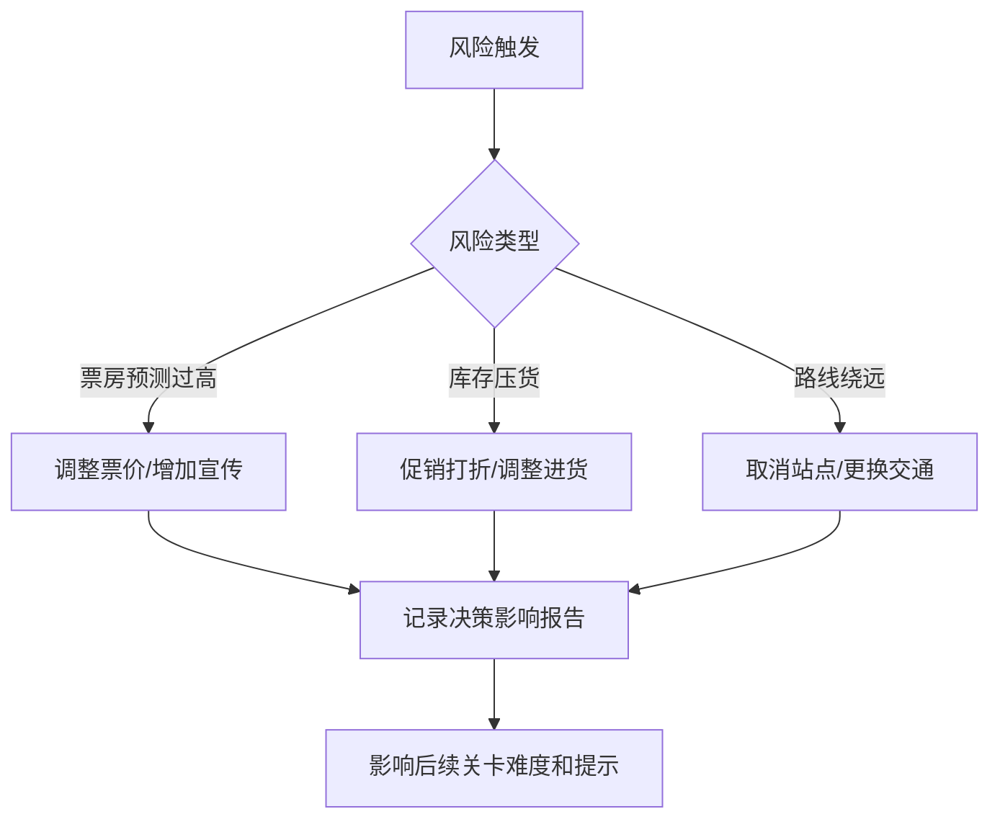

## 1. 产品概述

乐队巡演预算赛是一款面向独立音乐人的巡演预算模拟游戏。玩家通过管理车费、场租、票房和周边销售，在限定预算内完成多城市巡演，目标是实现盈利或至少回本。游戏不只是简单的胜负判定，而是提供完整的复盘报告，帮助乐队在真实巡演前进行预算演练。

### 1.1 核心价值
- 为独立乐队提供低成本的巡演预算模拟训练
- 识别巡演中的关键风险点（票房预测、库存管理、路线规划）
- 保留原始数据口径和手工备注，支持乐队个性化数据导入
- 通过失败回放和处置建议，积累巡演决策经验

### 1.2 目标用户
- 独立乐队经纪人/财务负责人
- 巡演策划人员
- 音乐行业从业者

## 2. 核心功能

### 2.1 用户角色
| 角色 | 注册方式 | 核心权限 |
|------|----------|----------|
| 乐队用户 | 本地使用，无需注册 | 导入数据、进行游戏、查看复盘、导出报告 |

### 2.2 功能模块
1. **数据导入页**：城市站点、场租、车费、票价、周边库存、巡演报告导入与预览
2. **游戏主界面**：巡演路线地图、现金流面板、库存管理、实时提示
3. **关卡结算页**：单站结算、现金流更新、风险提示
4. **复盘报告页**：完整巡演分析、处置建议、失败回放
5. **报告导出页**：PDF/Excel格式报告导出

### 2.3 页面详情
| 页面名称 | 模块名称 | 功能描述 |
|----------|----------|----------|
| 数据导入页 | 文件上传 | 支持CSV/Excel导入，拖拽上传，格式校验 |
| 数据导入页 | 数据预览 | 显示原始数据，标记脏数据，保留手工备注字段 |
| 数据导入页 | 清洗确认 | 展示处理顺序，用户确认后进入游戏 |
| 游戏主界面 | 路线地图 | 可视化巡演路线，标记已完成/待进行站点 |
| 游戏主界面 | 现金流面板 | 实时显示当前预算、收入、支出、利润 |
| 游戏主界面 | 库存管理 | 周边商品库存监控，补货/促销决策 |
| 游戏主界面 | 风险提示 | 票房预测过高、库存压货、路线绕远预警 |
| 关卡结算页 | 单站结算 | 本场票房、场租、车费、周边销售明细 |
| 关卡结算页 | 风险处置 | 针对问题提供3种处置建议供选择 |
| 复盘报告页 | 财务总览 | 巡演全程财务数据可视化 |
| 复盘报告页 | 风险分析 | 识别所有风险点，标注处理效果 |
| 复盘报告页 | 失败回放 | 可回溯关键决策节点，查看不同选择的模拟结果 |
| 复盘报告页 | 处置建议 | 针对本次巡演的改进建议清单 |
| 报告导出页 | 格式选择 | 支持PDF/Excel导出，可选择包含原始数据 |

## 3. 核心流程

### 3.1 用户主流程

### 3.2 特殊场景处理流程

## 4. 用户界面设计

### 4.1 设计风格
- **主色调**：深炭灰 (#1a1a2e) 搭配霓虹粉 (#e94560) 和霓虹青 (#0f3460)
- **辅助色**：警告橙 (#ff9a3c)、成功绿 (#4ade80)、危险红 (#ef4444)
- **整体风格**：复古摇滚 + 赛博朋克，模拟演出海报和巡演巴士的视觉质感
- **字体**：展示字体使用 "Permanent Marker"（手写摇滚风格），正文字体使用 "Inter"
- **按钮风格**：霓虹边框，悬停时发光效果，粗体大写文字
- **图标风格**：线性图标，音乐相关元素（吉他、麦克风、巴士、唱片）
- **背景**：暗纹噪点底 + 霓虹光效装饰，模拟演出舞台灯光感

### 4.2 页面设计概览
| 页面名称 | 模块名称 | UI 元素 |
|----------|----------|---------|
| 数据导入页 | 上传区域 | 虚线边框，拖拽悬停时霓虹边框发光，显示文件图标 |
| 数据导入页 | 数据表格 | 深色背景，脏数据行用橙色高亮，备注列用斜体区分 |
| 游戏主界面 | 路线地图 | 连线式地图，站点用唱片图标表示，当前站点霓虹高亮 |
| 游戏主界面 | 仪表盘 | 仿汽车仪表盘设计，现金流、库存、风险指数三个表盘 |
| 游戏主界面 | 事件卡片 | 霓虹边框卡片，弹出时带有滑入动画，显示风险和处置选项 |
| 关卡结算页 | 结算清单 | 分栏布局，收入绿色、支出红色，合计数字放大加粗 |
| 复盘报告页 | 时间轴 | 垂直时间轴，标记每站关键事件和决策点 |
| 复盘报告页 | 图表 | 深色主题图表，霓虹色线条，支持hover显示详情 |

### 4.3 响应式设计
- **桌面优先**：采用桌面端为主要设计目标，充分利用宽屏展示地图和多面板
- **平板适配**：面板改为可折叠设计，地图可缩放
- **移动端**：垂直堆叠布局，关键信息置顶，支持手势操作
- **触摸优化**：按钮最小高度48px，滑动交互支持，避免双击缩放

### 4.4 动画与交互
- **页面切换**：淡入淡出 + 轻微滑动，模拟舞台幕布效果
- **数据更新**：数字滚动动画，现金流变化时有正负颜色闪烁
- **风险提示**：卡片从底部滑入，伴有轻微震动效果，霓虹边框呼吸动画
- **悬停效果**：按钮和可点击元素悬停时发光，图标轻微放大
- **加载状态**：唱片旋转动画，配合进度条显示数据处理进度

## 5. 游戏机制设计

### 5.1 核心数值系统
| 数值项 | 计算方式 | 影响范围 |
|--------|----------|----------|
| 初始预算 | 用户导入或默认值 | 全局可用资金 |
| 票房收入 | 到场人数 × 票价 - 场地分成 | 现金流 |
| 场租支出 | 固定费用 + 票房分成（如有） | 现金流 |
| 交通费用 | 距离 × 交通方式单价 | 现金流 |
| 周边收入 | 销量 × 单价 | 现金流、库存 |
| 周边成本 | 进货量 × 成本价 | 现金流、库存 |
| 风险指数 | 综合票房偏差、库存周转、路线效率 | 提示频率、关卡难度 |

### 5.2 风险判定规则
- **票房预测过高**：实际票房 < 预测的70%，触发高风险提示
- **库存压货**：某类商品库存周转天数 > 巡演剩余天数 × 1.5
- **路线绕远**：实际路线距离 > 最优路线的120%
- **临界状态**：现金流 < 未来3站预估支出的总和

### 5.3 处置建议系统
每种风险提供3种处置方案，不同方案影响不同：
- **保守方案**：风险低，收益也较低
- **平衡方案**：中等风险，中等收益
- **激进方案**：高风险，可能获得高回报或导致失败

所有决策都会被记录，并在复盘报告中分析其影响。
