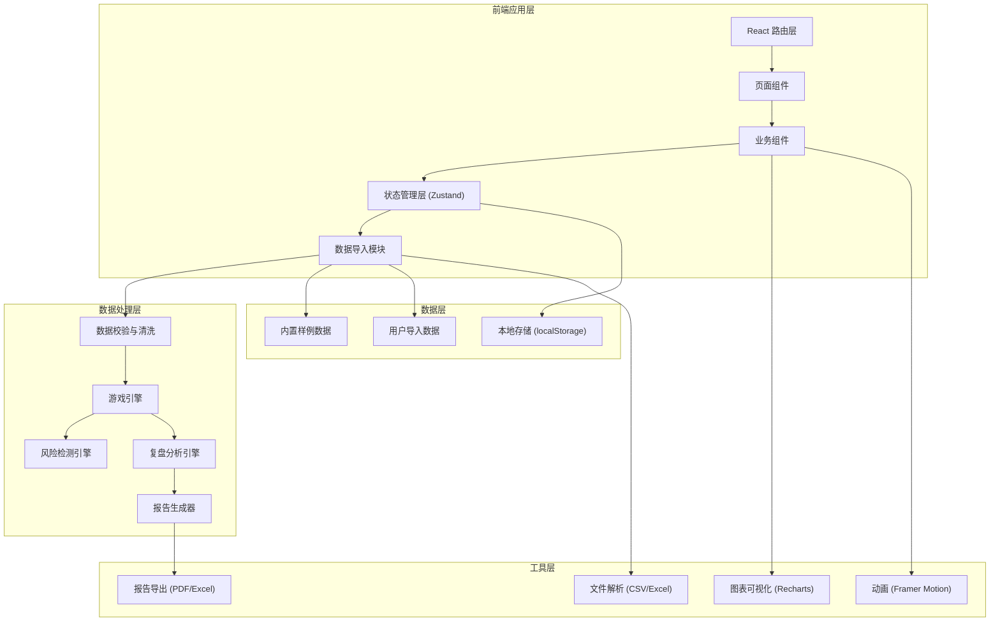
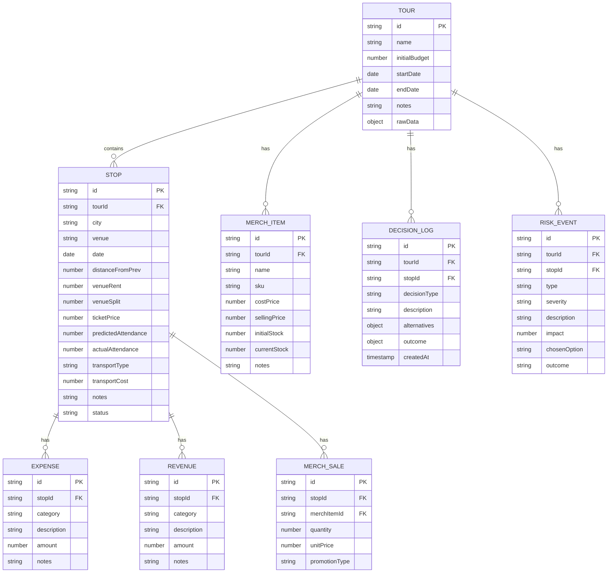

## 1. 架构设计



## 2. 技术描述

### 2.1 技术栈选择
| 层级 | 技术选型 | 版本 | 用途说明 |
|------|----------|------|----------|
| 前端框架 | React | 18.x | 组件化开发，虚拟DOM性能优化 |
| 类型系统 | TypeScript | 5.x | 类型安全，减少运行时错误 |
| 构建工具 | Vite | 5.x | 快速开发构建，HMR支持 |
| 样式方案 | TailwindCSS | 3.x | 原子化CSS，快速实现UI |
| 状态管理 | Zustand | 4.x | 轻量级状态管理，支持中间件 |
| 路由管理 | React Router | 6.x | 单页应用路由控制 |
| 动画库 | Framer Motion | 11.x | 流畅的页面和交互动画 |
| 图表库 | Recharts | 2.x | 财务数据可视化图表 |
| 文件解析 | PapaParse | 5.x | CSV文件解析 |
| 文件解析 | XLSX | 0.18.x | Excel文件解析 |
| PDF导出 | jspdf | 2.x + jspdf-autotable | PDF报告生成 |
| Excel导出 | XLSX | 0.18.x | Excel报告导出 |
| 图标库 | Lucide React | 0.x | 线性图标系统 |

### 2.2 项目初始化
- **初始化方式**：`npm init vite-init@latest -y . -- --template react-ts --force`
- **后端服务**：无，纯前端应用，数据存储于浏览器本地
- **数据库**：localStorage 存储游戏进度和用户数据

## 3. 路由定义

| 路由路径 | 页面名称 | 核心功能 |
|----------|----------|----------|
| `/` | 首页/启动页 | 游戏介绍、开始新游戏、加载存档 |
| `/import` | 数据导入页 | 文件上传、数据预览、清洗确认 |
| `/game` | 游戏主界面 | 路线地图、仪表盘、库存管理、风险处置 |
| `/settlement/:stopId` | 关卡结算页 | 单站结算明细、风险处理选择 |
| `/review` | 复盘报告页 | 财务总览、风险分析、失败回放、处置建议 |
| `/export` | 报告导出页 | 格式选择、导出配置、下载报告 |

## 4. 数据模型

### 4.1 核心数据实体关系



### 4.2 数据导入格式规范

#### 城市站点表 (stops.csv)
| 字段名 | 类型 | 必填 | 说明 |
|--------|------|------|------|
| city | string | 是 | 城市名称 |
| venue | string | 是 | 场地名称 |
| date | date | 是 | 演出日期 |
| distance_from_prev | number | 否 | 距上一站距离(km) |
| venue_rent | number | 是 | 场地租金(元) |
| venue_split | number | 否 | 场地票房分成比例(0-1) |
| ticket_price | number | 是 | 票价(元) |
| predicted_attendance | number | 是 | 预测到场人数 |
| transport_type | string | 否 | 交通方式 |
| transport_cost | number | 否 | 交通费用(元) |
| notes | string | 否 | 手工备注 |

#### 周边库存表 (merch.csv)
| 字段名 | 类型 | 必填 | 说明 |
|--------|------|------|------|
| name | string | 是 | 商品名称 |
| sku | string | 否 | 商品编码 |
| cost_price | number | 是 | 成本价(元) |
| selling_price | number | 是 | 售价(元) |
| initial_stock | number | 是 | 初始库存 |
| notes | string | 否 | 手工备注 |

#### 巡演基础信息 (tour.csv)
| 字段名 | 类型 | 必填 | 说明 |
|--------|------|------|------|
| tour_name | string | 是 | 巡演名称 |
| initial_budget | number | 是 | 初始预算(元) |
| start_date | date | 是 | 开始日期 |
| end_date | date | 是 | 结束日期 |
| band_name | string | 否 | 乐队名称 |
| notes | string | 否 | 手工备注 |

### 4.3 数据清洗规则

#### 脏数据类型与处理顺序
1. **缺失值处理**（优先级1）
   - 必填字段缺失：标记为严重错误，需用户手动补全
   - 非必填字段缺失：使用默认值填充，记录处理日志

2. **格式校验**（优先级2）
   - 日期格式错误：尝试多种格式解析，失败则标记
   - 数值字段含非数字字符：清理后转换，记录原始值

3. **逻辑校验**（优先级3）
   - 结束日期早于开始日期：标记为矛盾
   - 成本价高于售价：标记为警告
   - 预测人数为0或负数：标记为异常

4. **异常值检测**（优先级4）
   - 票价偏离均值±3σ：标记为异常
   - 场租偏离均值±3σ：标记为异常
   - 距离异常（相邻城市距离过大）：标记为路线绕远风险

所有处理操作都会记录 `processing_log`，原始数据完整保留在 `rawData` 字段中。

## 5. 核心算法设计

### 5.1 风险检测算法

```typescript
// 票房预测风险
function calculateBoxOfficeRisk(
  predicted: number,
  actual: number,
  threshold: number = 0.7
): RiskLevel {
  const ratio = actual / predicted;
  if (ratio >= 0.9) return 'low';
  if (ratio >= threshold) return 'medium';
  return 'high';
}

// 库存压货风险
function calculateInventoryRisk(
  currentStock: number,
  dailySalesRate: number,
  remainingDays: number
): RiskLevel {
  const daysToSell = currentStock / dailySalesRate;
  if (daysToSell <= remainingDays) return 'low';
  if (daysToSell <= remainingDays * 1.5) return 'medium';
  return 'high';
}

// 路线效率风险
function calculateRouteRisk(
  actualDistance: number,
  optimalDistance: number
): RiskLevel {
  const ratio = actualDistance / optimalDistance;
  if (ratio <= 1.1) return 'low';
  if (ratio <= 1.2) return 'medium';
  return 'high';
}

// 现金流风险
function calculateCashFlowRisk(
  currentCash: number,
  projectedExpenses: number[]
): RiskLevel {
  const next3Stations = projectedExpenses.slice(0, 3).reduce((a, b) => a + b, 0);
  if (currentCash >= next3Stations * 1.5) return 'low';
  if (currentCash >= next3Stations) return 'medium';
  return 'high';
}
```

### 5.2 处置建议生成算法

每种风险类型根据严重程度和当前游戏状态生成3种方案：

```typescript
interface DisposalOption {
  id: string;
  name: string;
  description: string;
  riskLevel: 'conservative' | 'balanced' | 'aggressive';
  immediateImpact: {
    cashFlow: number;
    riskIndex: number;
  };
  projectedOutcome: {
    bestCase: number;
    expectedCase: number;
    worstCase: number;
  };
}
```

### 5.3 失败回放模拟算法

```typescript
interface AlternativePath {
  decisionPointId: string;
  alternativeOption: DisposalOption;
  simulatedResult: {
    finalCashFlow: number;
    totalRevenue: number;
    totalExpense: number;
    risksAvoided: string[];
    risksCreated: string[];
  };
}

function simulateAlternativePath(
  originalTour: Tour,
  decisionPoint: DecisionLog,
  alternativeOption: DisposalOption
): AlternativePath {
  // 从决策点开始重新模拟
  // 应用备选方案的影响
  // 运行剩余站点的模拟计算
  // 返回对比结果
}
```

## 6. 项目目录结构

```
src/
├── components/           # 公共组件
│   ├── layout/          # 布局组件
│   ├── ui/              # 基础UI组件
│   └── game/            # 游戏专用组件
├── pages/               # 页面组件
│   ├── Home.tsx
│   ├── DataImport.tsx
│   ├── Game.tsx
│   ├── Settlement.tsx
│   ├── Review.tsx
│   └── Export.tsx
├── store/               # Zustand状态管理
│   ├── useGameStore.ts
│   ├── useDataStore.ts
│   └── useUIModalStore.ts
├── hooks/               # 自定义Hooks
│   ├── useGameEngine.ts
│   ├── useRiskDetection.ts
│   ├── useReviewAnalysis.ts
│   └── useDataImport.ts
├── types/               # TypeScript类型定义
│   ├── tour.ts
│   ├── game.ts
│   └── report.ts
├── utils/               # 工具函数
│   ├── parsers/         # 文件解析
│   ├── calculators/     # 计算逻辑
│   ├── exporters/       # 报告导出
│   └── validators/      # 数据校验
├── data/                # 内置样例数据
│   ├── sample-normal/   # 正常数据样例
│   ├── sample-critical/ # 临界数据样例
│   └── sample-dirty/    # 脏数据样例
├── styles/              # 全局样式
├── router/              # 路由配置
└── App.tsx              # 应用入口
```

## 7. 状态管理设计

### 7.1 游戏状态切片 (useGameStore)
```typescript
interface GameState {
  currentTour: Tour | null;
  currentStopIndex: number;
  gamePhase: 'setup' | 'playing' | 'settlement' | 'review';
  cashFlow: number;
  totalRevenue: number;
  totalExpense: number;
  riskIndex: number;
  decisions: DecisionLog[];
  riskEvents: RiskEvent[];
  isPaused: boolean;
  
  // Actions
  startTour: (tour: Tour) => void;
  processStop: (stopId: string, results: StopResult) => void;
  recordDecision: (decision: Omit<DecisionLog, 'id' | 'createdAt'>) => void;
  updateCashFlow: (amount: number) => void;
  goToPhase: (phase: GamePhase) => void;
  resetGame: () => void;
}
```

### 7.2 数据导入状态切片 (useDataStore)
```typescript
interface DataState {
  rawFiles: File[];
  parsedData: {
    tour: Partial<Tour>;
    stops: Partial<Stop>[];
    merch: Partial<MerchItem>[];
  };
  processingLog: ProcessingLogEntry[];
  validationErrors: ValidationError[];
  isDirty: boolean;
  
  // Actions
  uploadFiles: (files: File[]) => Promise<void>;
  validateData: () => ValidationError[];
  cleanData: () => ProcessingLogEntry[];
  confirmImport: () => Tour;
  clearData: () => void;
}
```

## 8. 关键实现要点

### 8.1 原始数据保留策略
- 所有导入的原始数据完整存储在 `Tour.rawData` 字段中
- 数据清洗时不修改原始值，仅在 `processingLog` 中记录转换规则
- 手工备注字段（notes）在所有处理过程中保持原样，不做任何清洗
- 导出报告时可选择包含原始数据对比列

### 8.2 关卡节奏控制
- 风险指数影响后续事件触发概率：风险越高，负面事件概率越大
- 玩家决策影响后续提示内容：多次选择保守方案会增加激进机会提示
- 失败节点可触发回溯机制：关键失败点允许回退并尝试其他选择

### 8.3 复盘报告生成
- 报告结构：执行摘要 → 财务总览 → 站点分析 → 风险分析 → 决策分析 → 改进建议
- 每个风险点都标注：触发原因、处置选择、实际影响、可选优化方案
- 失败回放功能提供至少2个关键决策点的模拟对比

### 8.4 性能优化策略
- 数据导入时使用 Web Worker 处理大文件解析
- 图表数据使用 useMemo 缓存计算结果
- 游戏状态变更使用 immer 保证不可变更新
- 路由切换时保留滚动位置和表单状态
