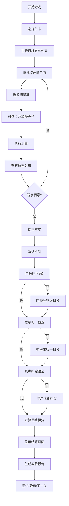

## 1. 产品概述

量子门电路拼装游戏是一款面向科普教育的互动学习工具，通过拖拽式关卡设计让学生理解量子计算原理。玩家通过摆放量子门构建电路，观察测量概率分布，识别错误来源（门顺序错误、概率未归一、噪声未扣除），在游戏中掌握量子计算核心概念。

- 核心目标：让量子计算学习游戏化、可视化、可交互
- 目标用户：中学生、大学本科生、量子计算入门学习者
- 市场价值：填补量子计算科普教育的互动工具空白

## 2. 核心功能

### 2.1 用户角色

| 角色 | 登录方式 | 核心权限 |
|------|----------|----------|
| 玩家 | 无需登录，本地存储 | 游戏关卡、电路编辑、实验报告导出 |

### 2.2 功能模块

1. **主界面**：关卡选择、游戏说明、样例入口
2. **游戏界面**：量子位轨道、门库面板、电路编辑区、概率显示区
3. **结算界面**：得分展示、错误分析、目标对比、改进建议
4. **实验报告**：回放记录、操作日志、概率分析、导出功能

### 2.3 页面详情

| 页面名称 | 模块名称 | 功能描述 |
|-----------|-------------|---------------------|
| 主界面 | 关卡卡片 | 显示关卡名称、难度、目标态、已完成状态 |
| 主界面 | 样例入口 | 提供"正确示范"和"错误示范"快速入口 |
| 游戏界面 | 量子位轨道 | 显示多量子位线路，支持拖拽放置量子门 |
| 游戏界面 | 门库面板 | H门、X门、Y门、Z门、CNOT门、T门、S门等基础门 |
| 游戏界面 | 测量区 | 选择测量基（X/Y/Z），显示概率柱状图 |
| 游戏界面 | 噪声系统 | 可选择添加噪声卡（比特翻转、相位翻转、退相干） |
| 结算界面 | 得分面板 | 目标达成度、扣分详情、最终评级 |
| 结算界面 | 错误分析 | 门顺序错误检测、概率归一检查、噪声扣除验证 |
| 实验报告 | 回放功能 | 操作步骤回放、时间轴控制 |
| 实验报告 | 导出功能 | JSON格式导出电路数据和实验结果 |

## 3. 核心流程

玩家选择关卡 → 查看目标态和约束条件 → 从门库拖拽量子门到线路 → 选择测量基执行测量 → 查看概率分布和错误提示 → 提交答案 → 系统检测门顺序/概率归一/噪声扣除 → 显示得分和错误分析 → 生成实验报告 → 可选择重试或导出记录

## 4. 用户界面设计

### 4.1 设计风格
- **主色调**：深空蓝 (#0a1628) 作为背景，量子蓝 (#00d4ff) 作为主题色，霓虹紫 (#b24dff) 作为强调色
- **按钮风格**：圆角矩形，悬浮发光效果，点击有按压动画
- **字体**：标题使用 Orbitron（科技感字体），正文使用 JetBrains Mono（等宽代码字体）
- **布局风格**：卡片式布局，玻璃拟态效果，电路区域使用网格系统
- **图标风格**：线条简约图标，量子门使用标准电路符号

### 4.2 页面设计概述

| 页面名称 | 模块名称 | UI元素 |
|-----------|-------------|-------------|
| 主界面 | 关卡卡片 | 渐变边框、发光悬浮、难度标签、完成标记 |
| 游戏界面 | 电路编辑区 | 量子位轨道线、门插槽、拖拽放置动画、连接线发光 |
| 游戏界面 | 概率显示区 | 动态柱状图、百分比数字、颜色渐变填充 |
| 结算界面 | 错误分析 | 红色高亮错误项、展开详情、修正建议 |
| 实验报告 | 时间轴 | 操作节点、播放控制、进度条 |

### 4.3 响应性
- 桌面端优先设计（1280px+）
- 平板适配（768px-1279px）：两栏布局改为上下布局
- 移动端（<768px）：单列布局，简化门库显示

## 5. 错误检测核心规则

### 5.1 门顺序错误检测
- 检测电路中门的应用顺序是否符合量子态演化逻辑
- 对比目标态演化路径，标记位置错误的门
- 给出正确顺序提示

### 5.2 概率未归一检测
- 计算所有测量结果概率之和
- 若 |sum - 1| > 0.001，判定为未归一
- 高亮显示概率溢出或缺失项

### 5.3 噪声未扣除检测
- 当关卡要求噪声抵消时，检查是否添加了对应的噪声抵消门
- 对比噪声类型与抵消门类型是否匹配
- 计算残留噪声影响
