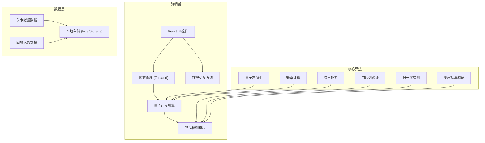

## 1. 架构设计



## 2. 技术描述

- **前端框架**: React@18 + TypeScript
- **构建工具**: Vite@5
- **样式方案**: TailwindCSS@3 + CSS Modules
- **状态管理**: Zustand
- **拖拽库**: @dnd-kit/core
- **图表库**: recharts
- **图标库**: lucide-react
- **后端**: 无（纯前端应用）
- **数据持久化**: localStorage

## 3. 目录结构

```
src/
├── components/          # UI组件
│   ├── circuit/        # 电路编辑器组件
│   ├── gates/          # 量子门组件
│   ├── layout/         # 布局组件
│   └── ui/             # 通用UI组件
├── hooks/              # 自定义Hooks
├── store/              # Zustand状态管理
├── utils/              # 工具函数
│   ├── quantum/        # 量子计算核心
│   └── validation/     # 错误检测逻辑
├── data/               # 关卡配置数据
├── types/              # TypeScript类型定义
└── pages/              # 页面组件
```

## 4. 路由定义

| 路由 | 页面名称 | 功能描述 |
|-------|---------|---------|
| / | 主界面 | 关卡选择、游戏说明、样例入口 |
| /game/:levelId | 游戏界面 | 电路编辑、概率计算、实时反馈 |
| /result/:sessionId | 结算界面 | 得分展示、错误分析、改进建议 |
| /report/:sessionId | 实验报告 | 回放记录、操作日志、导出功能 |

## 5. 核心数据模型

### 5.1 量子门模型

```typescript
interface QuantumGate {
  id: string;
  type: 'H' | 'X' | 'Y' | 'Z' | 'CNOT' | 'T' | 'S' | 'Measure';
  name: string;
  symbol: string;
  matrix: number[][];
  targetQubits: number;
}
```

### 5.2 电路模型

```typescript
interface Circuit {
  id: string;
  qubits: number;
  gates: CircuitGate[];
  measurements: Measurement[];
  noiseCards: NoiseCard[];
}

interface CircuitGate {
  id: string;
  type: string;
  position: { qubit: number; slot: number };
}
```

### 5.3 关卡模型

```typescript
interface Level {
  id: string;
  name: string;
  difficulty: 'easy' | 'medium' | 'hard';
  targetState: number[];
  qubits: number;
  availableGates: string[];
  requiredNoise?: string;
  targetProbabilities: Record<string, number>;
  hints: string[];
}
```

### 5.4 错误检测结果

```typescript
interface ValidationResult {
  isValid: boolean;
  gateOrderErrors: GateOrderError[];
  normalizationError: NormalizationError | null;
  noiseError: NoiseError | null;
  score: number;
  suggestions: string[];
}

interface GateOrderError {
  type: 'wrong_order' | 'missing_gate' | 'extra_gate';
  position: { qubit: number; slot: number };
  expected: string;
  actual: string;
  penalty: number;
}
```

## 6. 核心算法模块

### 6.1 量子态演化算法
- 使用矩阵乘法模拟量子门作用
- 支持多量子比特纠缠运算
- 实时计算态矢量演化

### 6.2 概率计算算法
- 从态矢量计算测量概率
- 支持不同测量基（X/Y/Z）
- 浮点数精度处理

### 6.3 错误检测算法
1. **门序列验证**: 动态规划匹配目标演化路径
2. **归一化检测**: 检查概率和与1的差值
3. **噪声抵消验证**: 计算噪声门与抵消门的对易关系

## 7. 启动方式说明

### 开发启动
```bash
npm install
npm run dev
```

### 样例入口
- 正确示范样例: `/game/demo-correct` - 展示标准Bell态构建
- 错误示范样例: `/game/demo-wrong` - 包含门顺序错误、概率未归一、噪声未扣除

### 失败操作示例
1. 门顺序错误: 在H门之后错误放置Z门（应放X门）
2. 概率未归一: 错误重复添加测量门导致概率溢出
3. 噪声未扣除: 添加比特翻转噪声后未添加抵消门
