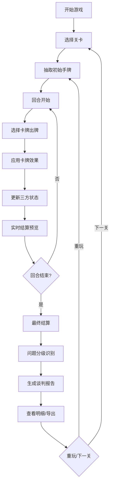

## 1. 产品概述

音乐版权谈判卡牌游戏是一款面向厂牌新人培训的互动教学工具，通过卡牌游戏形式模拟词曲、录音和发行三方的版权谈判流程，帮助新人理解版权分成、合同条款、风险识别等核心概念。

- 核心目标：通过游戏化方式让新人掌握音乐版权谈判的关键要素和风险点
- 目标用户：音乐厂牌新人、版权管理人员、法务人员
- 市场价值：填补版权谈判实操培训空白，降低培训成本，提升学习效果

## 2. 核心功能

### 2.1 用户角色
| 角色 | 注册方式 | 核心权限 |
|------|----------|----------|
| 学员 | 无需注册，直接使用 | 进行卡牌游戏、查看结算报告、导出谈判记录 |

### 2.2 功能模块
1. **游戏主界面**：卡牌谈判区、三方信息面板、实时结算预览
2. **关卡选择**：5个递进关卡（基础谈判→分成结算→条款冲突→信誉评分→综合实战）
3. **卡牌系统**：版权牌、艺人牌、平台牌、条款牌、行动牌
4. **结算系统**：分成计算、风险识别、问题分级、明细溯源
5. **报告系统**：谈判报告生成、原始/处理结果对比、导出功能

### 2.3 页面详情
| 页面名称 | 模块名称 | 功能描述 |
|---------|----------|----------|
| 开始页面 | 游戏介绍 | 游戏规则说明、角色介绍、新手引导 |
| 关卡选择 | 关卡列表 | 显示5个关卡进度、难度星级、解锁状态 |
| 谈判主界面 | 卡牌区域 | 手牌管理、出牌操作、卡牌详情查看 |
| 谈判主界面 | 三方面板 | 词曲方、录音方、发行方实时状态展示 |
| 谈判主界面 | 结算预览 | 实时分成计算、风险提示、问题标记 |
| 结算页面 | 明细分析 | 各项费用明细、问题分级展示、可点击溯源 |
| 结算页面 | 图表展示 | 分成饼图、趋势图、点击查看数据来源 |
| 报告页面 | 报告导出 | 谈判记录汇总、原始信息vs处理结果对比、PDF导出 |

## 3. 核心流程

## 4. 用户界面设计

### 4.1 设计风格
- **主色调**：深墨蓝 (#1a1a2e) 作为主背景，金色 (#d4af37) 作为强调色，象征音乐行业的专业性和价值感
- **辅助色**：酒红 (#9a031e) 表示警告/风险，翠绿 (#0f4c5c) 表示安全/正确
- **按钮风格**：微立体圆角按钮，悬停时有金色光晕效果
- **字体**：标题使用 Noto Serif SC（衬线字体，体现专业感），正文使用 Noto Sans SC（无衬线，保证可读性）
- **布局风格**：卡片式布局，分层阴影营造深度感，谈判桌为视觉中心
- **图标风格**：线性图标配合金色填充，音乐符号、版权符号等元素融入设计

### 4.2 页面设计概述
| 页面名称 | 模块名称 | UI元素 |
|---------|----------|--------|
| 开始页面 | 游戏介绍 | 大标题动画、渐入效果、唱片旋转动效、金色渐变按钮 |
| 关卡选择 | 关卡列表 | 卡片式关卡、进度条动画、锁图标、星级评价、悬停上浮效果 |
| 谈判主界面 | 卡牌区域 | 扇形手牌排列、卡牌翻转效果、拖拽出牌、发光选中状态 |
| 谈判主界面 | 三方面板 | 三列布局、头像+状态、实时数字跳动动画、风险标记闪烁 |
| 结算页面 | 明细分析 | 可折叠列表、颜色编码问题等级、点击展开溯源信息 |
| 结算页面 | 图表展示 | 交互式饼图、hover显示明细、点击跳转到对应原始数据 |

### 4.3 响应式
- 桌面端优先设计，保证谈判区域足够空间
- 平板端自适应调整卡牌大小和面板布局
- 移动端简化操作，采用垂直堆叠布局

### 4.4 动效设计
- 卡牌发牌：从牌堆扇形展开到玩家手牌区
- 出牌动画：卡牌飞向谈判桌，落地时有轻微弹跳
- 结算数字：数字滚动动画，从0到最终值
- 风险提示：红色脉冲动画，吸引注意力
- 页面切换：平滑淡入淡出，配合轻微缩放
