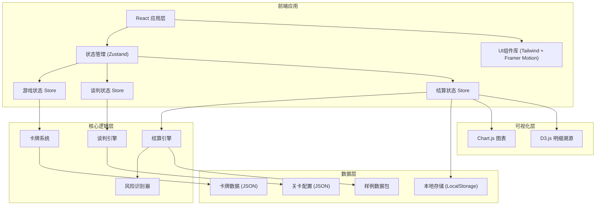
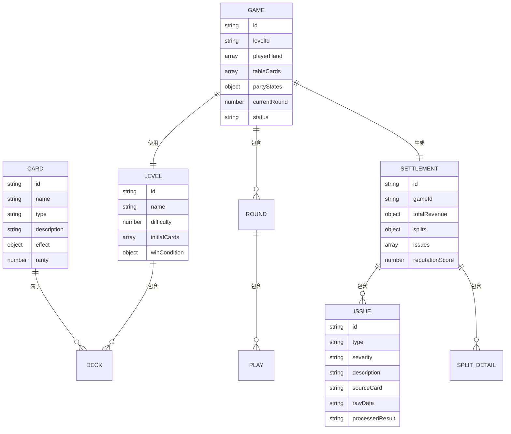

## 1. 架构设计



## 2. 技术描述

- **前端框架**: React@18 + TypeScript@5
- **构建工具**: Vite@5
- **样式方案**: TailwindCSS@3
- **状态管理**: Zustand@4
- **动画库**: Framer Motion@11
- **图表库**: Chart.js@4 + react-chartjs-2@5
- **拖拽**: @dnd-kit/core
- **PDF导出**: jspdf + html2canvas

## 3. 路由定义

| 路由 | 页面组件 | 用途 |
|------|----------|------|
| / | HomePage | 游戏开始页面，介绍规则 |
| /levels | LevelsPage | 关卡选择页面 |
| /game/:levelId | GamePage | 谈判主界面 |
| /settlement | SettlementPage | 结算明细页面 |
| /report | ReportPage | 谈判报告页面 |

## 4. 数据模型

### 4.1 数据模型定义



### 4.2 卡牌类型定义

```typescript
// 卡牌基础类型
interface Card {
  id: string;
  name: string;
  type: 'copyright' | 'artist' | 'platform' | 'clause' | 'action';
  description: string;
  effect: CardEffect;
  rarity: 'common' | 'rare' | 'epic';
}

interface CardEffect {
  type: 'split_modifier' | 'right_add' | 'risk_add' | 'reputation_mod';
  target: 'songwriter' | 'recording' | 'publisher' | 'all';
  value: number;
  condition?: string;
}

// 三方状态
interface PartyState {
  id: string;
  name: string;
  type: 'songwriter' | 'recording' | 'publisher';
  splitPercentage: number;
  rights: string[];
  risks: string[];
  reputation: number;
}

// 结算问题分级
interface Issue {
  id: string;
  type: 'split_mismatch' | 'right_missing' | 'deduction_ignored';
  severity: 'critical' | 'major' | 'minor';
  description: string;
  source: string;
  rawData: any;
  processedResult: any;
}

// 游戏状态
interface GameState {
  currentPage: 'home' | 'levels' | 'game' | 'settlement' | 'report';
  currentLevel: string | null;
  game: Game | null;
  settlement: Settlement | null;
}
```

## 5. 核心算法

### 5.1 分成结算算法

```typescript
function calculateSettlement(
  totalRevenue: number,
  parties: PartyState[],
  cards: Card[]
): Settlement {
  // 1. 基础分成计算
  let splits = parties.map(p => ({
    partyId: p.id,
    baseSplit: p.splitPercentage,
    amount: totalRevenue * p.splitPercentage / 100
  }));
  
  // 2. 应用卡牌效果
  cards.forEach(card => {
    if (card.effect.type === 'split_modifier') {
      const target = splits.find(s => s.partyId === card.effect.target);
      if (target) {
        target.amount *= (1 + card.effect.value / 100);
      }
    }
  });
  
  // 3. 风险识别
  const issues = detectIssues(splits, parties, cards);
  
  // 4. 信誉评分计算
  const reputationScore = calculateReputation(issues, parties);
  
  return { splits, issues, reputationScore };
}
```

### 5.2 风险分级规则

| 问题类型 | 严重程度 | 判定条件 |
|---------|----------|----------|
| 分成比例不满一 | critical | 三方分成总和 < 95% 或 > 105% |
| 录音权漏算 | major | 录音方权利列表缺少'mechanical_right' |
| 平台扣费忽略 | minor | 平台条款卡已使用但未扣除平台费用 |

## 6. 文件结构

```
src/
├── components/
│   ├── Card/
│   │   ├── Card.tsx
│   │   ├── CardHand.tsx
│   │   └── CardTable.tsx
│   ├── Party/
│   │   ├── PartyPanel.tsx
│   │   └── PartyStatus.tsx
│   ├── Settlement/
│   │   ├── SplitChart.tsx
│   │   ├── IssueList.tsx
│   │   └── DetailTrace.tsx
│   └── Report/
│       ├── ReportViewer.tsx
│       └── ExportButton.tsx
├── stores/
│   ├── useGameStore.ts
│   └── useSettlementStore.ts
├── data/
│   ├── cards.json
│   ├── levels.json
│   └── sampleData.json
├── utils/
│   ├── settlementEngine.ts
│   ├── issueDetector.ts
│   └── reportGenerator.ts
├── pages/
│   ├── HomePage.tsx
│   ├── LevelsPage.tsx
│   ├── GamePage.tsx
│   ├── SettlementPage.tsx
│   └── ReportPage.tsx
└── types/
    └── index.ts
```
