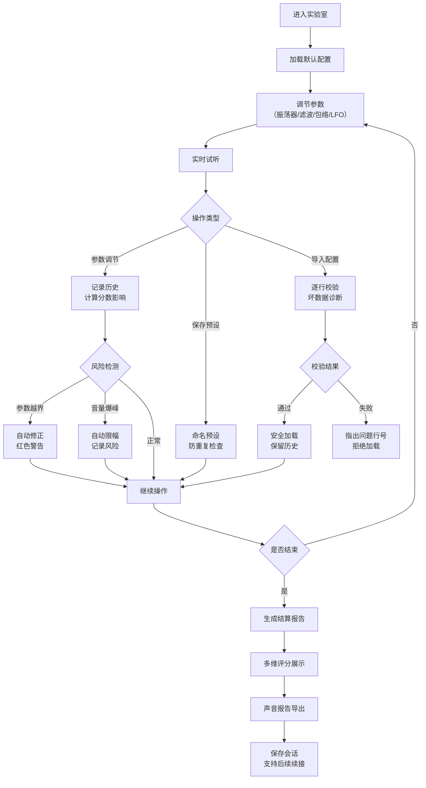

## 1. 产品概述

声音合成实验室是一款面向电子音乐爱好者的合成器互动教学游戏，玩家通过调节振荡器、滤波器、包络、LFO等声音合成参数，实时感受音色变化，系统根据操作过程给出多维度评分和详细分析报告。

- **核心目的**：通过游戏化方式教授声音合成基础知识，让玩家在实践中理解各参数对音色的影响
- **目标用户**：电子音乐社成员、合成器初学者、对声音设计感兴趣的音乐爱好者
- **产品价值**：将抽象的声音合成理论转化为可交互的实践体验，降低学习门槛

---

## 2. 核心特性

### 2.1 用户角色

| 角色 | 注册方式 | 核心权限 |
|------|----------|----------|
| 玩家 | 无需注册，本地会话 | 完整的参数调节、试听、预设管理、分数结算功能 |

### 2.2 功能模块

1. **主工作台**：振荡器、滤波器、包络、LFO 四大参数调节模块
2. **预设系统**：预设保存、加载、导入、导出、防覆盖保护
3. **历史记录**：操作追踪、变化说明、会话续接
4. **试听系统**：实时音色预览、音符触发、波形可视化
5. **风险提示**：参数越界警告、音量爆峰检测、坏数据诊断
6. **分数结算**：多维度评分、操作分析、声音报告导出

### 2.3 页面详情

| 页面名称 | 模块名称 | 功能描述 |
|----------|----------|----------|
| 主工作台 | 振荡器模块 | 波形选择（正弦/方波/锯齿/三角）、频率调节、粗调/细调、失谐控制 |
| 主工作台 | 滤波器模块 | 滤波类型（低通/高通/带通/带阻）、截止频率、谐振、包络量 |
| 主工作台 | 包络模块 | Attack/Decay/Sustain/Release 四阶段调节 |
| 主工作台 | LFO模块 | 波形选择、频率、深度、目标（音量/音高/滤波） |
| 主工作台 | 试听控制 | 音符键盘、持续播放开关、波形显示 |
| 预设管理 | 预设面板 | 保存当前配置、加载预设、删除预设 |
| 预设管理 | 导入导出 | JSON格式导入导出、冲突检测、防覆盖确认 |
| 历史记录 | 操作日志 | 每步操作时间戳、参数变化、分数影响、可追溯来源 |
| 历史记录 | 会话续接 | 支持保存会话状态，后续导入继续同一记录 |
| 风险提示 | 参数保护 | 数值范围限制、越界自动修正、红色高亮警告 |
| 风险提示 | 坏数据诊断 | 导入数据时逐行校验，指出问题行号和原始来源 |
| 风险提示 | 音量保护 | 爆峰检测、自动限幅、警告提示 |
| 结算报告 | 多维评分 | 音色丰富度、参数合理性、操作流畅度、探索广度、风险控制 |
| 结算报告 | 详细分析 | 每类参数调节次数、极值使用、风险事件统计 |
| 结算报告 | 声音报告 | 生成完整音色描述、参数配置清单、操作历程回顾 |

---

## 3. 核心流程

### 3.1 主流程描述

玩家进入实验室后，首先看到默认的初始音色配置。通过调节各个模块的旋钮和滑块，实时试听音色变化。每一步操作都会被记录到历史中并影响分数。玩家可以随时保存预设、导出配置，或触发风险警告（如参数越界、音量爆峰）。完成探索后，玩家可以查看详细的结算报告，包含多维度评分和完整的操作分析。

### 3.2 流程图

---

## 4. 用户界面设计

### 4.1 设计风格

**设计方向**：复古未来主义（Retro-Futuristic），融合70年代模拟合成器的经典质感与现代数字界面的交互体验

- **主色调**：深邃炭黑 `#121212` 为底，霓虹青色 `#00F0FF` 为主强调色，霓虹品红 `#FF00AA` 为副强调色，琥珀橙 `#FFA500` 为警告色
- **按钮风格**：圆角矩形边框按钮，hover时发光效果，按下时有物理凹陷感
- **旋钮风格**：金属质感圆形旋钮，带刻度线和指示灯，旋转时有流畅的阻尼动画
- **字体**：显示字体使用 `Orbitron`（科技感无衬线），正文字体使用 `JetBrains Mono`（等宽 monospace）
- **布局风格**：模块化卡片布局，各合成器模块使用带边框的面板容器，模块间有明确的视觉分隔
- **视觉元素**：CRT扫描线效果、LED数字显示风格、模拟仪表指针动画、细微的电路纹理背景

### 4.2 页面设计概述

| 页面名称 | 模块名称 | UI元素 |
|----------|----------|--------|
| 主工作台 | 顶部状态栏 | 会话ID显示、当前总分、风险计数、实时波形显示、菜单按钮 |
| 主工作台 | 振荡器面板 | 4个大型旋钮（波形/频率/粗调/失谐）、波形图标按钮、LED数值显示 |
| 主工作台 | 滤波器面板 | 4个大型旋钮（类型/截止/谐振/包络量）、滤波响应曲线预览 |
| 主工作台 | 包络面板 | 4个垂直滑块（A/D/S/R）、包络曲线实时预览图 |
| 主工作台 | LFO面板 | 4个旋钮（波形/速率/深度/目标）、调制目标选择按钮 |
| 主工作台 | 试听区 | 钢琴键盘组件、播放/停止按钮、音量表（VU Meter） |
| 侧边栏 | 预设列表 | 可滚动预设卡片列表、保存/导入/导出按钮 |
| 侧边栏 | 历史记录 | 时间线式操作列表、每项显示参数变化和分数影响 |
| 弹窗 | 风险提示 | 半透明红色遮罩、具体警告信息、确认/取消按钮 |
| 弹窗 | 坏数据诊断 | 代码样式显示、问题行高亮、错误说明、原始内容预览 |
| 结算页 | 评分面板 | 5个维度的雷达图、每项得分详情、总分展示 |
| 结算页 | 分析报告 | 分类统计图表、操作时间线、风险事件标记 |
| 结算页 | 导出区 | 报告格式选择、下载按钮、会话保存按钮 |

### 4.3 响应式设计

- **桌面端（1280px+）**：三栏布局，左侧历史记录，中间主工作台（2x2模块网格），右侧预设管理
- **平板端（768px-1279px）**：两栏布局，上方主工作台（2x2模块），下方左右分栏为历史和预设
- **移动端（<768px）**：单栏滚动布局，顶部试听区，然后依次是各模块面板，底部Tab切换历史/预设
- **触控优化**：旋钮支持触摸旋转，滑块增加触控热区，按钮最小尺寸48x48px

### 4.4 动画与交互细节

1. **旋钮交互**：
   - 悬停：外圈发光，数值显示高亮
   - 拖拽：跟随鼠标/触摸旋转，有阻尼感（非1:1跟随）
   - 释放：轻微回弹动画，数值锁定

2. **参数变化**：
   - 数值变化时有平滑过渡动画
   - 相关波形/曲线实时重绘
   - 历史记录项滑入动画

3. **风险提示**：
   - 越界参数：红色边框脉冲闪烁
   - 音量爆峰：VU表红色区域闪烁 + 警告图标抖动
   - 坏数据：逐行扫描动画，问题行逐字显现

4. **页面过渡**：
   - 进入：模块依次淡入，错位0.1s
   - 结算：分数滚动累加动画，雷达图逐段绘制

---

## 5. 数据与业务规则

### 5.1 参数范围与保护规则

| 参数 | 最小值 | 最大值 | 默认值 | 风险阈值 |
|------|--------|--------|--------|----------|
| 振荡器频率 | 20Hz | 20000Hz | 440Hz | >8000Hz 高频警告 |
| 滤波器截止 | 20Hz | 20000Hz | 2000Hz | <100Hz 或 >18000Hz 警告 |
| 谐振 | 0 | 20 | 1 | >15 自激警告 |
| 总音量 | 0 | 1 | 0.5 | >0.9 爆峰风险 |
| Attack | 0.001s | 5s | 0.01s | - |
| Decay | 0.001s | 5s | 0.1s | - |
| Sustain | 0 | 1 | 0.7 | - |
| Release | 0.001s | 10s | 0.3s | >5s 长释放警告 |
| LFO速率 | 0.1Hz | 20Hz | 5Hz | - |
| LFO深度 | 0 | 1 | 0.3 | >0.8 深度警告 |

### 5.2 分数规则

| 评分维度 | 权重 | 计算规则 |
|----------|------|----------|
| 音色丰富度 | 25% | 基于使用的波形种类、滤波器类型、调制目标数量 |
| 参数合理性 | 25% | 避免极端值，参数组合在合理区间内 |
| 操作流畅度 | 20% | 单位时间内有效操作数，避免反复微调 |
| 探索广度 | 20% | 调节过的参数占总参数的比例 |
| 风险控制 | 10% | 触发警告次数扣分，零警告加分 |

### 5.3 预设保护规则

1. **防覆盖**：保存同名预设时强制要求重命名或确认覆盖
2. **导入保护**：导入时不自动清除当前状态，需用户确认替换
3. **音量保护**：导入预设时若音量 > 0.8，自动降低到 0.8 并提示
4. **历史保留**：加载预设时记录为一条操作，保留之前的历史记录

### 5.4 坏数据诊断规则

导入JSON配置时按以下顺序校验：
1. JSON格式校验 → 失败时指出解析错误的行号和列号
2. 字段存在性校验 → 缺失必填字段时指出字段名
3. 数值范围校验 → 越界值指出具体参数和原始值
4. 类型校验 → 类型不匹配时指出期望类型和实际类型
5. 完整性校验 → 参数组合逻辑冲突时说明冲突点
